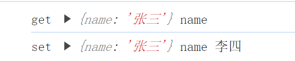
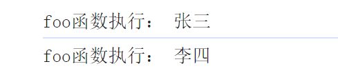
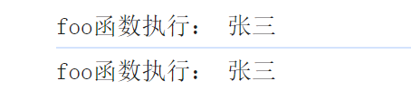
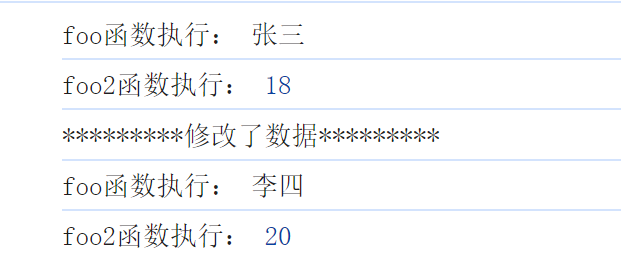

# 响应式数据的基本实现

## 思考

经过上一章节的论述，我们留下了一个疑问，如何将 obj 变为响应式的数据？并通过和 effect 函数搭配实现了一个为代码的例子，从中得到两点线索：

-   执行 effect 函数时，会获取字段 obj.name 的值，此操作即为**读**
-   当修改 obj.name 的值时，就会重新设置字段 obj.name 的值，此操作即为**写**

有了这两点之后，我们要做的事情就很明显了，就是进行**读**和**写**的时候进行拦截，插入我们需要执行的代码逻辑，比如读的时候就可以把这个 effect 函数收集起来，放到一个数组里面，当进行写的时候，就从这个数组里面取出 effect 函数，在重新执行。

现在问题就又升级了，我如何才能拦截到这个读、写的操作呢？在 ES6 之前，使用的是 Object.defineProperty 来进行实现，而在 ES6 中可以使用代理实现，这两种方法的优缺点，这里不做探讨。这里我们采用 Vue3 的选择，即 proxy。

## 实现

### proxy 初体验

当采用了 proxy 之后，我们就可以对数据的读、写进行拦截，代码如下：

```javascript
// 存储函数
const list = []

// 原始数据
const obj = {
  name: '张三'
}

const objProxy = new Proxy(obj, {
  // 拦截读取操作
  get(target, key) {
  	console.log('get', target, key)
    return target[key]
  },
  // 拦截写入操作
  set(target, key, newVal) {
    console.log('set', target, key, newVal)
    target[key] = newVal
    // set 方法返回 true 表示成功，false 表示失败，失败时，当前操作无效
    return true
  }
})

// 测试
objProxy.name
objProxy.name = '李四'
```

在预期中，会先触发一次 get 在触发一次 set，结果如图：



结果也正如我们所期望的那样，既然实现了拦截，那么此时就可以植入我们需要的代码逻辑，在 get 时收集执行的函数，set 时在触发，此时我们会发现一个问题，我 get 触发的时候，怎么才能得到当前正在执行的函数呢，如果不能得到这个函数，我如何进行存储呢？

### proxy + 副作用函数

如果需要得到当前正在执行的函数，我们可以定义一个全局变量，执行 get 的时候，从这个全局变量上获取正在执行的函数，而如果想要给这个全局变量赋值，我们就需要有一个函数(记作 fn1)可以帮助我们完成这一件事，即将需要和响应式数据关联的函数(记作 fn2)，将 fn2 作为参数传递给 fn1，fn1 内部执行一次 fn2，并将 fn2 赋值给全局变量，fn2 被执行时会触发读取一个响应式对象属性的代码(比如 obj.name)，obj.name 机会触发 get，在 get 中收集 fn2，代码如下：

```javascript
const list = []

const obj = {
  name: '张三'
}

// 全局变量
let activeFn = null

const objProxy = new Proxy(obj, {
  get(target, key) {
  	activeFn && list.push(activeFn)
		return target[key]
	},
  set(target, key, newVal) {
    target[key] = newVal
    list.forEach(fn => fn())
    return true
  }
})

// 收集执行的函数
function effect(fn) {
    activeFn = fn
    fn()
}

// 要执行的函数
function foo() {
    console.log('foo函数执行：', objProxy.name)
}

effect(foo)

// 修改值
objProxy.name = '李四'
```

最后结果也正如我们所期望的这样，结果如图：



### 建立正确的副作用函数与目标字段之间的联系

为什么要建立正确的联系呢？我们看一下下面这段测试案例，如下：

```javascript
const list = []

const obj = {
    name: '张三',
    age: 18
}

let activeFn = null

const objProxy = new Proxy(obj, {
    get(target, key) {
        activeFn && list.push(activeFn)
        return target[key]
    },
    set(target, key, newVal) {
        target[key] = newVal
        list.forEach(fn => fn())
        return true
    }
})

function effect(fn) {
    activeFn = fn
    fn()
}

function foo() {
    // 获取的是 obj.name
    console.log('foo函数执行：', objProxy.name)
}

effect(foo)

// 修改 age
objProxy.age = 20
```

结果如图：



在这个例子中，foo 函数里面读取的是 name 字段，为什么修改 age 也会导致再次执行 foo 呢，就是因为没有正确的关联，所以我们需要将 key 和这个 list 进行一个关联，objProxy 的每一个 key 都应该单独对应的 list，既然字段存在这种关系，那么想必 obj 这个对象本身也是存在的，而 foo 函数可能不止于一个。

那针对这些情况，我们应该如何设计数据结构呢？在分析中，我们有三个角色：

-   被代理的对象 obj
-   字段名 name
-   使用 effect 注册的副作用函数 foo

如果 target 表示所代理的原始对象，key 表示被操作的字段名，effectFn 表示被注册的副作用函数，那么可以建议如下关系：

```javascript
target
  |———— key
  		  |———— effctFn
```

这就是一种树形的结构，我们还可以多举几个例子来看一下：

**case1：**两个副作用函数同时读取一个对象的属性值

-   代码如下：

    ```javascript
    effect(function effectFn1() {
        console.log(obj.name)
    })
    effect(function effectFn2() {
        console.log(obj.name)
    })
    ```

-   关系如下：

    ```javascript
    target
      |———— name
              |———— effctFn1
      				|———— effctFn2
    ```

**case2：**如果同一个副作用函数中读取了同一个对象两个不同属性

-   代码如下：

    ```javascript
    effect(function effectFn1() {
        console.log(obj.name)
        console.log(obj.age)
    })
    ```

-   关系如下：

    ```javascript
    target
       |———— name
      		|———— effctFn1
       		|———— age
      		|———— effctFn1
    ```

**case3：**在不同的副作用函数中读取了两个不同对象的不同属性

-   代码如下：

    ```javascript
    effect(function effectFn1() {
        console.log(obj1.name)
    })
    effect(function effectFn2() {
        console.log(obj2.age)
    })
    ```

-   关系如下：

    ```javascript
    obj1
       |———— name
      		  |———— effctFn1
    obj2
       |———— age
      		  |———— effctFn2
    ```

有了这个数据结构之后，我们就可以来构建它，如下：

```javascript
const list = []

const obj = {
    name: '张三',
    age: 18
}

let activeFn = null
let targetMap = new WeakMap()

function track(target, key) {
    if (!activeFn) return
    // 从targetMap中获取target对应的依赖集合，是一个 map 结构
    let depsMap = targetMap.get(target)
    // 如果当前对象没有存储过依赖，则创建
    if (!depsMap) {
        depsMap = new Map()
        // 创建后，将依赖集合存储到 targetMap 中
        targetMap.set(target, depsMap)
    }
    // 获取当前key的依赖，没有则创建集合，是一个 set 结构
    let deps = depsMap.get(key)
    if (!deps) {
        deps = new Set()
        // 创建后，将依赖集合存储到 depsMap 中
        depsMap.set(key, deps)
    }
    // 将当前函数存储到依赖集合中
    deps.add(activeFn)
}

function trigger(target, key) {
    // 从targetMap中根据target获取对应的依赖集合，是一个 map 结构
    let depsMap = targetMap.get(target)
    if (!depsMap) return
    // 根据当前key的，获取依赖集合，是一个 set 结构
    let deps = depsMap.get(key)
    if (!deps) return
    // 遍历依赖集合，执行依赖函数
    deps.forEach(fn => fn())
}

const objProxy = new Proxy(obj, {
    get(target, key) {
        // 收集依赖
        track(target, key)
        return target[key]
    },
    set(target, key, newVal) {
        target[key] = newVal
        trigger(target, key)
        return true
    }
})

function effect(fn) {
    activeFn = fn
    fn()
}

function foo() {
    console.log('foo函数执行：', objProxy.name)
}

function foo2() {
    console.log('foo2函数执行：', objProxy.age)
}

effect(foo)
effect(foo2)

console.log('*********修改了数据*********')
objProxy.name = '李四'
objProxy.age = 20
```

结果如图：


