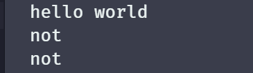
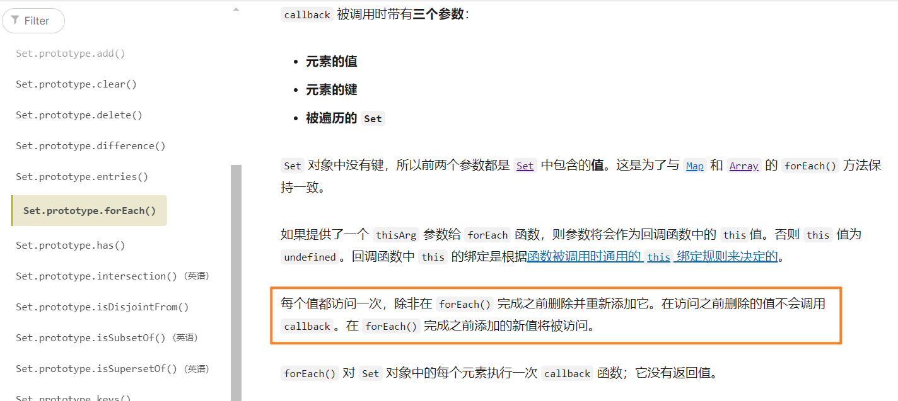
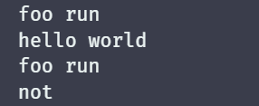
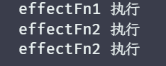
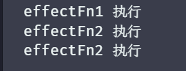
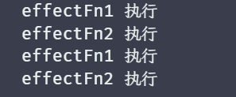

# 处理响应式系统的边界情况

## 分支切换和cleanup

### 问题分析

案例代码如下：

```javascript
const obj = {
	ok: true,
	text: 'hello world'
}

const objProxy = new Proxy(obj, {/* ... */})

function foo() {
	console.log(objProxy.ok ? objProxy.text : 'not')
}

effect(foo)
```

输出结果如图：



可以看到执行了三次输出，但是应该吗？其实**不应该**。

ok 的初始值为 true，那么第一次会收集 ok、text 两个属性，所以会把 foo 收集两次，如果只是此时将 ok 改为 false 之后，调用一次 foo，但是后续再把 text 重新赋值时，ok 为 false 就不会执行 obj.text，那么就不应该被收集，而且要将上次收集的清除掉，所以按照设想来说，只会触发两次。

### 解决方案

要解决这一点其实也简单，只要每次重新执行依赖之前，就把之前旧的依赖清除掉即可。

但是如何清除就需要进行一番思考，首先如果要清楚，那总得能存储下来吧，为了实现这一点，我们需要对 effect 函数进行一些改造，如下：

```javascript
function effect(fn) {
	const effectFn = () => {
		activeFn = effectFn
		fn()
	}
	// 给这个函数添加一个 deps 属性，用来存储所有与该副作用函数相关联的依赖关系
	//  - 里面存储的都是一个个的 Set 依赖集合
    //  - 为啥是数组？比如一个 foo 里面会访问 obj 里面不同的属性，那么就存在多个了
	effectFn.deps = []
	effectFn()
}
```

有了存储的位置之后，那么肯定就要有加入存储的地方，而收集依赖的地方就在 track 函数中，所以只需要在 track 函数中进行简单的修改即可，如下：

```javascript
function track(target, key) {
	if (!activeFn) return
	let depsMap = targetMap.get(target)
	if (!depsMap) {
		depsMap = new Map()
		targetMap.set(target, depsMap)
	}
	let deps = depsMap.get(key)
	if (!deps) {
		deps = new Set()
		depsMap.set(key, deps)
	}
	deps.add(activeFn)
	// 将 deps 添加到 activeFn.deps 中-便于后续进行清除上一次的依赖
	activeFn.deps.push(deps)
}
```

现在已经完成了依赖的记录，剩下的就是清除，那么我们在定义一个清除函数，如下：

```javascript
function cleanup(effectFn) {
	for (let i = 0; i < effectFn.deps.length; i++) {
		const deps = effectFn.deps[i]
		// 利用 Set 可以很方便的进行删除操作-只需删除特定的依赖即可
		deps.delete(effectFn)
	}
	// 清空 effectFn.deps
	effectFn.deps.length = 0
}
```

然后再执行副作用函数前，将其清除即可，如下：

```javascript
function effect(fn) {
	const effectFn = () => {
		activeFn = effectFn
		// 执行前，先清空 deps
		cleanup(effectFn)
		fn()
	}
	effectFn.deps = []
	effectFn()
}
```

但是如果此时这样就直接执行，那么就会陷入死循环，为什么呢？这是因为在 cleanup 中清除了上一次的依赖之后，就再次执行了代码 `fn()` 导致依赖被重新收集了，即在 Set 中先进行了一次 delete 的操作，又进行了一次 add 的操作，这个行为可以使用一段示例代码表示，如下：

```javascript
const set = new Set([1])

set.forEach(item => {
	set.delete(1)
	set.add(1)
	console.log('遍历中')
})
```

此时运行这段代码，就会陷入死循环，原因就是：**在调用 forEach 遍历 Set 集合时，如果一个值已经被访问过了，但该值被删除并重新添加到集合，且此时 forEach 的遍历没有结束的话，那么该值将会重新被访问。**

在 MDN 中，有一段描述可以看到这点，[点击查看](https://developer.mozilla.org/zh-CN/docs/Web/JavaScript/Reference/Global_Objects/Set/forEach)，或者查看记录的截图，如图：



当然，这点在 **ECMAScript** 中也可以查看到，[点击查看](https://tc39.es/ecma262/multipage/keyed-collections.html#sec-set.prototype.foreach)

解决这个也很简单，在 trigger 重新派发更新时，我重新构建一个 Set，利用这个 Set 进行遍历即可，代码如下：

```javascript
function trigger(target, key) {
	let depsMap = targetMap.get(target)
	if (!depsMap) return
	let deps = depsMap.get(key)
	if (!deps) return

	// 重新构造一个 Set，避免死循环
	const effetsToRun = new Set(deps)
	effetsToRun.forEach(fn => fn())
}
```

测试代码如下：

```javascript
function foo() {
	console.log('foo run')
	console.log(objProxy.ok ? objProxy.text : 'not')
}

effect(foo)

objProxy.ok = false
objProxy.text = 'hello vue3'
```

现在我们在 ok 改为 false 之后，再次修改 text 的值就不会再次触发 foo，如图：



## 嵌套的 effect 和 effect 栈

### 问题分析

effect 是可以发生嵌套的，而且这个常见在 Vue 中非常常见，如果你之前了解过相关的知识，就知道一个组件的都是由 render 函数生成的，所以组件的嵌套也就是 render 函数的嵌套，类似与 effect(render)。

因此 effect 就需要支持这种嵌套写法，那么现在如果进行嵌套会发生什么呢？我们写一段代码测试一下，如下：

```javascript
const obj = { foo: 'foo', bar: 'bar' }

const objProxy = new Proxy(obj, /* ... */)

let a, b

effect(function effectFn1() {
	console.log('effectFn1 执行')

	effect(function effectFn2() {
		console.log('effectFn2 执行')
		// 在 effecFn1 中访问 obj.bar
		b = objProxy.bar
	})
	// 在 effecFn1 中访问 obj.foo
	a = objProxy.foo
})

objProxy.bar = 'bar-bar'
```

如果按照这个设想，我们期望的依赖关系如下：

```javascript
obj
   |———— foo
  		  |———— effctFn1
   |———— bar
  		  |———— effctFn2
```

此时按照我们的期望，如果是修改 bar 的值，那么就只触发 effectFn2，看一下输出的结果，如图：



结果是正常的，那么我们修改一下 foo 的值呢？`objProxy.foo = 'foo-foo'`，此时我们期望的是再次触发 effectFn1 并顺带执行 effectFn2，查看一下输出的结果，如图：



可以看到结果还是没有改变，第一次输出的 effectFn1 和 effectFn2 是正常的，但是第三次输出的 effectFn2 的时候就不对了，我们修改的 foo 的值，但是输出的却是 effectFn2，这是因为我们采用的是全局变量 activeFn 来记录当前激活的函数，执行 effect(effectFn1) 的时候，还没执行完成，就执行了 effect(effectFn2)，而 effect 函数内部执行的时候会覆盖 activeFn 全局变量的值，这就导致了正确的收集完成 effectFn2 之后，执行 effectFn1 剩下的代码的时候，activeFn 还是 effectFn2，这就导致收集的依赖关系变成了下面这样：

```javascript
obj
   |———— foo
  		  |———— effctFn2
   |———— bar
  		  |———— effctFn2
```


### 解决方案

在上述的分析中，结果明显是不对的，那此时可能就会想到一个解决方案，每次 effect 执行完成后都把 activeFn 置空会如何呢？代码如下：

```javascript
function effect(fn) {
	const effectFn = () => {
		activeFn = effectFn
		cleanup(effectFn)
		fn()
	}
	effectFn.deps = []
	effectFn()
	// 置空
	activeFn = null
}
```

可以看到结果还是不对，这是因为 effect(effectFn2) 执行完成之后，把 activeFn 设置为了 null，此时 activeFn 为 null，在 track 函数中就不会进行依赖收集的逻辑，自然修改 foo 的值就不会发生任何的函数重新执行。

那应该如何解决呢？其实也简单，我们维护一个栈，每次执行副作用函数之前，把当前执行的副作用函数加入到这个栈中，而当前副作用函数执行完毕后，就把这个函数移出栈，并把 activeFn 赋值为栈中存储的最新一个副作用函数即可，代码如下：

```javascript
const effectStack = []

/* 省略其他代码... */

function effect(fn) {
	const effectFn = () => {
		activeFn = effectFn
		cleanup(effectFn)
		// 需要进行副作用处理的函数执行前，将当前副作用函数入栈
		effectStack.push(effectFn)
		fn()
		// 当前副作用函数执行后，将当前副作用函数出栈
		effectStack.pop()
		// 并更新当前副作用函数为副作用函数栈中的最后一个副作用函数
		activeFn = effectStack[effectStack.length - 1]
	}
	effectFn.deps = []
	effectFn()
}
```

此时再次查看执行结果，如图：



