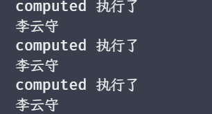
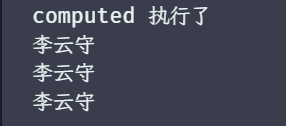
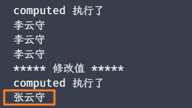

# 计算属性 computed 和 lazy

## lazy

在有些场景中，我们并不希望 effect 处理的副作用函数立马执行，此时我们就可以实现一个懒加载来实现它，于 scheduler 一样，也是 options 的一个配置，代码如下：

```javascript
function effect(fn, options = {}) {
  const effectFn = () => {
    activeFn = effectFn
    cleanup(effectFn)
    effectStack.push(effectFn)
    fn()
    effectStack.pop()
    activeFn = effectStack[effectStack.length - 1]
  }

  effectFn.options = options

  effectFn.deps = []

  // 如果开启了懒加载，则不立即执行
  if (options.lazy) {
    return effectFn
  }
  effectFn()
}

const et = effect(
  () => {
    console.log(objProxy.a)
  },
  {
    lazy: true
  }
)
// 手动执行副作用函数
et()

objProxy.a++
objProxy.a++
```

此时执行时机就交给了我们自己

## computed

### 初窥面貌

上述中实现了一个懒加载效果，但是如果只是手动执行副作用函数，其实意义并不大，但是如果我们把传递给 effect  的函数看作为一个 getter，那么这个 getter 则可以返回任何值，如果你使用过 Vue 的计算属性，那么就可以很清楚的知道这表示什么，例如：

```javascript
const obj = { first: '李', last: '云守' }
const objProxy = new Proxy(obj /* ... */)

const et = effect(() => objProxy.first + objProxy.last, { lazy: true })

// value 就是 getter 的返回值
const value = et()
```

当然，目前这段代码还只是一个设想，时机上目前 et 的返回值，只是 effect 函数本身的返回值，而非 getter 的返回值，所以我们需要做一些处理，如下：

```javascript
function effect(fn, options = {}) {
  const effectFn = () => {
    activeFn = effectFn
    cleanup(effectFn)
    effectStack.push(effectFn)
    // 使用 result 变量存储 fn(即getter) 的返回值
    const result = fn()
    effectStack.pop()
    activeFn = effectStack[effectStack.length - 1]
    // 将 fn 函数的返回作为 effectFn 函数的返回值
    return result
  }

  effectFn.options = options

  effectFn.deps = []

  if (options.lazy) {
    return effectFn
  }
  effectFn()
}
```

这个处理中 fn 才是实际上的 getter 函数，所以要将 fn 函数的返回值作为 effectFn 函数的返回值。此时 value 就是 getter 函数的返回值了。

在 Vue3 中，一个计算属性返回的结果需要使用 `xxx.value` 来获取，那么我们这里也针对这个来进行 computed 的实现，代码如下：

```javascript
function computed(getter) {
  // 将 getter 作为副作用函数
  const effectFn = effect(getter, {
    lazy: true
  })

  const obj = {
    // 当读取 value 属性时触发
    get value() {
      return effectFn()
    }
  }

  return obj
}

const fullName = computed(() => objProxy.first + objProxy.last)
console.log(fullName.value) // 李云守
```

### 实现缓存

看似是实现了，但是还有不少的缺陷，比如，无法缓存，我们知道，计算属性当值未发生变化时，是不会重新计算的，直接使用缓存，而目前我们没有缓存处理，就会导致每次获取都会执行一次 effectFn 函数，从而返回这个值，我们给 getter 函数添加一句打印，代码如下：

```javascript
const fullName = computed(() => {
  console.log('computed 执行了')
  return objProxy.first + objProxy.last
})
console.log(fullName.value)
console.log(fullName.value)
console.log(fullName.value)
```

结果如图：



所以我们可以定义一个变量，来保存这个值，然后通过一个开关来控制是重新计算还是使用缓存，代码如下：

```javascript
function computed(getter) {
  // 缓存上一次的值
  let value
  // 决定是否需要重新计算值，为 true 表示需要重新计算，也表示数据脏了，false 表示使用缓存
  let dirty = true

  const effectFn = effect(getter, {
    lazy: true
  })

  const obj = {
    get value() {
      // 如果数据脏了，则重新计算
      if (dirty) {
        // 重新计算，获取新的结果，并赋值给 value
        value = effectFn()
        // 修改状态
        dirty = false
      }
      return value
    }
  }

  return obj
}
```

再次测试结果如图：



缓存目前还存在一个隐患，当计算属性内部依赖的响应式数据更改时，不会更新缓存的值，案例代码如下：

```javascript
const fullName = computed(() => {
  console.log('computed 执行了')
  return objProxy.first + objProxy.last
})
console.log(fullName.value)
console.log(fullName.value)
console.log(fullName.value)

objProxy.first = '张'
console.log('***** 修改值 *****')
console.log(fullName.value)
```

结果如图：

可以看到重新执行了 computed 但是值并没有更新，这是因为 dirty 并没有从 false 改为 true，从而导致 value 的值一直不变，此时我们就可以利用之前实现的调度器，当 getter 重新运行的时候，如果存在调度器就会触发调度器，所以我们只需要在调度器改变 dirty 的状态即可，代码如下：

```javascript
function computed(getter) {
  let value
  let dirty = true

  const effectFn = effect(getter, {
    lazy: true,
    scheduler() {
      // 修改的时候，dirty 为 true，下次访问的时候，会重新计算
      dirty = true
    }
  })

  const obj = {
    get value() {
      if (dirty) {
        value = effectFn()
        dirty = false
      }
      return value
    }
  }

  return obj
}
```

结果如图：



此时结果就已经实现了改变，那到这一步 computed 是否已经完成了，并没有，还存在一点小缺陷，这个缺陷体现在 **当我们另外一个 effect 中读取计算属性的值** 的时候，阿里代码如下：

```javascript
const fullName = computed(() => {
  return objProxy.first + objProxy.last
})

effect(() => {
  console.log('模拟在模板中使用了 computed：', fullName.value)
})

console.log('***** 修改值 *****')
objProxy.first = '张'
```

执行结果如图：


可以看到修改值之后，并没有在重新打印 effect 的副作用函数，那么体现实际 Vue 中，即计算属性改变了值，但是模板没有重新渲染，而导致出现这个问题的原因也简单，fullName.value 触发 get value，get value 中第一次会调用 computed 内部的 effectFn 函数来返回 getter 的值，而 getter 也是被一个 effect（即 effect(getter)）包裹的；那么此时在配合外部的 effect（即模拟模板的 effect），两者直接是一个显而易见的嵌套的 effect 关系。而在这种嵌套的 effect 关系中，我们在[处理响应式系统的边界情况](./03_处理响应式系统的边界情况.md)这一文中有讲到，**外部 effect 不会被内部 effect 中的响应式数据收集。**因此当 objProxy.first 的值发生修改的时候，只会让内部的这个 effect 运行，而不会触发外部的 effect。

搞清楚源头之后，解决起来就很好解决了，既然是因为没有收集依赖导致的，那么我们手动的收集依赖和触发依赖不就可以了吗，代码如下：

```javascript
function computed(getter) {
  let value
  let dirty = true

  const effectFn = effect(getter, {
    lazy: true,
    scheduler() {
      if (!dirty) {
        dirty = true
        // 派发更新
        trigger(objProxy, 'value')
      }
    }
  })

  const obj = {
    get value() {
      if (dirty) {
        value = effectFn()
        dirty = false
      }
      // 收集依赖-在次期间属于 effect 的执行时期，activeFn是有值的，所以可以直接调用 track 建立联系
      track(obj, 'value')
      return value
    }
  }

  return obj
}
```

再次执行，测试结果如图：


