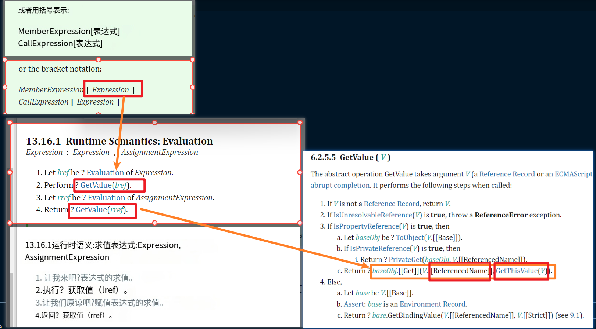
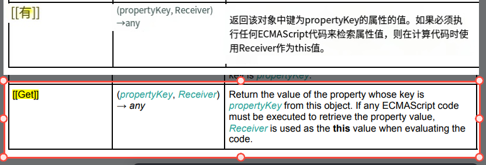

# 理解 Proxy 和 Reflect

这里我不在赘述什么是代理和基本语法，我直接通过具体的案例，来了解这两者之间在响应式系统中有什么作用。

我们先看一下单独使用 Reflect 时的结果，如下：

```javascript
const obj = {
	a: 1,
	get foo() {
		return this.a
	}
}
console.log(Reflect.get(obj, 'foo')) // 1
console.log(Reflect.get(obj, 'foo', { a: 10 })) // 结果是 10 而非 1
```

从这个例子上看，Reflect.get 如果不传入第三个参数和 obj.foo 没有区别，第三个参数传入就像是改变了 this，这里本质上不仅仅只有这个意义，但是在响应式系统中，只有这一点和我们密切相关。

这里为什么 Reflect 可以实现这个效果呢？我们平常使用 . 或者 [] 访问一个对象属性的时候，并没有给我们提供改变 this 指向的参数，因为这是在 js 内部会自动帮助我们添加上，我们可以从 ECMA 文档中找到相关的解释，如图：



`GetThisValue` 是用于获取当前执行上下文中的 `this` 值，所以这里也就表示符合了 [[GET]] 的内部方法，即语法层面标注 obj[key]，在内部实际执行的是 `obj.[[GET]](key, this)`，所以直接使用这种括号的方式是无法指定这个 this 了，但是我们可以通过调用这个 Reflect.get 方法，来完成这个指定 this 的操作。

而 Reflect.get 其实就是调用了内部的 [[GET]] 方法，如图：



可以看到这个方法，除了可以返回这个对象属性的值之外，还可以接受一个参数，这个参数就可以用来指代 this。

清楚了上面的概念之后，我们就可以来看一下下面这段例子，如下：

```javascript
const obj = {
	a: 1,
	get foo() {
		return this.a
	}
}
const objProxy = new Proxy(obj, /* ... */)

effect(() => {
	console.log(objProxy.foo)
})
// 更新 a
objProxy.a++
```

按照预期应该是执行两次的，但是结果只执行了一次，这是为什么呢？objProxy.foo 访问 foo 时，会发现这是一个访问器函数，里面执行了 `this.a`，好像一切都合理，但是这里的 this 是表示谁呢？

这里的 this 表示其实是 obj 这个原始对象，而非 objProxy 这个代理对象，因为我们在 get 拦截函数中，是直接使用 targt[key] 这样来返回值的，这就等于是 obj.xx 进行访问属性，自然 this 就表示是 obj 这个原始对象，而原始对象自然不会进行依赖的收集，所以只触发了一次。

如果要解决这个问题，我们只需要让它这个 this 代指 objProxy 即可，所以这里就用到了我们上述提到的 Reflect.get 方法，我们修改一下 get 拦截的代码，如下：

```javascript
// receiver 表示谁在调用这个属性，比如 objProxy.foo，receiver 就是 objProxy
get(target, key, receiver) {
	track(target, key)
	// 换成 Reflect.get
	return Reflect.get(target, key, receiver)
},
```

这里为了更加直观的看到改变，只展示了 get 部分的修改。

此时我们在看一下输出的结果，如图：


