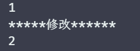

# 实现 reactive

## 编写 reactive 的函数签名

前面我们已经实现了一个基础的响应式数据，但是这是一种比较简陋的方法，而且使用起来书写相对繁琐，所以我们先构造一个 reactive 的函数签名，如下：

```javascript
function get(target, key, receiver) {
	track(target, key)
	return Reflect.get(target, key, receiver)
}

function set(target, key, newVal) {
	target[key] = newVal
	trigger(target, key)
	return true
}

function reactive(value) {
  // 简单做一个基础拦截
  if (typeof value !== 'object' || value === null) {
		console.warn('value 必须是一个对象')
		return value
	}
  
	const proxy = new Proxy(value, { get, set })
	return proxy
}

const state = reactive({ name: 'zs', age: 18 })

effect(() => {
	console.log(`${state.name}今年${state.age}岁了`)
})

state.age++
```

上述这段代码中，我们将 get 和 set 的逻辑抽离了出去，这样代码会更优雅一点，同时简单的封装了一下 reactive，创建一个可响应的数据也方便一点。

## 处理对象的其他行为

> 这个行为具体的可以查阅文档得知：https://developer.mozilla.org/en-US/docs/Web/JavaScript/Reference/Global_Objects/Proxy#object_internal_methods

### 拦截 in 操作符

前面我们处理的只有 get 和 set，也简单的把 get 就看做是读，set 看做是写，而在响应式系统中，读是一个宽泛的概念，比如 in 操作符也是一个读的操作，例如：

```javascript
effect(()=>{
  'foo' in obj
})
```

而这种读的操作，在响应式系统中也应该被拦截，而如果想拦截 in 这个读的操作，就需要使用内部方法 [[HasProperty]]，而这个内部方法在 Proxy 中对应的则是 [has](https://developer.mozilla.org/en-US/docs/Web/JavaScript/Reference/Global_Objects/Proxy/Proxy/has)，这些在 ECMA 或者 MDN 文档中都可以找到，有兴趣的自行翻阅即可。

已经知道了对应的拦截器，那实现也就非常简单了，如下：

```javascript
function has(target, key) {
  console.log('in 被拦截了')
	track(target, key)
	return Reflect.has(target, key)
}

function reactive(value) {
	if (typeof value !== 'object' || value === null) {
		console.warn('value 必须是一个对象')
		return value
	}
	const proxy = new Proxy(value, { get, set, has })
	return proxy
}

const state = reactive({ name: 'zs', age: 18 })
effect(() => {
	'age' in state
})
```

我们来查看一下输出的结果，如图：


### 拦截 for...in 循环

for...in 循环对应的内部方法为 [[OwnPropertyKeys]]，对应 Proxy 中的 [ownKeys](https://developer.mozilla.org/en-US/docs/Web/JavaScript/Reference/Global_Objects/Proxy/Proxy/ownKeys)，我们先看一下实现代码，如下：

```javascript
const ITERATE_KEY = Symbol('iterate')
function ownKeys(target) {
	// 手动构造了一个 key，让其与副作用函数关联
	track(target, ITERATE_KEY)
	return Reflect.ownKeys(target)
}
```

在这段代码中，与之前不一样的则是，手动的创建一个 key，这是为什么呢？我们设计响应式依赖收集数据结构中，需要一个 key，而 ownKeys 方法确并没有提供 key 的参数，只有 target，为什么不提供 key 呢，合理吗？

其实是合理的，因为不同于 get/set 的操作，我们总能精准的知道，当前读取的是对象的那个属性，而 ownKeys 则是用来获取一个对象的所有属于自己的键值，这个操作是没有和任何具体的键值进行绑定，所以不提供 key 是合理的。

因此我们如果想复合我们设计的数据结构，只有手动的构造一个 key 来实现依赖的关联。

那我们来看看，是否现在可以达到我们预期的效果，代码如下：

```javascript
const state = reactive({ name: 'zs', age: 18 })
effect(() => {
	for (const key in state) {
		console.log(key)
	}
})
state.address = 'shanghai'
```

这段代码，我们的预期是先输出 name、age，然后添加了一个 address 时，肯定会对 for...in 循环产生印象，那么应该在输出一个 address，我们看一下执行的结果，如图：


预期中的 address 并没有出现，这是为什么呢？因为这一部分触发的其实 set，我们给 set 方法添加一句打印，如下：

```javascript
function set(target, key, newVal) {
	console.log('set: ', key)
	target[key] = newVal
	trigger(target, key)
	return true
}
```

查看一下运行结果，如图：


但是在 set 中触发，key 是 address，这和我们设置的 ITERATE_KEY 是一点关系都没有，所以应该如何触发呢？我们可以尝试给 ITERATE_KEY 单开一个 Set 集合在执行即可，如下：

```javascript
function trigger(target, key) {
	let depsMap = targetMap.get(target)
	if (!depsMap) return
	let deps = depsMap.get(key)
	// 取得 ITERATE_KEY 的依赖
	let iterateDeps = depsMap.get(ITERATE_KEY)

	const effetsToRun = new Set()
	deps &&
		deps.forEach(effectFn => {
			if (effectFn !== activeFn) {
				effetsToRun.add(effectFn)
			}
		})
	// 除了加入当前 key 的依赖，还要加入 ITERATE_KEY 的依赖
	iterateDeps &&
		iterateDeps.forEach(effectFn => {
			if (effectFn !== activeFn) {
				effetsToRun.add(effectFn)
			}
		})

	effetsToRun.forEach(fn => {
		if (fn.options && fn.options.scheduler) {
			fn.options.scheduler(fn)
		} else {
			fn()
		}
	})
}
```

此时我们写一段测试代码，如下：

```javascript
const state = reactive({ name: 'zs', age: 18 })
effect(() => {
	for (const key in state) {
		console.log(key)
	}
})
console.log('*****添加******')
state.address = 'shanghai'
```

结果如图：


但是现在还有一个问题，就是无差别触发，比如我重新修改年龄，那么此时并不会对，并不会对这个迭代行为产生影响，那么就不应该触发，所以我们需要识别 set 触发时，当前的 key 是新增的还是重新赋值，基于这点我们就可以优化一下代码，如下：

```javascript
function trigger(target, key, type) {
	let depsMap = targetMap.get(target)
	if (!depsMap) return
	let deps = depsMap.get(key)

	const effetsToRun = new Set()
	deps &&
		deps.forEach(effectFn => {
			if (effectFn !== activeFn) {
				effetsToRun.add(effectFn)
			}
		})

	// 只有添加属性才会触发 ITERATE_KEY 的副作用函数
	if (type === 'ADD') {
		let iterateDeps = depsMap.get(ITERATE_KEY)
		iterateDeps &&
			iterateDeps.forEach(effectFn => {
				if (effectFn !== activeFn) {
					effetsToRun.add(effectFn)
				}
			})
	}

	effetsToRun.forEach(fn => {
		if (fn.options && fn.options.scheduler) {
			fn.options.scheduler(fn)
		} else {
			fn()
		}
	})
}

/* ... */

function set(target, key, newVal, receiver) {
	// 根据当前对象有没有这个 key 来区分是新增还是修改
	const type = Object.prototype.hasOwnProperty.call(target, key) ? 'SET' : 'ADD'
	const result = Reflect.set(target, key, newVal, receiver)
	if (!result) return
	trigger(target, key, type)
	return result
}

/* ... */

const state = reactive({ name: 'zs', age: 18 })
effect(() => {
	for (const key in state) {
		console.log(key)
	}
})
console.log('*****修改******')
state.age++
console.log('*****添加******')
state.sex = '男'
```

查看一下输出的结果，如图：


此时就是符合我们预期的，修改不触发，添加才触发。

当然，为了更好的维护，我们通常会将这个维护成一个枚举值，如下：

### delete 操作符

delete 在 Proxy 对应的方法则是 [deleteProperty](https://developer.mozilla.org/en-US/docs/Web/JavaScript/Reference/Global_Objects/Proxy/Proxy/deleteProperty)，因此我们在其中书写对应的逻辑即可，如下：

```javascript
function deleteProperty(target, key) {
	// 检测属性是否存在
	const hadKey = Object.prototype.hasOwnProperty.call(target, key)
	const result = Reflect.deleteProperty(target, key)
	// 属性存在和删除成功，则触发依赖
	if (hadKey && result) {
		trigger(target, key, TrggerType.DELETE)
	}
	return result
}
```

这里其他的没有特殊的地方，唯有在 trigger 的时候，我们传递了一个类型，这是因为当属性删除的时候，也会印象 for...in 的迭代行为，所以需要这个类型，如下：

```javascript
function trigger(target, key, type) {
	let depsMap = targetMap.get(target)
	if (!depsMap) return
	let deps = depsMap.get(key)

	const effetsToRun = new Set()
	deps &&
		deps.forEach(effectFn => {
			if (effectFn !== activeFn) {
				effetsToRun.add(effectFn)
			}
		})

	// 添加判断条件
	if (type === TrggerType.ADD || type === TrggerType.DELETE) {
		let iterateDeps = depsMap.get(ITERATE_KEY)
		iterateDeps &&
			iterateDeps.forEach(effectFn => {
				if (effectFn !== activeFn) {
					effetsToRun.add(effectFn)
				}
			})
	}

	effetsToRun.forEach(fn => {
		if (fn.options && fn.options.scheduler) {
			fn.options.scheduler(fn)
		} else {
			fn()
		}
	})
}
```

那么基于修改后的代码我们可以来测试一下，测试1，如下：

```javascript
const state = reactive({ name: 'zs', age: 18, sex: '男' })
effect(() => {
	console.log('effect', state.sex)
})

delete state.sex
```

结果如图：


是达到我们的预期了，在来看看第二个情况，如下：

```javascript
const state = reactive({ name: 'zs', age: 18, sex: '男' })
effect(() => {
	for (const key in state) {
		console.log('effect: ', key)
	}
})
console.log('************')
delete state.sex
```

结果如图：


也是符合我们的预期的，成功触发了 for...in 的迭代行为。

## 处理边界

### 新旧值发生变化时才触发依赖的情况

现在我们的只要触发了 set 就会进行依赖的派发，而在正确的逻辑中，如果新旧值不一样，则无需触发，我们写一段代码测试一下，如下：

```javascript
const state = reactive({ name: 'zs', age: 18, sex: '男' })
effect(() => {
	console.log('effect:', state.age)
})
state.age = 18
```

测试结果如图：


所以我们需要对触发的新旧值进行判断，代码如下：

```javascript
function set(target, key, newVal, receiver) {
	// 获取旧值
	const oldVal = target[key]

	const type = Object.prototype.hasOwnProperty.call(target, key) ? TrggerType.SET : TrggerType.ADD
	const result = Reflect.set(target, key, newVal, receiver)
	if (!result) return

	// 新旧值不相等，则触发依赖
	if (oldVal !== newVal) {
		trigger(target, key, type)
	}

	return result
}
```

我们在执行一样的测试代码，如图：


现在我们使用的判断是 ===，这个方式是会存在一些问题的，我们看一段测试结果，如下：

```javascript
console.log(NaN === NaN) // false
console.log(+0 === -0) // true
console.log(Object.is(NaN, NaN)) // true
console.log(Object.is(+0, -0)) // false
```

一个值从 NaN 变为 NaN 不会对我们的结果产生影响，所以要看做一样的值，而 +0 和 -0 则会影响，比如在某些数学运算和函数中，`+0` 和 `-0` 可能会产生不同的结果。例如，在某些情况下，计算 `1 / +0` 和 `1 / -0` 会得到正无穷大和负无穷大，所以应该是不一样的，因此这里需要将 === 换成 Object.is 判断，如下：

```javascript

function set(target, key, newVal, receiver) {
	const oldVal = target[key]

	const type = Object.prototype.hasOwnProperty.call(target, key) ? TrggerType.SET : TrggerType.ADD
	const result = Reflect.set(target, key, newVal, receiver)
	if (!result) return

	if (!Object.is(oldVal, newVal)) {
		trigger(target, key, type)
	}

	return result
}
```

### 处理从原型上继承属性的情况

话不多说，我们看一段测试代码，如下：

```javascript
const obj = {}
const proto = { bar: 1 }

const child = reactive(obj)
const parent = reactive(proto)
// 将 parent 作为 child 的原型
Object.setPrototypeOf(child, parent)

effect(() => {
	console.log(child.bar)
})
child.bar = 2
```

执行结果如图：


从结果不难发现，修改 bar 的值之后，竟然触发了两次副作用函数，这是为什么呢？让我们顺着代码的执行过程来解析一下。

首先我们知道，如果一个对象身上没有某个属性的话，会顺着原型链网上查找，这里 child.bar 实际上是 parent.bar 的值，所以输出的值是1，而这个查找的过程，第一次查找 child 时就会触发 child 的 get 拦截，此时 key 为 bar，我们的 child 时一个响应式数据，就会发生一次依赖的收集；而在 child 上没有找打，则去查找 parent，那么 parent.bar 也是一个读取行为，则也会触发 parent 的 get 拦截，且 parent 也是一个响应式数据，那么也会造成一次依赖的收集，此时就会导致收集的依赖关系如下：

```javascript
child
	|--bar
			|--effect
parent
	|--bar
			|--effect
```

不过这些还不足以解释为什么会触发两次，那么我们再来看 child.bar = 2 这句代码会发生什么事情。

首先设置 bar 的值时候，一定会触发一次 child 的 set 拦截，这里就可以知道次数 +1，哪还有一次从何而来呢？

关于这一段，在 ECMA 中可以找到调用内部方法 [[Set]] 时的执行过程，如图：


这一段解释的意思大概是，如果设置的属性不存在于对象上的话，则会取得其原型，并调用原型的 [[Set]] 方法，也就是 parent 的 [[Set]] 内部方法吗，而由于 parent 也是一个响应式数据，那么也会也会触发一次 set 拦截，而前面我们也分析了依赖收集的关系，parent 也收集了这个 bar 属性，看到这里就很明显了，这就是第二次执行的由来。

知道了问题之后，我们就可以思考如何解决。尽然是两次执行，我们只需要屏蔽掉其中一次即可，而具体屏蔽那一次，肯定是除第一次之后的都屏蔽掉，因为原型只要想，这个链条上可以不止两个。

那如何让其只执行第一次呢？这个我们就要把视线回到 **receiver** 上，我们来看一下不同时候触发的 set 的拦截里面 receiver 都是那个，我们添加一句打印，如下：

```javascript
function set(target, key, newVal, receiver) {
	console.log('set-target: ', target)
	console.log('set-receiver: ', receiver)
  
	const oldVal = target[key]

	const type = Object.prototype.hasOwnProperty.call(target, key) ? TrggerType.SET : TrggerType.ADD
	const result = Reflect.set(target, key, newVal, receiver)
	if (!result) return

	if (!Object.is(oldVal, newVal)) {
		trigger(target, key, type)
	}

	return result
}

// 为了方便查看打印，添加一个 name 属性表示
const obj = { name: 'obj' }
const proto = { bar: 1, name: 'proto' }

const child = reactive(obj)
const parent = reactive(proto)
Object.setPrototypeOf(child, parent)

effect(() => {
	console.log(child.bar)
})
child.bar = 2
```

打印结果如图：


通过这个打印可以看到，target 第一次是 obj 原始对象，第二次为 proto 原始对象，而反之 receiver 两次都是代理对象 child，因此我们只要添加一个判断条件，当 receiver 这个代理的原始对象等于 target 那么才触发更新，如果不是则表示是原型上的，则不派发。

有了这个思路之后，我们的问题就是，如何在代理身上得到代理的原始对象，不幸的是，原生的 proxy 并没有提供这样的属性，但是我们可以自己解决，代码如下：

```javascript
// 获取原始对象时的 key
const RAW_KEY = Symbol('raw')

function get(target, key, receiver) {
	// 只要 key 为 RAW_KEY，就返回原始对象
	if (key === RAW_KEY) {
		return target
	}

	track(target, key)
	return Reflect.get(target, key, receiver)
}
```

有了这个 RAW_KEY 之后，就可以在代理身上拿到其所代理的原始对象，代码如下：

```javascript
function set(target, key, newVal, receiver) {
	const oldVal = target[key]

	const type = Object.prototype.hasOwnProperty.call(target, key) ? TrggerType.SET : TrggerType.ADD
	const result = Reflect.set(target, key, newVal, receiver)
	if (!result) return

	// receiver[RAW_KEY] 表示所代理原始对象，若两者相等则表示 receiver 是 target 的代理对象
	if (receiver[RAW_KEY] === target) {
		if (!Object.is(oldVal, newVal)) {
			trigger(target, key, type)
		}
	}

	return result
}

/* ... */

const obj = {}
const proto = { bar: 1 }

const child = reactive(obj)
const parent = reactive(proto)
Object.setPrototypeOf(child, parent)

effect(() => {
	console.log(child.bar)
})
console.log('*****修改*****')
child.bar = 2
```

结果如图：


现在触发的次数就正常了。

### 处理一个对象已经是代理对象的情况

如果当一个对象已经是代理对象了，那么按照逻辑来说，就应该直接返回这个代理对象，而不需要在做一次代理，而实现这一点也很简单，可以参考设置 RAW_KEY 的方式，如下：

```javascript
// 添加是否是代理对象的标识 key
const IS_REACTIVE = Symbol('isReactive')

function reactive(value) {
	if (typeof value !== 'object' || value === null) {
		console.warn('value 必须是一个对象')
		return value
	}
  
  if()

	const proxy = new Proxy(value, { get, set, has, ownKeys, deleteProperty })

	// 给完成代理的对象添加一个标识，表示是一个代理对象
	proxy[IS_REACTIVE] = true

	return proxy
}

// 判断一个值是否是响应式对象
function isReactive(value) {
	return typeof value === 'object' && value !== null && !!value[IS_REACTIVE]
}

/* ... */

const o1 = reactive({
	name: 'zs'
})
const o2 = reactive(o1)
const o3 = reactive({
	name: 'zs'
})
console.log(o1 === o2) // true
console.log(o1 === o3) // false
```

o1 等于 o2 就表示了不会对本身就是一个代理对象的数据进行二次代理。

### 处理一个原始对象已经被代理过一次之后的情况

若一个原始对象 obj 已经被代理过一次之后，再次使用代理的时候，也不应该在进行代理，而是返回之前代理完成的对象，代码如下：

```javascript
// 缓存已经代理过的对象
const reactiveMap = new WeakMap()

function reactive(value) {
	if (typeof value !== 'object' || value === null) {
		console.warn('value 必须是一个对象')
		return value
	}

	// 以 value 为 key，从缓存中取出对应的代理对象，如果有责返回缓存的代理对象，不然进行代理
	if (reactiveMap.has(value)) {
		return reactiveMap.get(value)
	}

	if (isReactive(value)) return value

	const proxy = new Proxy(value, { get, set, has, ownKeys, deleteProperty })
	proxy[IS_REACTIVE] = true

	// 将代理好的对象缓存起来
	reactiveMap.set(value, proxy)

	return proxy
}

const obj = { name: 'zs' }
const p1 = reactive(obj)
const p2 = reactive(obj)
console.log(p1 === p2) // true
```

p1 与 p2 相等，则表示没有重复对同一个原始对象进行代理。

## 浅响应与深响应

我们来看一段示例代码：

```javascript
const obj = {
	foo: {
		bar: 1
	}
}
const p1 = reactive(obj)

effect(() => {
	console.log(p1.foo.bar)
})

console.log('*****修改******')
p1.foo.bar = 2
```

再来看一下输出的结果，如图：


修改 p1.foo.bar 的值并没有导致副作用函数再次执行，那么就表示目前我们的 reactive 还是一个浅响应的，foo 的值还是一个普通对象，而非代理的响应式对象，因此我们需要给它变成响应式对象。

这点我们可以在 get 拦截器中完成，当检测到 Reflect.get 返回的值是一个对象时，那么就再次进行代理，完成递归式的处理，不过我们这个行为是**懒**的，只要当用到了这个属性才会被深度代理，如下：

```javascript
function get(target, key, receiver) {
	if (key === RAW_KEY) {
		return target
	}
	track(target, key)

	// 得到本次获取的原始值
	const result = Reflect.get(target, key, receiver)
	// 若是一个对象则进行代理，否则直接返回此值
	if (typeof result === 'object' && result !== null) {
		return reactive(result)
	}
	return result
}
```

现在我们在运行上面的例子，查看一下结果，如图：



但是并不是是什么时候都需要进行深度响应，此时我们就需要一个方法来完成只进行浅响应，基于这个情况，shallowReactive 应运而生，基于此我们可以将 reactive 函数在做一层封装，将其抽离出来，如下：

```javascript
// 因为是抽离出来的 get，所以如果想拿到 isShallow 的值，就需要在封装一层
function baseGet(isShallow) {
	return function get(target, key, receiver) {
		if (key === RAW_KEY) {
			return target
		}
		track(target, key)

		const result = Reflect.get(target, key, receiver)

		// 如果 isShallow 为 true 表示只需要做到浅响应即可，因此直接返回 result 即可
		if (isShallow) return result

		if (typeof result === 'object' && result !== null) {
			return reactive(result)
		}
		return result
	}
}

// 深响应
function reactive(value) {
	return createReactiveObject(value)
}

// 浅响应
function shallowReactive(value) {
	return createReactiveObject(value, true)
}

// 将逻辑再做一次抽离，放入 createReactiveObject 函数中
//  - 使用 isShallow 参数来区分是深响应还是浅响应，默认为 false 表示进行深响应处理
function createReactiveObject(value, isShallow = false) {
	if (typeof value !== 'object' || value === null) {
		console.warn('value 必须是一个对象')
		return value
	}
	if (reactiveMap.has(value)) {
		return reactiveMap.get(value)
	}
	if (isReactive(value)) return value

	// 通过 baseGet 返回具体的 get 拦截回调函数
	const proxy = new Proxy(value, { get: baseGet(isShallow), set, has, ownKeys, deleteProperty })
	proxy[IS_REACTIVE] = true
	reactiveMap.set(value, proxy)
	return proxy
}
```

添加一段测试代码看看是否完成了浅响应，如下：

```javascript
const obj = {
	a: {
		b: 100
	}
}
const p1 = shallowReactive(obj)
effect(() => {
	console.log(p1.a.b)
})
console.log('*****修改******')
p1.a.b++
```

查看结果，看看是否修改值之后是否会触发更新，如图：


我们在测试一下只修改第一层的属性是否会发生更新，代码如下：

```javascript
const obj = {
	a: 1
}
const p1 = shallowReactive(obj)
effect(() => {
	console.log(p1.a)
})
console.log('*****修改******')
p1.a++
```

结果如图：


