# 实现reactive之代理 Set 和 Map

> Set 和 Map 都有特定的属性和方法来操作自身，因此需要单独处理。	

## 创建代理

我们来看一段案例代码，体验一下和它们的独特之处，如下：

```javascript
const s = new Set([1, 2, 3])
const sProxy = new Proxy(s, {})

console.log(sProxy.size) // TypeError: Method get Set.prototype.size called on incompatible receiver
```

这段代码的执行结果是报错，大概意思就是“无法再 receiver 上调用不兼容的 get Set.prototype.size 方法”，从这个信息中可以大概看出来是一个 size 是一个访问器属性，如图：

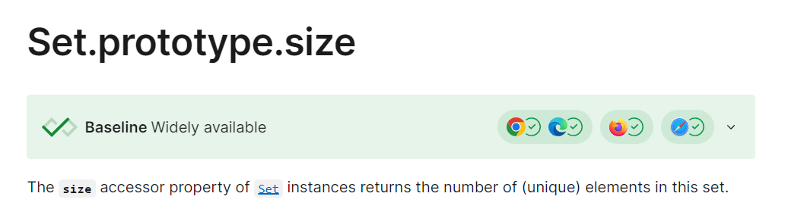

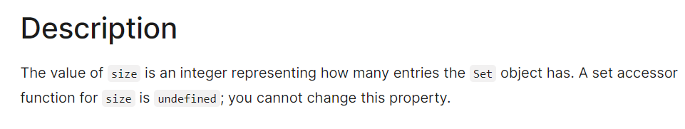

所以我们不能使用这个代理去访问，而是使用 target 访问，所以我们可以做出如下的修改：

```javascript
const s = new Set([1, 2, 3])
const sProxy = new Proxy(s, {
	get(target, key, receiver) {
		// 如果读取的是 size 属性，则 receiver 改为 target
		if (key === 'size') {
			return Reflect.get(target, key, target)
		}
    // 读取其他属性的行为
		return Reflect.get(target, key, receiver)
	}
})

console.log(sProxy.size) // 3
```

那我们来看一下其他行为会不会出现问题，代码如下：

```javascript
const s = new Set([1, 2, 3])
const sProxy = new Proxy(s, {
	get(target, key, receiver) {
		if (key === 'size') {
			return Reflect.get(target, key, target)
		}
		return Reflect.get(target, key, receiver)
	}
})

sProxy.delete(1) // TypeError: Method Set.prototype.delete called on incompatible receiver
```

也抛出了一个错误，这个错误与上一个错误也非常相似，不同的点在于 size 属性是一个访问器属性，因此 sProxy.size 时是会立即触发 getter 的，此时可以通过修改 receiver 来改变 this 指向。

而 sProxy.delete 是一个方法，sProxy.delete 是访问状态，并没有真的执行，只有当 sProxy.delete(1) 才是真正执行了，但是这个执行是外部的用户操作的，因此就算我们一样设置 Reflect.get(target, key, target)，也不行，因为 JavaScript 中 this 的指向通常需要函数调用那一刻才能确定，所以最后还是变成 sProxy 来调用。

找到问题的源头，解决的手段也就呼之欲出了，我们其实只需要改变 this 的指向，而这种改变 this 指向让用户调用这个函数的效果，正好是 bind 方法所具备的，代码如下：

```javascript
const s = new Set([1, 2, 3])
const sProxy = new Proxy(s, {
	get(target, key, receiver) {
		if (key === 'size') {
			return Reflect.get(target, key, target)
		}
		return target[key].bind(target)
	}
})

sProxy.delete(1)
console.log(sProxy) // Set(2) { 2, 3 }
```

此时，我们的代码就可以正常被代理了，当然，我们目前的 get 是还没融入到之前的系统中的，我们也可以将其融入，如下：

```javascript
function baseGet(isShallow, isReadonly) {
	return function get(target, key, receiver) {
		/* ...省略 */

		// 在 Vue 的源码中是没有如此直接判断类型的处理的，而是单独抽到了 collectionHandlers 这个文件里面处理，有兴趣的可以自己去查阅一下
		// 这里我们直接判断类型，来进入单独的分支处理
		if (getValueType(target) === 'Set') {
			if (key === 'size') {
				return Reflect.get(target, key, target)
			}
			return target[key].bind(target)
		}

		const result = Reflect.get(target, key, receiver)
		if (isShallow) return result

		if (typeof result === 'object' && result !== null) {
			return isReadonly ? readonly(result) : reactive(result)
		}
		return result
	}
}
```

此时我们的测试案例就可以写成一个更加简洁的方式，如下：

```javascript
const s = reactive(new Set([1, 2, 3]))
console.log(s.size) // 3
s.delete(1)
console.log(s.size) // 2

const m = reactive(new Map())
m.set('a', 1)
m.set('b', 2)
console.log(m.size) // 2
```

## 建立响应式联系

处理好如何代理之后，那我们是否已经可以进行响应式了呢？我们来看一段案例，如下：

```javascript
const s = reactive(new Set([1, 2, 3]))
effect(() => {
	console.log('effect:', s.size)
})
s.add(4)
```

遗憾的是，这里是无法触发副作用函数的，如图：


我们在前面只是创建了代理，但是并没有收集依赖，所以我们可以进行完善一下，如下：

```javascript
function baseGet(isShallow, isReadonly) {
	return function get(target, key, receiver) {
		/* ...省略 */
    
		if (getValueType(target) === 'Set' || getValueType(target) === 'Map') {
			if (key === 'size') {
				// 收集依赖
				track(target, ITERATE_KEY)
				return Reflect.get(target, key, target)
			}
			return target[key].bind(target)
		}

		const result = Reflect.get(target, key, receiver)
		if (isShallow) return result

		if (typeof result === 'object' && result !== null) {
			return isReadonly ? readonly(result) : reactive(result)
		}
		return result
	}
}
```

这里的 key 之所以使用 ITERATE_KEY，是因为 Set 无论是新增还是删除都会影响 size 属性，收集了响应之后，又应该如何触发呢？按照之前的处理逻辑，add 本身也是一个函数，我们如果想在这里做一些文章的话，只能是在包装一层，从而在我们包装的这一层，来实现我们需要的逻辑，如下：

```javascript
function baseGet(isShallow, isReadonly) {
	return function get(target, key, receiver) {
		/* ...省略 */
    
		if (getValueType(target) === 'Set' || getValueType(target) === 'Map') {
			if (key === 'size') {
				track(target, ITERATE_KEY)
				return Reflect.get(target, key, target)
			}
      // add 如此，那么其他方法也是如此，因此我们单独提出一个对象来处理
			return mutableInstrumetations[key]
		}

		const result = Reflect.get(target, key, receiver)
		if (isShallow) return result

		if (typeof result === 'object' && result !== null) {
			return isReadonly ? readonly(result) : reactive(result)
		}
		return result
	}
}
```

那么我们现在的任务就是完善一下 mutableInstrumetations，如下：

```javascript
const mutableInstrumetations = {
	add(value) {
		// 此时这里 add 方法的 this 依然是 proxy
		//  - 因为外部使用的时候还是通过代理对象调用的 s.add()
		//  - 所以我们要拿到原始对象，通过原始对象调用 add 方法
		const target = this[RAW_KEY]
		// 拿到原始对象之后，也就省去了 bind，直接通过 target.add() 调用即可
		//  - 保存得到的结果
		const result = target.add(value)
		// 触发依赖-指定类型为 ADD
		trigger(target, value, 'ADD')
		return result
	}
}
```

此时再次运行测试案例，结果如图：

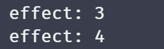

当然，我们这里也还存在优化的地方，比如这个值如果存在了，那么就没有必要再次触发了，如下：

```javascript
const mutableInstrumetations = {
	add(value) {
		const target = this[RAW_KEY]
		const hasKey = target.has(value)
		const result = target.add(value)
		// 不存在则触发 ADD 依赖
		if (!hasKey) {
			trigger(target, value, 'ADD')
		}
		return result
	}
}
```

而在此基础之上，依葫芦画瓢，就可以轻松写出 delete 方法，如下：

```javascript
const mutableInstrumetations = {
	delete(value) {
		const target = this[RAW_KEY]
		const hasKey = target.has(value)
		const result = target.delete(value)
    // 存在才表示正确的删除了，需要触发依赖
		if (hasKey) {
			trigger(target, value, 'DELETE')
		}
		return result
	}
}
```

## 避免污染原始数据

这个概念可能需要我们用一些例子来举例才能理解其具体是什么，在这其中，我们需要用到 Map 数据类型 get 和 set 方法，也同样，我们需要给他建立对应的响应式联系，如下：

```javascript
const mutableInstrumetations = {
	get(key) {
		const target = this[RAW_KEY]
		// 检测是否存在这个 key
		const had = target.has(key)
		// 建立依赖
		track(target, key)
		if (had) {
			// 通过 key 获取值
			const result = target.get(key)
			// 如果是对象，则递归处理
			if (result === 'object' && result !== null) {
				return reactive(result)
			} 
      // 不是则直接返回原始值
      else {
				return result
			}
		}
	}
}
```

但是这里还有一些细节是我们没有处理的，在递归处理这里，还需要考虑是否是只读，是否是浅响应的情况，因此，这个 mutableInstrumetations 对象里面定义的方法就需要拿到这 *isShallow*, *isReadonly* 两个值，来进行后续的逻辑执行，所以需要进行一些改造，如下：

```javascript
const mutableInstrumetations = {
	add() {
		return function (value) {
			const target = this[RAW_KEY]
			const hasKey = target.has(value)
			const result = target.add(value)
			if (!hasKey) {
				trigger(target, value, 'ADD')
			}
			return result
		}
	},
	delete() {
		return function (value) {
			const target = this[RAW_KEY]
			const hasKey = target.has(value)
			const result = target.delete(value)
			if (hasKey) {
				trigger(target, value, 'DELETE')
			}
			return result
		}
	},
	get(isShallow, isReadonly) {
		return function (key) {
			const target = this[RAW_KEY]
			const had = target.has(key)
			track(target, key)
			if (had) {
				const result = target.get(key)
				if (typeof result === 'object' && result !== null) {
					// 这里的逻辑并不需要我们在写一次，在之前就已经处理过了，复用 createReactiveObject 函数即可
					return createReactiveObject(result, isShallow, isReadonly)
				} else {
					return result
				}
			}
		}
	}
}
```

这里利用闭包来实现接收 isShallow, isReadonly 的值进行后续的使用，这里修改了，使用 mutableInstrumetations 的地方也需要相应的修改，如下：

```javascript
function baseGet(isShallow, isReadonly) {
	return function get(target, key, receiver) {
		/* ...省略 */

		if (getValueType(target) === 'Set' || getValueType(target) === 'Map') {
			if (key === 'size') {
				track(target, ITERATE_KEY)
				return Reflect.get(target, key, target)
			}
			// 这里也要更新一下使用方式，将数据传递
			return mutableInstrumetations[key](isShallow, isReadonly)
		}

		/* ...省略 */
	}
}
```

完成了收集依赖的功能之后，我们还需要进行依赖的触发，如下：

```javascript
const mutableInstrumetations = {
  set() {
		return function (key, value) {
			const target = this[RAW_KEY]
			// 检测 key 是否存在
			const had = target.has(key)
			// 获取旧值
			const oldValue = target.get(key)
			// 设置新值
			target.set(key, value)
			// 触发依赖-判断当前 key 是新增还是修改，不存在则表示是新增
			if (!had) {
				trigger(target, key, TriggerType.ADD)
			} else {
				// 两次值存在变化才触发依赖
				if (!Object.is(oldValue, value)) {
					trigger(target, key, TriggerType.SET)
				}
			}
		}
	}
}
```

此时，我们就可以编写一段测试代码进行测试，如下：

```javascript
const m = reactive(new Map([['a', 1]]))
effect(() => {
	console.log('effect:', m.get('a'))
})
m.set('a', 2)
```

结果如图：

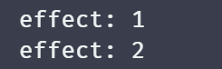

此时问题 set 函数就会存在一个问题，我们来看一下下面这段测试代码：

```javascript
// 原始 map 对象
const m = new Map()
// p1 是 m 的代理对象
const p1 = reactive(m)
// p2 是另一个代理对象
const p2 = reactive(new Map())
// 为 p1 设置一个键值对，值是代理对象 p2
p1.set('p2', p2)

effect(() => {
	// Tip：这里通过原始对象 m 访问 p2，而不是代理对象 p1
	console.log('effect: ', m.get('p2').size)
})

// Tip：这里通过原始对象 m 设置 p2 为一个键值对 foo --> 1
//  - 这里 m.get('p2') 返回的是代理对象 p2(即一个代理好的 map 对象)
m.get('p2').set('foo', 1)
```

我们来运行一下这段测试代码，如图：

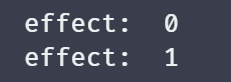

此时我们就发现了问题，我们使用的是一个 m 原始对象，原始对象为什么会关联起来呢？这个行为是不应该的，原始数据如果具备这个行为，则用户既可以操作原始数据又可以操作响应式数据，那么代码的执行就会造成混乱。

而造成这个问题的原因就在于 set 中，我们是直接运行代码 **target.set(key, value)** 将 value 设置到了 target 这个原始数据上面，而我们这种把**响应式数据设置原始数据上的行为叫做数据污染**。

解决这个问题也非常简单，在设置的时候检测是否是一个响应式数据，如果是则在获取一下其原始对象数据即可，如下：

```javascript
const mutableInstrumetations = {
	set() {
		return function (key, value) {
			const target = this[RAW_KEY]
			const had = target.has(key)
			const oldValue = target.get(key)
			// 先获取一下当前 value 的 RAW_KEY 属性是否存在值，存在则表示是代理对象
			const rawValue = value[RAW_KEY] || value
			target.set(key, rawValue)
			if (!had) {
				trigger(target, key, TriggerType.ADD)
			} else {
				if (!Object.is(oldValue, value)) {
					trigger(target, key, TriggerType.SET)
				}
			}
		}
	}
}
```

## 处理 forEach

遍历这个东西我们已经很熟悉了，在这里以 Map 为例，只要可以影响键值对的熟练都应该建立响应式联系，代码如下：

```javascript
const mutableInstrumetations = {
  forEach() {
		return function (callback) {
			const target = this[RAW_KEY]
			// 与 ITERATE_KEY 建立依赖关系
			track(target, ITERATE_KEY)
			// 使用原始对象的 forEach 方法
			target.forEach(callback)
		}
	}
}
```

经过这样处理之后，我们就初步实现了依赖触发，测试代码如下：

```javascript
const m = reactive(new Map([[{ key: 1 }, { value: 1 }]]))
effect(() => {
	console.log('effect')
	m.forEach((value, key) => {
		console.log('value:', value, 'key:', key)
	})
})

m.set({ key: 2 }, { value: 2 })
```

结果如图：

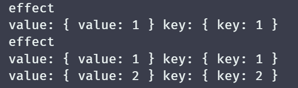

但是目前还是存在一些缺陷，目前我们是直接将 callback 交给原始对象的 forEach 方法，这就将导致回调函数的参数不是一个响应式数据，从而引发下面这个代码无法预期工作：

```javascript
effect(() => {
	console.log('effect')
	m.forEach((v, k) => {
		console.log(v.size)
	})
})

// 没有触发副作用函数执行
m.get(key).add(4)
```

按照预期来说，value(即Set)，添加了一个数据，改变了 size 的值，就应该再次触发副作用函数，所以为了解决这一点，我们需要将 callback 的参数变为响应式数据，如下：

```javascript
const mutableInstrumetations = {
  forEach() {
		return function (callback) {
			const target = this[RAW_KEY]
			// 转为响应式对象
			const wrap = v => {
				if (typeof v === 'object' && v !== null) {
					return reactive(v)
				}
				return v
			}
			track(target, ITERATE_KEY)
			target.forEach((v, k) => {
				callback(wrap(v), wrap(k), this)
			})
		}
	}
}
```

此时就可以触发了，结果如图：

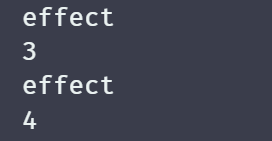

当然，forEach 原本还有第二个参数，在这里我们也需要补上，如下：

```javascript
const mutableInstrumetations = {
  forEach() {
    // 接收第二个参数
		return function (callback, thisArg) {
			const target = this[RAW_KEY]
			// 转为响应式对象
			const wrap = v => {
				if (typeof v === 'object' && v !== null) {
					return reactive(v)
				}
				return v
			}
			track(target, ITERATE_KEY)
			target.forEach((v, k) => {
				callback.call(thisArg, wrap(v), wrap(k), this)
			})
		}
	}
}
```

至此，我们还要一项缺陷没有补充完成，那就是与值的响应式联系，与 for...in 不同，for...in 只关心键的数量，而 map 的forEach 还需要关心值，示例代码如下：

```javascript
const m = reactive(new Map([['key', 1]]))

effect(() => {
	console.log('effect')
	m.forEach((value, key) => {
		console.log(value)
	})
})

m.set('key', 2)
```

此时我们改变了 value，但是并没有触发，而这个操作是属于设置(即 SET)，那么就表示就算是 set 操作也要触发与 ITERATE_KEY 相关联的数据，所以我们需要对 trigger 函数在做一些处理，如下：

```javascript
function trigger(target, key, type, newValue) {
	// 省略代码
  
	if (
		type === TriggerType.ADD ||
		type === TriggerType.DELETE ||
		// 如果操作类型是 SET,且对象是 Map 数据类型，也应该触发 ITERATE_KEY 的副作用函数
		(type === TriggerType.SET && getValueType(target) === 'Map')
	) {
		let iterateDeps = depsMap.get(ITERATE_KEY)
		addEffects(effetsToRun, iterateDeps)
	}

	// 省略代码
}
```

执行结果如图：

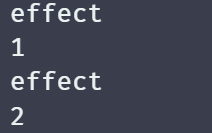

## for...of

这一块涉及的就是迭代器的知识，而且这块的处理与 forEach 都差不多，所以我们就直接写一个初步的方案，如下：

```javascript
const mutableInstrumetations = {
	[Symbol.iterator]() {
		return function () {
			const target = this[RAW_KEY]
			const wrap = v => {
				if (typeof v === 'object' && v !== null) {
					return reactive(v)
				}
				return v
			}
			// 获取原始迭代器方法
			const iterator = target[Symbol.iterator]()

			// 收集依赖
			track(target, ITERATE_KEY)

			// 返回自定义的迭代器
			return {
				next() {
					// 调用原始迭代器的 next 方法，获取 value 和 done
					const { value, done } = iterator.next()
					return {
						// 如果 value 有值，则进行包裹，map数据的 value 是一个数组，数组中的每一项都是 [key, value]
						value: value ? [wrap(value[0]), wrap(value[1])] : value,
						done
					}
				}
			}
		}
	}
}
```

可以看到，整个的过程都是和 forEach 非常的类似的，我们编写一段测试代码，如下：

```javascript
const m = reactive(
	new Map([
		['key1', 'value1'],
		['key2', 'value2']
	])
)

effect(() => {
	console.log('effect')
	for (const [key, value] of m) {
		console.log(key, value)
	}
})

m.set('key3', 'value3')
```

结果如图：

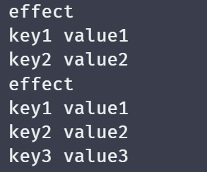

在这里还有个地方需要注意一下，m.entries 方法与 m[Symbol.iterator] 是等价的，所以我们使用同样的代码实现即可，如下：

```javascript
const mutableInstrumetations = {
	[Symbol.iterator]: iterationMethod,
	entries: iterationMethod  
}

// 抽离函数，进行复用
function iterationMethod() {
	return function () {
		const target = this[RAW_KEY]
		const wrap = v => {
			if (typeof v === 'object' && v !== null) {
				return reactive(v)
			}
			return v
		}
		// 获取原始迭代器方法
		const iterator = target[Symbol.iterator]()

		// 收集依赖
		track(target, ITERATE_KEY)

		// 返回自定义的迭代器
		return {
			next() {
				// 调用原始迭代器的 next 方法，获取 value 和 done
				const { value, done } = iterator.next()
				return {
					// 如果 value 有值，则进行包裹，map数据的 value 是一个数组，数组中的每一项都是 [key, value]
					value: value ? [wrap(value[0]), wrap(value[1])] : value,
					done
				}
			}
		}
	}
}
```

那么此时我们来进行一下测试，看一下能否正常使用，如下：

```javascript
const m = reactive(
	new Map([
		['key1', 'value1'],
		['key2', 'value2']
	])
)

// TypeError: m.entries is not a function or its return value is not iterable
for (const [key, value] of m.entries()) {
	console.log(key, value)
}
```

此时代码会进行一个报错，意思为 m.entries 返回的不是一个可迭代对象。通过这个错误我们就可以知道，这个返回的对象具备 next 方法，但是不具备 Symbol.iterator 方法，因此不是一个可迭代对象。

Tip：**可迭代协议**与**可迭代器协议**并不一致，可迭代协议指的是一个对象实现了 Symbol.iterator 方法，而可迭代器协议指的是对象实现了 next 方法，而一个对象是可以同时具备这两者的，例如：

```javascript
const obj = {
  // 迭代器协议
  next(){
    // ...
  },
  // 可迭代协议
  [Symbol.iterator](){
    return this
  }
}
```

根据这个我们就可以解决我们的问题，只需要返回的对象增加一个可迭代协议即可，代码如下：

```javascript
// 抽离函数，进行复用
function iterationMethod() {
	return function () {
		const target = this[RAW_KEY]
		const wrap = v => {
			if (typeof v === 'object' && v !== null) {
				return reactive(v)
			}
			return v
		}
		const iterator = target[Symbol.iterator]()

		track(target, ITERATE_KEY)

		return {
			next() {
				const { value, done } = iterator.next()
				return {
					value: value ? [wrap(value[0]), wrap(value[1])] : value,
					done
				}
			},
			[Symbol.iterator]() {
				return this
			}
		}
	}
}
```

现在执行就不会在抛出错误了。

## values 与 keys 方法

values 方法与 entries 方法的实现也差不多，values 使用 for...of 进行迭代的时候，得到的仅仅是 map 数据的 value，而非与 entries 一样，同时得到 kv。

values 方法实现如下：

```javascript
const mutableInstrumetations = {
  [Symbol.iterator]: iterationMethod,
	entries: iterationMethod,
	values: valuesIterationMethod
}

function valuesIterationMethod() {
	return function () {
		const target = this[RAW_KEY]
		const wrap = v => {
			if (typeof v === 'object' && v !== null) {
				return reactive(v)
			}
			return v
		}
		const iterator = target.values()

		track(target, ITERATE_KEY)

		return {
			next() {
				const { value, done } = iterator.next()
				return {
					// 仅会获取 value，所以只需要针对 value 进行包装
					value: wrap(value),
					done
				}
			},
			[Symbol.iterator]() {
				return this
			}
		}
	}
}
```

keys 的方法也遇 values 实现差不多，如下：

```javascript
const mutableInstrumetations = {
  [Symbol.iterator]: iterationMethod,
	entries: iterationMethod,
	values: valuesIterationMethod,
	keys: keysIterationMethod
}

function keysIterationMethod() {
	return function () {
		const target = this[RAW_KEY]
		const wrap = v => {
			if (typeof v === 'object' && v !== null) {
				return reactive(v)
			}
			return v
		}
    
    // 更换为 keys
		const iterator = target.keys()

		track(target, ITERATE_KEY)

		return {
			next() {
				const { value, done } = iterator.next()
				return {
					value: wrap(value),
					done
				}
			},
			[Symbol.iterator]() {
				return this
			}
		}
	}
}
```

好像看着很完美，但是这里还存在一个缺陷，我们来看下面这个例子，如下：

```javascript
const m = reactive(
	new Map([
		['key1', 'value1'],
		['key2', 'value2']
	])
)

effect(() => {
	console.log('effect')
	for (const key of m.keys()) {
		console.log(key)
	}
})

m.set('key2', 'value2-value2')
```

来看一下执行结果，如图：

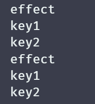

我们只是通过 key 修改了一个值，并没有改动 key 本身啊，按照 keys 方法的语义，我们是不应该再次触发这个副作用函数的，所以我们在这里就要修改一下我们收集依赖的地方，如下：

```javascript
function keysIterationMethod() {
	return function () {
		const target = this[RAW_KEY]
		const wrap = v => {
			if (typeof v === 'object' && v !== null) {
				return reactive(v)
			}
			return v
		}
		const iterator = target.keys()

		// 更改依赖建立关系
		track(target, MAP_KEY_ITERATOR_KEY)

		return {
			next() {
				const { value, done } = iterator.next()
				return {
					value: wrap(value),
					done
				}
			},
			[Symbol.iterator]() {
				return this
			}
		}
	}
}

function trigger(target, key, type, newValue) {
	/* ... */

	// 处理 Map 数据类型的 keys 方法
	if ((type === TriggerType.ADD || type === TriggerType.DELETE) && getValueType(target) === 'Map') {
		// 取得 Map 数据类型的 keys 方法对应的副作用函数
		const iterateEffects = depsMap.get(MAP_KEY_ITERATOR_KEY)
		addEffects(effetsToRun, iterateEffects)
	}

	/* ... */
}
```

我们现在再编写一段测试代码看一下，如下：

```javascript
const m = reactive(
	new Map([
		['key1', 'value1'],
		['key2', 'value2']
	])
)

effect(() => {
	console.log('effect')
	for (const key of m.keys()) {
		console.log(key)
	}
})

m.set('key2', 'value2-value2') // 不可触发响应
m.set('key3', 'value3') // 可触发响应
```

结果如图：

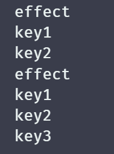