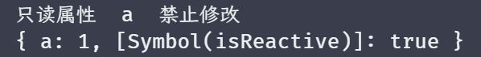
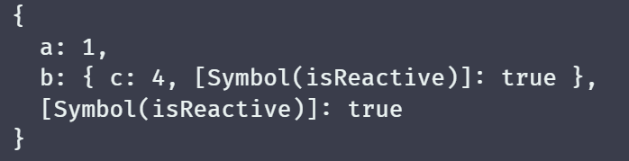
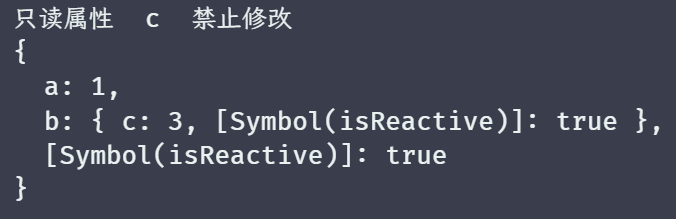

# 实现readonly

> 在某些时候，我们希望定义一些数据是只读的，不允许被修改，从而实现对数据的保护，即为 readonly

只读本质上也是对数据对象的代理，我们同样可以基于之前实现的 createReactiveObject 函数来实现，可以为此函数添加第三个参数 isReadonly，如下：

```javascript
function createReactiveObject(value, isShallow = false, isReadonly = false){}
```

而有了这个参数之后，我们还需要对拦截器进行其他操作，修改或者删除一个对象的属性，都是改变此对象，因此我们需要针对这两个进行拦截，如下：

```javascript
const noWarnKey = [RAW_KEY, IS_REACTIVE, ITERATE_KEY]

// set
function baseSet(isReadonly) {
	return function set(target, key, newVal, receiver) {
		// isReadonly 为 true 时，禁止修改，而一些内部属性则忽略
		if (isReadonly && !noWarnKey.includes(key)) {
			// 并弹出警告
			console.warn('只读属性 ', key, ' 禁止修改')
			return true
		}

		const oldVal = target[key]
		const type = Object.prototype.hasOwnProperty.call(target, key) ? TrggerType.SET : TrggerType.ADD
		const result = Reflect.set(target, key, newVal, receiver)
		if (!result) return
		if (receiver[RAW_KEY] === target) {
			if (!Object.is(oldVal, newVal)) {
				trigger(target, key, type)
			}
		}

		return result
	}
}

// delete
function baseDeleteProperty(isReadonly) {
	return function deleteProperty(target, key) {
		if (isReadonly && !noWarnKey.includes(key)) {
			console.warn('只读属性 ', key, ' 禁止删除')
			return true
		}

		const hadKey = Object.prototype.hasOwnProperty.call(target, key)
		const result = Reflect.deleteProperty(target, key)
		if (hadKey && result) {
			trigger(target, key, TrggerType.DELETE)
		}
		return result
	}
}

// get
function baseGet(isShallow, isReadonly) {
	return function get(target, key, receiver) {
		if (key === RAW_KEY) {
			return target
		}

		// 只有当前的对象是一个非只读数据时，才需要收集依赖
		if (!isReadonly) {
			track(target, key)
		}

		const result = Reflect.get(target, key, receiver)
		if (isShallow) return result
		if (typeof result === 'object' && result !== null) {
			return reactive(result)
		}
		return result
	}
}

function createReactiveObject(value, isShallow = false) {
	if (typeof value !== 'object' || value === null) {
		console.warn('value 必须是一个对象')
		return value
	}
	if (reactiveMap.has(value)) {
		return reactiveMap.get(value)
	}
	if (isReactive(value)) return value

	const proxy = new Proxy(value, {
		get: baseGet(isShallow),
		set: baseSet(isReadonly),
		has,
		ownKeys,
		deleteProperty: baseDeleteProperty(isReadonly)
	})
	proxy[IS_REACTIVE] = true
	reactiveMap.set(value, proxy)
	return proxy
}

function readonly(value) {
	return createReactiveObject(value, false, true)
}
```

现在我们写一段代码进行一下测试：

```javascript
const obj = { a: 1 }
const r1 = readonly(obj)
r1.a++

console.log(r1)
```

结果如图：



不过目前还存在一个问题，目前的只读只能处理成浅响应，案例如下：

```javascript
const obj = {
	a: 1,
	b: {
		c: 3
	}
}
const r1 = readonly(obj)
r1.b.c++

console.log(r1)
```

测试结果如图：



我们虽然在创建 readonly 函数时，给 createReactiveObject 的第二个参数是 false，表示是深响应的，但从结果可以看到，没有被拦截，而且依然被修改了。

所以按照之前的经验，如果要深处理，就直接进行递归处理即可，所以我们可以进行如下修改：

```javascript
function baseGet(isShallow, isReadonly) {
	return function get(target, key, receiver) {
		if (key === RAW_KEY) {
			return target
		}

		// 只有当前的对象是一个非只读数据时，才需要收集依赖
		if (!isReadonly) {
			track(target, key)
		}

		const result = Reflect.get(target, key, receiver)
		if (isShallow) return result

		// 在此处进行递归处理
		if (typeof result === 'object' && result !== null) {
			// 若开启了只读，则使用 readonly 函数包装结果，实现递归处理每一层
			return isReadonly ? readonly(result) : reactive(result)
		}
		return result
	}
}
```

我们在使用之前的测试案例，执行 r1.b.c++ ，来查看一下结果，如图：



而如果要实现浅响应，那就更加简单了，如下：

```javascript
function shallowReadonly(value) {
	// 只需要将 isShallow 设置为 true 即可，表示只处理第一层
  // - 设置 isShallow 为 true 后，在 get 中，就会直接返回这个属性的原有的值，不做代理、只读或者其他处理
	return createReactiveObject(value, true, true)
}
```

