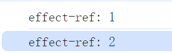

# 原始值的响应式方案-ref

## 引入 ref

在之前实现的 reactive 方法，其代理的目标必须是一个非原始值才行，例如：

```javascript
let str = 'vue'
// 无法拦截 str 的修改
str = 'vue3'
```

上述这个例子表达的意思就是，我们还缺少一个能够对原始值实现响应式数据的手段。

对于这个问题，基于现有的 reactive 就一定毫无办法吗，其实也不尽然，也有一些曲线救国的手段，如下：

```javascript
const wrapper = {
  value: 'vue'
}

// 使用 proxy 代理 wrapper，间接实现对原始值的拦截
const name = reactive(wrapper)
name.value // vue
// 修改值-触发响应拦截
name.value = 'vue3'
```

这样确实是可以进行拦截，但是它存在两个问题：

- 用户为了创建一个响应式对象的原始值，不得不顺带创建一个包裹对象，使用不方便
- 包裹对象由用户定义，而这意味着不规范，用户可以随意命名，例如：wrapper.value、wrapper.v、wrapper.v，甚至如果用户愿意，可以写成语义错乱的情况，比如：wrapper.size。

而为了解决以上两个问题，我们需要封装一个函数，来进行规范，如下：

```javascript
// 封装一个 ref 函数
function ref(val){
  // 在 ref 函数内创建包裹对象
  const wrapper = {
    value: val
  }
  // 将包裹对象变成响应式数据
  return reactive(wrapper)
}
```

这样就解决了上述的两个问题，我们来添加一段测试代码如下：

```javascript
const refVal = ref(1)

effect(() => {
  console.log('effect-ref:', refVal.value)
})

refVal.value++
```

结果如图：



这段代码可以按照我们预期的工作，他还存在诸多的问题，第一个面临的就是如何区分这是一个 ref 对象，即如何区分 refVal 到底是原始值的包裹对象，还是一个非原始值的响应式数据，如如下代码所示：

```javascript
const refVal1 = ref(1)
const refVal2 = reactive({value: 1})
```

如果放入 effect 函数中执行，这两个代码都是一样的效果。但是我们有必要区分一个数据到是是不是 ref，因为这对于后续的自动脱 ref 能力至关重要。

而想区分也并不难，在 reactive 中我们是在 get 拦截器中通过一个内置的 Symbol 为 key 来实现的，这里我们可以使用类似的方式，不过由于没有使用代理，我们可以使用 Object.defineProperty，如下：

```javascript
function ref(val) {
  const wrapper = {
    value: val
  }

  // 添加一个特殊属性，用于标识这个对象是否是一个 ref 对象
  //  - 且这个属性是不可枚举的，防止被遍历到
  Object.defineProperty(wrapper, '__v_isRef', {
    value: true
  })

  return reactive(wrapper)
}
```

通过这个属性就可以实现是否是一个 ref 对象

## 解决响应丢失的问题

ref 除了能够用于原始值的响应式方案之外，还可以用来解决响应式丢失的问题，首先，我们来看一下什么叫响应式丢失，在编写 vue.js 组件时，我们通常把数据暴露到模板中使用，例如：

```javascript
export default {
  setup(){
    // 响应式数据
    const obj = reactive({ foo: 1, bar: 2 })
    
    // 将数据暴露到模板中
    return {
      ...obj
    }
  }
}
```

然后在模板中可以访问从 setup 中暴露的数据，如下：

```html
<template>
	<p> {{ foo }} / {{ bar }} </p>  
</template>
```

然而，这样书写就会失去响应式，当我们修改数据时，不会触发渲染，这是为什么？因为我们使用了展开运算符，而经过展开之后，等价于：

```javascript
return {
  foo: 1,
  bar: 2
}
```

而这，就是一个普通对象，自然不具备响应式能力，我们也可以通过我们熟悉的 effect 案例来描述这个例子，如下：

```javascript
const obj = reactive({ foo: 1, bar: 2 })

// 将响应式数据战展开到一个新的对象 newObj
const newObj = {
  ...obj
}

effect(()=>{
  // 在副作用函数内使用新的对象 newObj 读取 foo 属性值
  console.log(newObj.foo)
})

// 修改-无法触发响应
obj.foo = 100
```

如何解决这个问题呢？或者说：在副作用函数中，即时通过普通对象 newObj 来访问属性值，也能够建立响应联系，如下：

```javascript
const obj = reactive({ foo: 1, bar: 2 })

// newObj 具备 obj 的同名属性，并且每个属性值都是一个对象，这个对象具备一个访问器属性 value，当读取 value 属性，其实读取的就是 obj 下对应的属性值
const newObj = {
  foo: {
    get value(){
      return obj.foo
    }
	},
  bar: {
    get value(){
      return obj.bar
    }
	}
}

effect(()=>{
  console.log(newObj.foo)
})

// 可以触发响应
obj.foo = 100
```

这样就可以实现响应的触发了，仔细观察就不难发现 foo 和 bar 的处理都是一致的，对于这种我们可以通过封装一个函数来提高效率，如下：

```javascript
function toRef(obj, key) {
  const wrapper = {
    get value() {
      return obj[key]
    }
  }

  return wrapper
}
```

有了这个函数之后，我们的 newObj 就可以大大简化了，如下：

```javascript
const newObj = {
  foo: toRef(obj, 'foo'),
  bar: toRef(obj, 'bar')
}
```

但是如果这样 foo 的属性非常多，处理起来也显得麻烦，我们可以在编写一个 toRefs 函数来完成，如下：

```javascript
function toRefs(obj) {
  const ret = {}
  // 遍历对象中的每一个属性
  for (const key in obj) {
    // 调用 toRef 函数完成转换
    ret[key] = toRef(obj, key)
  }
  return ret
}
```

现在，我们的使用会更加的简洁，如下：

```javascript
const newObj = { ...toRefs(obj) }
```

而由上述可得 toRef 会将一个数据转为 ref 数据，所以还需要为 toRef 函数补充一点，如下：

```javascript
function toRef(obj, key) {
  const wrapper = {
    get value() {
      return obj[key]
    }
  }

  // 添加一个特殊属性，用于标识这个对象是否是一个 ref 对象
  //  - 且这个属性是不可枚举的，防止被遍历到
  Object.defineProperty(wrapper, '__v_isRef', {
    value: true
  })

  return wrapper
}
```

此时的 toRef 还只是只读的，因此我们还需要为其加上 setter，如下：

```javascript
function toRef(obj, key) {
  const wrapper = {
    get value() {
      return obj[key]
    },
    // 允许设置值
    set value(val) {
      obj[key] = val
    }
  }

  Object.defineProperty(wrapper, '__v_isRef', {
    value: true
  })

  return wrapper
}
```

## 自动脱 ref

toRefs 解决了响应式丢失问题，也带了新的问题，由于 toRefs 会把第一层属性值转为 ref，因此必须通过 value 属性来访问，这样就会导致用户的心智负担，如下：

```html
<!-- good -->
<div>{{ foo }} / {{ bar }}</div>

<!-- bad -->
<div>{{ foo.value }} / {{ bar.value }}</div>
```

因此，我们需要脱 ref 能力，所谓自动脱 ref，就是指的属性访问行为，即 ref 数据无需通过 xx.value 来访问。

而实现这个功能其实也不难，如下：

```javascript
function proxyRefs(target) {
  return new Proxy(target, {
    get(target, key, receiver) {
      const value = Reflect.get(target, key, receiver)
      // 自动脱 ref 实现：如果 value 是一个 ref 对象，则返回它的 value 属性
      return isRef(value) ? value.value : value
    }
  })
}
```

可以看到，我们利用 proxy 的 get 拦截器作为插入代码逻辑的地方，在这里我们通过判断一个值是否是 ref 数据，如果是在自动的在这里读取 refVal.value。

而实际上，在编写 vue.js 组件的时候，组件中的 setup 函数所返回的数据会传递给 proxyRefs 来处理：

```javascript
const myComp = {
  setup(){
		const count = ref(0)
    // 返回的这个对象会交给 proxyRefs 来处理
    return { count }
  }
}
```

这样在模板中，我们就无需通过 xx.value 来访问属性值。而可以读取，自然也需要添加修改，如下：

```javascript
function proxyRefs(target) {
  return new Proxy(target, {
    get(target, key, receiver) {
      const value = Reflect.get(target, key, receiver)
      return isRef(value) ? value.value : value
    },
    set(target, key, newValue, receiver) {
      const oldValue = target[key]
      // 如果是 ref，则设置其对应的 value 属性值
      if (isRef(oldValue)) {
        oldValue.value = newValue
        return true
      }
      return Reflect.set(target, key, newValue, receiver)
    }
  })
}
```

有了自动脱 ref 的能力之后，就可以降低用户在使用时的心智负担，无需关心那个属性是 ref 那个属性是普通数据或者是 reactive。