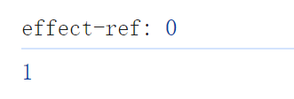
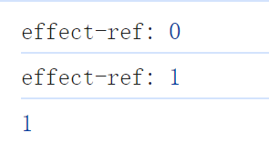

# 实现 ref
> 在上一节中，我们初步实现了一个 ref，可以使用，但是实现结构不够好，本节我们仿照 Vue3 源码重新实现一下

创建 ref 方法，如下：

```javascript
function ref(value) {
  return createRef(value)
}
```

可能注意到了，这里并没有直接和上一节一样，在 ref 直接编写逻辑，而是通过 createRef 这个函数来返回一个 ref 数据，这是因为后续会进行深浅响应，多做了一层处理，与之前实现的 reactive 的深浅响应是类似的，那么按照这个说法，createRef 将具备两个参数，如下：

```javascript
function createRef(rawValue, isShallow) {}
```

那这个 createRef 方法里面具体如何实现呢？按照我们上一节的分析，第一步是要进行判断这个数据是不是一个 ref 数据，如果是，则将其直接返回，因此我们需要一个 isRef 方法，如下：

```javascript
const IS_REF = Symbol('__v_isRef__')

function isRef(ref) {
  return !!ref[IS_REF]
}
```

这里出于严谨考虑，并没有采用上一节的，直接使用一个字符串，而是换成了 symbol，当然，目前这里只有根据标识符判断，而没有添加，稍后会进行添加。

当我们具备 isRef 方法时，就可以将其加入到 createRef 方法中，如下：

```javascript
function createRef(rawValue, isShallow) {
  if (isRef(rawValue)) {
    return rawValue
  }
}
```

现在我们就可以来进行实际的 ref 数据创建，在 Vue3 中，针对 ref 数据的创建，使用的是 class 实现的，因此我们需要具备一个能够生成 ref 示例的类，如下：

```javascript
class RefImpl {
  constructor(rawValue, isShallow) {
    // 保存原始值
    this._rawValue = rawValue
    // 添加判断是否是 ref 数据标识
    this[IS_REF] = true
  }
}

function createRef(rawValue, isShallow) {
  if (isRef(rawValue)) {
    return rawValue
  }
  // 返回 ref 实例
  return new RefImpl(rawValue, isShallow)
}
```

在上面的代码中，我们不难发现，我们只是保存了原始值，但是没有实现真正用于使用的 value 值，例如 computed 内部的 value。

这个 ref 内部的 value 的值需要根据 isShallow 来进行判断，因为我们还会实现一个 shallowRef 方法，来作为浅层次的 ref，浅层 ref 的内部值将会原样存储和暴露，并且不会被深层递归地转为响应式。只有对 `.value` 的访问是响应式的，例如：

```javascript
const state = shallowRef({ count: 1 })

// 不会触发更改
state.value.count = 2

// 会触发更改
state.value = { count: 2 }
```

根据这个分析，我们对于使用的 value 值也就不难实现了，如下：

```javascript
class RefImpl {
  constructor(rawValue, isShallow) {
    this._rawValue = rawValue
    this._isShallow = isShallow
    // 如果是浅层响应式，则直接返回原始值
    this._value = isShallow ? rawValue : toReactive(rawValue)
    this[IS_REF] = true
  }
}
```

可以看到，我们这里会通过一个 toReactive 方法对深层次的 ref 进行响应式处理，这个函数的实现也很简单，如下：

```javascript
function toReactive(value) {
	return isObject(value) ? reactive(value) : value
}
```

当然这个方法，是放在 reactive 模块中的，这里我就不展示模块之间的联系了。

现在我们已经完成了 ref 的基本骨架，接下来要完成的就是实现访问器属性 value，在使用 refVal.value 时读取数据时，进行拦截，如下：

```javascript
class RefImpl {
  constructor(rawValue, isShallow) {
    this._rawValue = rawValue
    this._isShallow = isShallow
    this._value = isShallow ? rawValue : toReactive(rawValue)
    this[IS_REF] = true
  }

  get value() {
    return this._value
  }
}
```

那我们来看一下是否可以真的访问到，测试代码如下：

```javascript
const count = ref(0)
// 正常访问
console.log(count.value) // 0
```

那我们在完成一个 setter 方法，看看是否能够就实现响应式，如下：

```javascript
class RefImpl {
  constructor(rawValue, isShallow) {
    this._rawValue = rawValue
    this._isShallow = isShallow
    this._value = isShallow ? rawValue : toReactive(rawValue)
    this[IS_REF] = true
  }

  get value() {
    return this._value
  }

  set value(newValue) {
    // 如果新值和旧值相等，则不进行更新
    if(!hasChanged(this._value, newValue)) return
    // 更新原始值
    this._rawValue = newValue
    // 更新响应式值
    this._value = this._isShallow ? newValue : toReactive(newValue)
  }
}
```

测试如下：

```javascript
const count = ref(0)

effect(() => {
  console.log('effect-ref:', count.value)
})

count.value = 1
console.log(count.value)
```

结果如图：



可以看到，值虽然发生改变了，但是没有进行依赖触发，这是因为在上一节我们是直接使用了 reactive，所以本身就已经了响应式逻辑了，无须我们额外处理，而这里我们是没有进行依赖的收集和派发的，那我们先创建一个依赖收集函数，如下：

```javascript
function trackRefValue(refIns) {
  if (activeEffect) {
    const deps = refIns.deps || (refIns.deps = new Set())
    trackEffects(deps)
  }
}

function trackEffects(deps) {
  deps.add(activeEffect)
  // 将依赖集合 deps 加入到当前激活的 effect 函数的 depSetList 中
  activeEffect.depSetList.push(deps)
}

class RefImpl {
  // 省略部分代码

  get value() {
    // 收集依赖
    trackRefValue(this)
    return this._value
  }

 	// 省略部分代码
}
```

这里对于 trackRefValue 函数可能存在一些不好理解的地方，首先这里没有之前那样直接通过 target 和 key 来建立依赖，但是也是隐式的遵守了这个规则，我们不防来解析一下这个过程：

1. 当 count.value 被读取时，触发 trackRefValue 函数进行依赖收集
2. 此时 this 表示这个当前 ref 数据的 ref 实例，且这个实例身上肯定没有 deps 属性，因此会将 deps 初始化为一个空的 Set 集合
3. trackEffects 执行的时候，就会将当前激活的 activeEffect 加入到这个 deps 中，activeEffect.depSetList.push(deps) 则是为了处理上一次的旧依赖，这一点翻阅前面的章节即可
4. 换而言之，这里并没有把 ref 的依赖放入一个 targetMap 数据中，而是将其保存到了当前的 ref 实例中，即 this.deps

所以知道了依赖的存放只处，那么剩下的只是在需要派发更新的时候，将这些依赖重新执行即可，如下：

```javascript
function triggerRefValue(refIns) {
  if (refIns.deps) {
    // 重新构造依赖集合，防止触发 delete 操作之后立马执行 add 操作，导致无限循环
    const deps = new Set(refIns.deps)
    triggerEffects(deps)
  }
}

function triggerEffects(effetsToRun) {
  if (effetsToRun) {
    effetsToRun.forEach(effect => {
      triggerEffect(effect)
    })
  }
}

class RefImpl {
  // 省略部分代码

  set value(newValuefunction triggerEffects(effetsToRun) {
  if (effetsToRun) {
    effetsToRun.forEach(effect => {
      triggerEffect(effect)
    })
  }
}) {
    if (!hasChanged(this._value, newValue)) return
    this._rawValue = newValue
    this._value = this._isShallow ? newValue : toReactive(newValue)
    // 触发依赖
    triggerRefValue(this)
  }
}
```

此时我们再来看一下测试的结果，如图：



此时就可以正常的触发依赖了。

至于 shallowRef 实现起来就很简单了，如下：

```javascript
function shallowRef(value) {
  return createRef(value, true)
}
```

