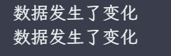

# 实现watch

> watch 本质上就是监听一个响应式数据，这个响应式数据发生变化的时候，进行通知并触发相应的回调函数。

## 初步实现 watch 的监听和新旧值获取

在实现之前，我们看一下 watch 的基本使用，如下：

```javascript
watch(obj, () => {
  console.log('数据发生变化了')
})

obj.a++
```

假设 obj 是一个响应式数据的话，那么 obj.a++ 执行之后，就会触发回调。

要实现这一点，我们只需要利用 effect 和 options.scheduler 即可，代码如下：

```javascript
effect(
  () => {
    objProxy.a
  },
  {
    scheduler() {
      console.log('数据发生了变化')
    }
  }
)

objProxy.a++
```

在一个副作用函数中访问了 a，那么当 a 变化的时候，自然就会触发这个调度器，而尽然可以控制这个数据更新后副作用函数执行的时机，就可以控制watch 回调的执行时机，我们就可以得出如下代码：

```javascript
function watch(source, cb) {
  effect(
    () => {
      source.a
    },
    {
      scheduler() {
        // 调用回调
        cb()
      }
    }
  )
}

watch(objProxy, () => {
  console.log('数据发生了变化')
})

objProxy.a++
```

但是这里我们是把访问 a 直接写死的，是一种硬编码，objProxy 其他属性就无法监听到了，所以我们需要做一下处理，自动实现这个对象上的属性读取，代码如下：

```javascript
const obj = { a: 1, b: 2 }
const objProxy = new Proxy(obj /* ... */)

function traverse(value, seen = new Set()) {
  // 如果当前 value 是原始值或者已经读取过了，则不在做处理
  if (typeof value !== 'object' || value === null || seen.has(value)) return
  // 加入到 seen 中，表示已经读取过了
  seen.add(value)

  // * 这里暂时不考虑数组的情况
  // 假设 value 是一个对象，使用 for...in 循环遍历 value 对象
  for (const key in value) {
    // value[key] 就已经进行了一个读取行为
    //  - 同时递归调用，处理深层次的对象
    traverse(value[key], seen)
  }

  // 返回 value，可以当做 getter 函数的返回值
  return value
}

function watch(source, cb) {
  effect(
    () => {
      return traverse(source)
    },
    {
      scheduler() {
        cb()
      }
    }
  )
}

watch(objProxy, () => {
  console.log('数据发生了变化')
})

objProxy.a++
objProxy.b++
```

此时按照预期，应该会触发两次，我们执行查看一下结果，如图：



而 watch 的 source 参数除了可以传一个响应式数据之外，还可以传递一个 getter，所以，我们要对这个 source 参数进行参数归一化，代码如下：

```javascript
function watch(source, cb) {
  let getter
  // 如果 source 是一个函数，则直接赋值给 getter
  if (typeof source === 'function') {
    getter = source
  }
  // 不是函数的话，则作为对象处理，调用 traverse 函数进行递归遍历
  else {
    getter = () => traverse(source)
  }
  effect(getter, {
    scheduler() {
      cb()
    }
  })
}
```

此时，就对 watch 函数的使用变得更加通用了，现在 watch 还缺少了一个重要的功能，就是在回调触发的时候，获取新旧值，要实现这一点，就需要利用上 lazy 选项，代码如下：

```javascript
function watch(source, cb) {
  let getter
  if (typeof source === 'function') {
    getter = source
  } else {
    getter = () => traverse(source)
  }
  let oldValue, newValue
  // 开启 lazy 选项-可以实现外部手动调用副作用函数，且调用得到的返回值就是 getter 函数的返回值
  const effectFn = effect(getter, {
    lazy: true,
    scheduler() {
      // 触发调度器时，表示数据更新了，此时可以通过再次调用 effectFn 得到新值
      newValue = effectFn()
      // 传递新旧值
      cb(newValue, oldValue)
      // 将本次的新值作为下一次的旧值
      oldValue = newValue
    }
  })
  // 手动调用一次，拿到初始值，作为旧值
  oldValue = effectFn()
}

/* ... */

watch(
  () => objProxy.a,
  (newValue, oldValue) => {
    console.log('数据发生了变化: ', newValue, oldValue)
  }
)

objProxy.a++
```

结果如图：


## 深度监听

其实这一点我们已经实现了，上述中我们的 traverse 本身便是深度的递归，所以我们只需要简单的处理一下即可完成这个选项，代码如下：

```javascript
let getter
if (typeof source === 'function') {
  getter = source
} else {
  getter = () => {
    // 根据传递选项来判断是否进行递归读取
    if (options.deep) {
      return traverse(source)
    } else {
      // 直接只遍历一层即可
      for (const key in source) {
        source[key]
      }
      // 返回source本身
      return source
    }
  }
}
```

当然，为了直观的展示变化，这里只展示了变动的一部分代码，或者也可以对 traverse 进行增强，可以实现服用。

## watch 的立即执行和回调执行时机

在默认情况下，watch 函数只有在监听的响应式数据发生变化时才会触发回调，在 Vue 中，可以通过指定第三个参数的选项 immediate 为 true 实现 watch 函数在创建时立即执行一次。

立即执行一次是触发回调，而数据变化也是执行回调，所以本质都是执行这个调度器，所以我们可以把调度器这块的逻辑单独创建一个函数，进行复用即可，代码如下：

```javascript
function watch(source, cb, options = {}) {
  let getter
  if (typeof source === 'function') {
    getter = source
  } else {
    getter = () => traverse(source)
  }

  let oldValue, newValue

  // 把 scheduler 提取出来
  const job = () => {
    newValue = effectFn()
    cb(newValue, oldValue)
    oldValue = newValue
  }

  const effectFn = effect(getter, {
    lazy: true,
    // 将job作为调度器函数
    scheduler: job
  })

  if (options.immediate) {
    // 立即执行一次
    job()
  } else {
    oldValue = effectFn()
  }
}

watch(
  () => objProxy.a,
  (newValue, oldValue) => {
    console.log('数据发生了变化: ', newValue, oldValue)
  },
  {
    immediate: true
  }
)
```

此时，我们查看一下输出的结果，如图：


旧值为 undefined 也是正常的，因为是立即执行，所以也就不存在旧值。

而除了立即执行之外，还可以通过其他选项参数来指定回调函数的执行时机，如在 vue3 中可以使用 flush 来指定，flush 的可设置的值有 'pre'、'post'、'sync'。

为 post 时，则会将回调加入到一个微队列中，需要等待 DOM 更新结束之后再执行，因此我们可以在调度器执行的时候，单独处理为 post 时的逻辑，代码如下：

```javascript
function watch(source, cb, options = {}) {
  let getter
  if (typeof source === 'function') {
    getter = source
  } else {
    getter = () => traverse(source)
  }

  let oldValue, newValue

  const job = () => {
    newValue = effectFn()
    cb(newValue, oldValue)
    oldValue = newValue
  }

  const effectFn = effect(getter, {
    lazy: true,
    scheduler: () => {
      // 为 post 时，放到微任务队列中执行
      if (options.flush === 'post') {
        // 手动创建一个微任务
        const p = Promise.resolve()
        p.then(job)
      } else {
        job()
      }
    }
  })

  if (options.immediate) {
    job()
  } else {
    oldValue = effectFn()
  }
}
```

通过这个拦截，就可以当为 post 时，将回调的执行推入微队列，而直接直接执行 job 本质上而言，就等于 sync 的同步执行，而 pre 则需要在组件的更新之前调用，这里暂时没有组件，就不做处理。

## 过期的副作用

我们先看一段示例代码：

```javascript
watch(obj, async () => {
  const resp = await axios.get('/api/book')
  tableData = resp
})
```

这段代码可能会发生一个竞态问题，例如，我们修改了 obj 属性的值，触发回调，发送了第一个请求 A，那么在请求 A 结果返回之前，又修改了 obj 属性的值，发送了第二个请求 B，而恰好请求 B 的耗时返回更短，进行了返回，然后才返回 A，那么此时 tableData 的值就是请求 A 的响应结果，而我们需要的是 B 的响应结果，所以请求 A 就是一个过期的副作用，请求 A 得到的结果应该是无效的。

那这个问题 Vue 是如何解决的，我们看一段示例代码，如下：

```javascript
watch(obj, async (newVal, oldVal, onInvalidate) => {
  // 表示是否过期
  let expired = false
  // 注册一个过期的回调
  onInvalidate(() => {
    // 过期时，修改 expired 为 true
    expired = true
  })
  const resp = await axios.get('/api/book')
  // 只有没有过期，才会进行赋值
  if (!expired) {
    tableData = resp
  }
})
```

那 Vue 是如何实现这一点的呢？我们看一眼如下的代码：

```javascript
function watch(source, cb, options = {}) {
  let getter
  if (typeof source === 'function') {
    getter = source
  } else {
    getter = () => traverse(source)
  }

  let oldValue, newValue

  // 存储用户注册的过期回调函数
  let cleanup

  const onInvalidate = fn => {
    cleanup = fn
  }

  const job = () => {
    newValue = effectFn()
    // 调用回调之前，先检测是否有注册过期回调函数，如果有则先执行
    if (cleanup) {
      cleanup()
    }
    cb(newValue, oldValue, onInvalidate)
    oldValue = newValue
  }

  const effectFn = effect(getter, {
    lazy: true,
    scheduler: () => {
      if (options.flush === 'post') {
        const p = Promise.resolve()
        p.then(job)
      } else {
        job()
      }
    }
  })

  if (options.immediate) {
    job()
  } else {
    oldValue = effectFn()
  }
}
```

这个实现是不是非常的简单，在 watch 函数中定义一个 cleanup 变量，存储一下注册的过期回调函数，这个函数怎么来就取决于用户调用 onInvalidate 参数的结果，第一次执行时，触发回调 job，此时 cleanup 为 undefined，则不会发生调用，而 cb 的执行，会注册一个 `()=> expired = true` 的过期函数，并赋值给 cleanup，然后请求 A 发送，等待响应结果，等待期间当 obj 再次改变时，第二次执行回调，即 job，此时就会调用 cleanup 这个函数，而这个函数会将第一执行时，watch 的回调里面的 expired 改变状态，设置为过期，自然第一次的请求响应结果就不会被正常使用，后续如果发生第三次执行，也是依次类推，始终保证最后一个请求是有效的，之前的都是过期的。

我们添加一段测试代码来测试一下，代码如下：

```javascript
// ***** 模拟测试 *****
let count = 0
watch(
  () => objProxy.a,
  (newValue, oldValue, onInvalidate) => {
    count++

    const _count = count

    let expired = false

    onInvalidate(() => {
      expired = true
    })

    // 模拟请求
    setTimeout(() => {
      if (!expired) {
        console.log(`请求${_count}-结束了-正常赋值`)
      } else {
        console.log(`请求${_count}-结束了-过期了`)
      }
    }, 5000 - count * 1000)
  }
)

// 触发第一次
objProxy.a++
// 触发第二次
objProxy.a++
```

这里我就没有采用正式的 api 请求了，而是采用了一个定时器来模拟结果，如图：


可以看到，是我们所预期的结果，第二个请求先返回，正常使用，第一个请求也返回了，但是过期了不会使用。