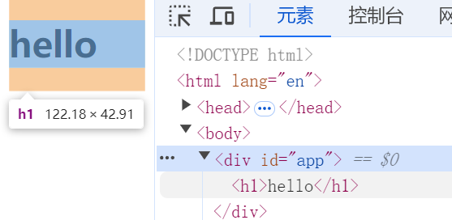

# 渲染器的设计
## 渲染器与响应式系统的结合
渲染器与响应式系统是相辅相成的，渲染器负责将响应式系统中的响应式数据渲染到视图中，而响应式系统则负责监听数据的变化并通知渲染器进行更新。

渲染器在浏览器平台中，用它渲染其中的真实 DOM 元素，渲染器不仅能够渲染真实 DOM 元素，它还是 Vue 框架能实现跨平台的关键。

目前我们不考虑跨平台，限定在浏览器中，我们可以先写个简单的渲染器，如下：

```javascript
function renderer(domString, container){
  container.innerHTML = domString
}
```

使用如下：

```javascript
renderer(`<div>hello world</div>`, document.querySelector('#app'))
```

这就是一个标准的渲染器实现，它会将获取的 dom 作为容器，并设置他的 html。

而如果搭配响应系统则可以实现数据更新重新渲染视图，如下：

```javascript
const count = ref(0)
effect(()=>{
  renderer(`<div>{{count.value}}</div>`, document.querySelector('#app'))
})
count.value++
```

## 渲染器的基本概念

通常使用 renderer 表示**渲染器**，而将 render 表示**渲染**。

渲染器的作用就是把虚拟 DOM 渲染为特定平台上的真实元素，在浏览器平台上，就是渲染真实的 DOM 元素。

虚拟 DOM 通常用英文 virtual DOM 来表示，简写：vdom。虚拟 DOM 和真实 DOM 结构一样，都是由一个个节点组成的树形结构，所以我们也会经常听到“虚拟节点”这样的词汇，即 virtual node，简写：vnode。这棵树中的任何一个 vnode 都可以是一颗子树，因此 vnode 和 vdom 有时可以替换使用，为了避免造成困惑，后续统一采用 vnode 的说法。

渲染器把虚拟 DOM 节点渲染为真实 DOM 节点的过程叫做**挂载**，通过使用英文 mount 表示。

渲染器把真实 DOM 挂载到哪里？其实渲染器本身并不知道应该吧真实 DOM 挂载到哪里。因此渲染器通常还需要接收一个挂载点作为参数，即容器(container)。

我们使用代码的形式表达这个渲染器，如下：

```javascript
function createRenderer(){
  function render(vnode, container){
    // ...
  }
  
  return render
}
```

这里来解释一下为什么需要 createRenderer，而不是直接定义 render 即可。

在前面我们提到，渲染器和渲染不是一个概念，渲染器是更加宽泛的概念，它包含渲染，渲染器不仅可以用来渲染，还可以用来激活已有的 DOM 元素，这个过程通常发生在同构渲染的情况下，例如：

```javascript
function createRenderer(){
  function render(vnode, container){
    // ...
  }
  
  function hydrate(vnode, container){
    // ...
  }
  
  return {
    render,
    hydrate
  }
}
```

可以看到，这里又额外多了一个 hydrate，在 vue 中，hydrate 是关于服务端渲染的。通过这个案例可以表明，渲染器的案例是非常宽泛的。其中把 vnode 渲染为真实 DOM 的 render 函数只是其中的一部分。在 vue.js3 中，创建应用的 createApp 函数也是渲染器的一部分。

当有了这个渲染器之后，我们就可以用它来执行渲染任务了，如下：

```javascript
const renderer = createRenderer()
// 首次渲染
renderer.render(vnode, document.querySelector('#app'))
```

在上面这段代码中，我们首先调用 createRenderer 创建了一个渲染器，然后使用 renderer.render 函数来执行渲染。当首次调用 renderer.render 函数时，只需要创建新的 DOM 元素即可，这个过程只涉及挂载。

而当多次在同一个 container 上调用 renderer.render 函数进行渲染时，渲染器除了要执行挂载的动作为之外，还需要执行更新操作，例如：

```javascript
const renderer = createRenderer()
// 首次渲染
renderer.render(oldVnode, document.querySelector('#app'))
// 第二次渲染
renderer.render(newVnode, document.querySelector('#app'))
```

如上面的代码所示，当首次渲染已经将 oldVnode 挂载到 container 内了，当再次调用 // 首次渲染
renderer.render 函数并尝试渲染 newVnode 时，就不能在简单的执行挂载操作，这种全量更新时非常的消耗性能的。这种情况下，渲染器会使用 newVnode 与上一次的 oldVnode 进行比较，试图找到并更新变更点，这个过程叫做“打补丁(或更新)”，英文通常使用 patch 来表示，实际上，挂载的动作也可以看做为一种特殊的打补丁，它的特殊之处就在于旧的 vnode 是不存在的，代码示例如下：

```javascript
function createRenderer(){
  function render(vnode, container){
    if(vnode){
			// 新 vnode 存在，将其与旧 vnode 一起传递给 patch 函数，进行打补丁
			patch(container._vnode, vnode, container)   
    } else {
    	if(container._vnode){
      	// 旧的 vnode 存在，且新的 vnode 不存在，则表示是卸载（unmount）操作
        // 只需要将 container 内的 dom 清空即可
        container.innerHTML = ''
    	}
  	}
    // 把 vnode 存储到 container._vnode 下，即后续渲染中的旧 vnode
    container._vnode = vnode
  }
  
  return {
    render
  }
}
```

根据这段代码中 render 函数的基础实现，我们可以配合下面的代码分析其执行流程，如下：

```javascript
const renderer = createRenderer()
// 首次渲染
renderer.render(vnode1, document.querySelector('#app'))
// 第二次渲染
renderer.render(vnode2, document.querySelector('#app'))
// 第三次渲染
renderer.render(null, document.querySelector('#app'))
```

执行过程如下：

1. 在首次渲染的时，执行挂载，并将 vnode1 存储到容器元素 container._vnode 属性中，在后续作为旧的 vnode 使用。
2. 在第二次渲染时，旧 vnode 存在，此时渲染器会把 vnode2 作为新 vnode，并将旧的 vnode 一起传递给 patch 函数进行打补丁。
3. 第三次渲染时，新 vnode 为 null，但是容器中渲染的是 vnode2 所描述的内容，所以会清空容器。代码中使用的是 container.innerHTML = '' 清空，但这只是一个暂时性的表达，实际这样清除会存在一些问题。

此外，在上述的描述中，我们可以初步得到 patch 函数的函数签名，如下：

```javascript
patch(oldVnode, newVnode, container)
```

虽然我们还没实现 patch 函数，实际上 patch 作为渲染器的核心入口，存在大量的代码逻辑，这里只对其做一个初步的解释，如下：

```javascript
function patch(n1, n2, container){
  //...
}
```

n1 表示旧节点，n2 表示新节点，container 表示容器。

## 自定义渲染器

我们从一个普通的 h1 标签开始，使用 vnode 对象来描述一个 h1 标签：

```javascript
const vnode = {
  type: 'h1',
  children: 'hello'
}
```

观察这个对象，我们使用 type 来表示一个 vnode 的类型，不同类型的 type 属性值可以描述多种类型的 vnode。当 type 为属性值为字符串时，表示一个普通的 html 标签，并使用 type 属性的属性值作为标签的名称。对于这样的一个 vnode，我们可以使用 render 函数来渲染，如下：

```javascript
const vnode = {
  type: 'h1',
  children: 'hello'
}
// 创建一个渲染器
const renderer = createRenderer()
// 调用 render 函数渲染该 vnode
renderer.render(vnode, document.querySelector('#app'))
```

为了完成这个渲染工作，我们需要补充 patch 函数，如下：

```javascript
function createRenderer(){
  function patch(n1, n2, container){
    // 在这里编写逻辑
  }
  
  function render(vnode, container){
    if(vnode){
      patch(container._vnode, vnode, container)
    } else {
      if(container._vnode){
        // 卸载
        container.innerHTML = ''
      }
    }
    container._vnode = vnode
  }
  
  return {
    render
  }
}
```

patch 函数实现如下：

```javascript
function patch(n1, n2, container) {
  // 如果 n1 不存在，则执行挂载，使用 mountElement 函数完成挂载
  if (!n1) {
    mountElement(n2, container)
  } else {
    //  todo 如果 n1 存在，则执行更新
  }
}
```

mountElement 函数如下：

```javascript
function mountElement(vnode, container) {
  // 创建 dom 元素
  const el = document.createElement(vnode.type)
  // 处理子节点
  if (isString(vnode.children)) {
    // 如果是文本节点，则直接设置文本内容
    el.textContent = vnode.children
  }
  // 将 dom 元素添加到容器中
  container.appendChild(el)
}
```

我相信上述这些代码大家都是能看懂的，现在我们来分析一下这样处理存在的问题。

我们的目标是设计一个不依赖于浏览器平台的通用渲染器，但是很明显，mountElement 函数内调用了大量依赖浏览器的 API，如果想要这个渲染器变得通用，那么这些可以操作 DOM 的 API 就应该作为配置项，该配置项可以作为 createRender 函数的参数，如下：

```javascript
const options = {
  // 创建元素
  createElement(tag){
    return document.createElement(tag)
  },
  // 设置元素的文本节点
  setElementText(el, text){
    el.textContent = text
  },
  // 用于在给定的 parent 下添加指定元素
  insert(el, parent, anchor = null){
    parent.insertBeforce(el, anchor)
  }
}

const renderer = createRenderer(options)
```

可以看到，在上述的处理中，我们将操作 DOM 的 API 封装为了一个对象，并传递给 createRenderer，这样在 mountElement 等函数内部就可以通过配置项传递的操作 DOM 的方法来实现，并且这个操作的主动权可以交给用户，这里我们默认是浏览器平台。

而根据这个设计思想并参考 vue3 的源码，我们也需要对我们目前的渲染器做出一些调整，如下：

```javascript
function createRenderer(options) {
  return baseCreateRenderer(options)
}

function baseCreateRenderer(options) {
  const {
    createElement: hostCreateElement,
    setText: hostSetText,
    insert: hostInsert
  } = options

  function patch(n1, n2, container) {
    if (!n1) {
      mountElement(n2, container)
    } else {
    }
  }

  function mountElement(vnode, container) {
    const el = hostCreateElement(vnode.type)
    if (isString(vnode.children)) {
      hostSetText(el, vnode.children)
    }
    hostInsert(el, container)
  }

  function render(vnode, container) {
    if (vnode) {
      patch(container._vnode, vnode, container)
    } else {
      if (container._vnode) {
        container.innerHTML = ''
      }
    }
    container._vnode = vnode
  }

  return {
    render
  }
}
```

首先我们进行了一层隔离，渲染器逻辑并不直接在 createRenderer 编写，而是通过 baseCreateRenderer 函数返回，这样可以提高灵活性以及扩展性，也是为了后期适配不同平台做一次处理。

那么应该如何使用呢？这里在 vue 中实在 runtime-dom 这个文件夹中来使用的，这个模块表示是专注服务于浏览器平台的，如果你的平台就是浏览器，则直接使用这个默认配置即可，所以我们这里也进行模块的分离，代码如下：

```javascript
import { createRenderer } from '@vue/runtime-core'
import { nodeOps } from './nodeOps'

// 传递给渲染器操作 dom 的配置-目前来说是只包含这点
const rendererOptions = nodeOps

let renderer

// 保证渲染器存在
function ensureRenderer() {
  return renderer || (renderer = createRenderer(rendererOptions))
}

export const render = (...args) => {
  ensureRenderer().render(...args)
}
```

通过这个导入也可以看出，我们需要去编写一下 nodeOps 的代码，如下：

```javascript
const doc = document

export const nodeOps = {
  createElement(tag) {
    return doc.createElement(tag)
  },
  setText(el, text) {
    el.textContent = text
  },
  insert(el, parent, anchor = null) {
    parent.insertBefore(el, anchor)
  }
}
```

那么我们来编写一段测试代码，看看是否能够正常执行，如下：

```javascript
const vnode = {
	type: 'h1',
	children: 'hello'
}
// 我们已经将 render 函数单独抽离出来，所以我们只需要直接调用即可
render(vnode, document.querySelector('#app'))
```

结果如图：



