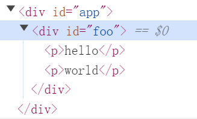
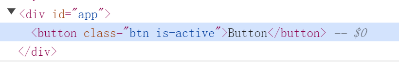

# 挂载子节点和元素的属性

## 挂载子节点

之前我们描述的 vnode 的 children 只是一个文本，children 是可以为一个数组的，而且大多数情况下，都是一个数组，如下：

```javascript
const vnode = {
  type: 'div',
  children: [
    {
      type: 'p',
      children: 'hello'
    },
    {
      type: 'p',
      children: 'world'
    }
  ]
}
```

为了完成这个子节点的渲染，我们需要对之前的 mountElement 函数来进行一些修改，如下：

```javascript
function mountElement(vnode, container) {
  const el = hostCreateElement(vnode.type)
  if (isString(vnode.children)) {
    hostSetText(el, vnode.children)
  } else if (isArray(vnode.children)) {
    // 如果是一个数组的话，需要循环调用patch
    vnode.children.forEach(child => {
      patch(null, child, el)
    })
  }
  hostInsert(el, container)
}
```

这个挂载子节点，是不是感觉还是非常简单的。

## 简单设置元素的属性

一个元素是具备很多的属性的，我们应该如何在 vnode 中描述这些属性，以及渲染。

在这众多的属性中，有些属性是通用的，比如 id、class、style 等，而有些属性是特定元素才有的，例如 form 的 action 属性，而渲染这个属性其实比想的要复杂，我们从简到难的来实现，先实现一个最基本的属性处理。

我们在 vnode 中可以通过增加 props 字段来描述属性，如下：

```javascript
const vnode = {
  type: 'div',
  props: {
    id: 'foo'
  },
  children: [
    {
      type: 'p',
      children: 'hello'
    },
    {
      type: 'p',
      children: 'world'
    }
  ]
}
```

props 是一个对象，它的键表示属性的名称，值表示对应属性的值，而这也表示 props 是存在多个的，所以我们需要通过遍历来处理，如下：

```javascript
function mountElement(vnode, container) {
  const el = hostCreateElement(vnode.type)
  // ...省略 children 处理

  // 如果 vnode.props 存在的话，则进行处理
  if (vnode.props) {
    for (const key in vnode.props) {
      const value = vnode.props[key]
      // 设置属性到元素上
      el.setAttribute(key, value)
    }
  }

  hostInsert(el, container)
}
```

我们在将这段代码通过 render 函数来渲染，看一下结果，id 是否被正确的设置了，如图：



## 区分 HTML Attributes 与 DOM Properties

理解这两者之间的差异和关联非常重要，只有知道这点才能合理的设计 vnode 的结构，也才能正确的设置属性。

比如最基本的 HTML，如下：

```html
<input id="my-input" type="text" value="foo" />
```

HTML Attributes 指的就是定义在 HTML 标签上的属性，比如在这段代码中指的就是 id="my-input"、type="text"、value="foo"。

当浏览器解析这段代码之后，会创建一个与之相符的 DOM 元素对象，即我们通过 js 代码读取的 DOM 对象，如下：

```javascript
const el = document.querySelector('#my-input')
```

这个 DOM 对象上就包含很多属性(Properties)，比如这个 el 上具备的属性就是 DOM Properties，很多 HTML Attributes 在与 DOM 对象上存在很多同名的 DOM Properties，例如 id="text" 对应的就是 el.id，type="text" 对应 el.type，value="foo" 对应 el.value 等。

但 DOM Properties 和 HTML Attributes 的名字也不是总是一样的，例如：

```html
<div class="foo"></div>
```

class="foo" 对应的 DOM Properties 则是 el.className，且并不是所有的 HTML Attributes 都有与之对应的 DOM Properties，例如：

```html
<div aria-valuenow="75"></div>
```

aria-* 类的 HTML Attributes 就没有与之对应的 DOM Properties。

反之，也不是所有的 DOM Properties 都有与之对应的 HTML Attributes，例如可以使用 el.textContent 来设置元素的文本内容，就没有与之对应的 HTML Attributes 来完成同样的工作。

HTML Attributes 与 DOM Properties 的值也是存在关联的，例如：

```html
<div id="foo"></div>
```

这段代码表达的意思是，id="foo" 对应的 DOM Properties 的为 el.id，且值为字符串 foo。我们把这种 DOM Properties 与 HTML Attributes 具有相同名称的（即 id）的属性值看做为**直接映射**。但并不是所有的 HTML Attributes 与 DOM Properties 之间都是直接映射的关系，例如：

```html
<input value="foo" />
```

这个 input 标签具备属性 value，值为字符串 foo，如果用户没有修改文本框的内容，那么通过 el.value 获取的值就是字符串 foo。而如果用户修改了文本框的值，那么 el.value 的值就是当前文本框的值。

比如当用户修改了文本框的值为字符串 bar，运行下面一段代码就会发生奇怪的现象：

```javascript
console.log(el.getAttribute('value')) // 仍然是 'foo'
console.log(el.value) // 'bar'
```

通过这个现象可以发现，用户对文本框的修改并不会影响 el.getAttribute('value') 的返回值，这个现象蕴含着 HTML Attributes 所代表的意义，实际上，HTML Attributes 的作用是设置与之对应的 DOM Properties 的初始值，一旦值改变，那么 DOM Properties 始终存储着当前值，而通过 getAttribute 函数得到的值仍然是初始值。

但是我们仍然可以通过 el.defaltValue 来访问初始值，如下：

```javascript
console.log(el.getAttribute('value')) // 仍然是 'foo'
console.log(el.value) // 'bar'
console.log(el.defaltValue) // 'foo'
```

这就说明一个 HTML Attributes 可能关联多个 DOM Properties。

虽然我们认为 HTML Attributes 是用于设置 DOM Properties 初始值的，但是在浏览器内部会检测 HTML Attributes 值是否合法，如果不合法会设置一个合法值作为 DOM Properties 属性的初始值，例如：

```html
<input type="foo" />
```

我们这里设置了 HTML Attributes 属性的 type 为 "foo"，但是这不是一个合法值，所以如果通过 el.type 访问，得到的结果将会是 "text"。

从上述这些分析来看，我们可以得到一个核心原则：**HTML Attributes 的作用是设置与之对应的 DOM Properties 的初始值**

## 正确的设置元素属性

我们以按钮为例，如下：

```html
<button disabled>Button</button>
```

这个在 vnode 中如何表示呢？如下：

```javascript
const vnode = {
	type: 'button',
  props: {
    disabled: ''
  },
  children: 'Button'
}
```

当我们设置 disabled 的属性为 '' 之后，在执行 `el.setAttribute(key, value)` 这句代码的时候则会变为 `el.setAttribute(disabled, '')`，这样也能实现按钮禁用的效果，但是我们还需要考虑下面这种情况，如下：

````html
<button :disabled="false"></button>
````

所以我们应该给 disabled 一个布尔值，如下：

```javascript
const vnode = {
	type: 'button',
  props: {
    disabled: false
  },
  children: 'Button'
}
```

这样的意思表示 false 则不禁用，true 才禁用，但是当我们设置为 false 之后，按钮在页面中依然是被禁用的，这是因为，在设置的时候，el.setAttribute(disabled, false) 虽然设置的是 false，但是实际是被当做了 'false' 这样字符串形式的处理。对于 el.disabled 来说，它的属性值是布尔类型的，并且它不关心 HTML Attributes 的值是什么，只要 disabled 属性存在，按钮就会被禁用，所以我们可以发现，设置属性不能只是单一的使用 setAttribute 函数将 vnode.props 设置到元素的属性上。

面对这种情况，一个简单的思路就是优先设置 DOM Properties，例如：

```javascript
el.disabled = false
```

但是这样又会存在问题，比如下面这种情况，如下：

```html
<button disabled></button>
```

当模板中这样书写的时候，实际转化为的 vnode 是：

```javascript
const vnode = {
	type: 'button',
  props: {
    disabled: ''
  },
  children: 'Button'
}
```

而如果是空字符的时候，由于 el.disabled 需要的是一个布尔值，就会被浏览器矫正为 false，而 false 实际表示的是不禁用，但是用户编写的这句模板 html 代码，明显是希望是禁止的，所以我们还需要多处理一下，即**优先处理 DOM Properties 的时候，如果是空字符串，要手动设置为 true**。

具体实现如下：

```javascript
function mountElement(vnode, container) {
  const el = hostCreateElement(vnode.type)
  // 省略

  if (vnode.props) {
    for (const key in vnode.props) {
      const value = vnode.props[key]
      // 使用 in 操作符判断 key 是否存在对应的 DOM Properties
      //  - 如果存在则优先设置 DOM Properties
      if (key in el) {
        // 获取 DOM Properties 属性的值的类型
        const type = typeof el[key]
        // 如果是布尔类型，并且值是空字符串，则设置为 true
        if (type === 'boolean' && vnode.props[key] === '') {
          el[key] = true
        } else {
          el[key] = value
        }
      } else {
        // 如果不存在对应的 DOM Properties，则表示是一个 HTML Attributes
        el.setAttribute(key, value)
      }
    }
  }

  hostInsert(el, container)
}
```

但是这样处理之后，解决了 disabled，还是存在一些其他问题，比如有些 DOM Properties 属性是只读的，如下所示：

```html
<form id="form1"></form>
<input form="form1" />
```

这段代码之中设置了 input 标签的 form 属性为 form1，它对应的 DOM Properties 是 el.form，而 el.form 是只读的，因此我们只能通过 setAttribute 来设置它，这就需要我们修改一下逻辑，来额外处理一下，如下：

```javascript
function shouldSetAsProps(el, key, value) {
  // 特殊处理
  if (key === 'form' && el.tagName === 'INPUT') return false
  // 正常处理
  return key in el
}

function mountElement(vnode, container) {
  const el = hostCreateElement(vnode.type)
  // 省略

  if (vnode.props) {
    for (const key in vnode.props) {
      const value = vnode.props[key]
      // 使用 shouldSetAsProps 判断是否应该作为 DOM Properties 处理
      if (shouldSetAsProps(el, key, value)) {
        if (key in el) {
          const type = typeof el[key]
          if (type === 'boolean' && vnode.props[key] === '') {
            el[key] = true
          } else {
            el[key] = value
          }
        }
      } else {
        el.setAttribute(key, value)
      }
    }
  }

  hostInsert(el, container)
}
```

最后，这个关于属性的处理，我们也需要提取出来，作为 api 传入，如下：

```javascript
function patchProp(el, key, prevValue, nextValue) {
  if (shouldSetAsProps(el, key, nextValue)) {
    if (isBoolean(nextValue) && nextValue === '') {
      el[key] = true
    } else {
      el[key] = nextValue
    }
  } else {
    el.setAttribute(key, nextValue)
  }
}
```

然后同时在内部进行解构和重命名，如下：

```javascript
const {
  createElement: hostCreateElement,
  setText: hostSetText,
  insert: hostInsert,
  patchProp: hostPatchProp
} = options
```

那么 mountElement 也需要进行相应的修改，如下：

```javascript
function mountElement(vnode, container) {
  const el = hostCreateElement(vnode.type)
 	// 省略

  if (vnode.props) {
    for (const key in vnode.props) {
      // 挂载行为时，上一次的属性值统一为 null
      hostPatchProp(el, key, null, vnode.props[key])
    }
  }

  hostInsert(el, container)
}
```

## class 的处理

在处理 class 之前，我们可以想到后续还会有 style、事件，所以针对 props 的处理是比较多的，因此需要单独提炼一个文件，在 vue 中也是这样处理的，如下：

```javascript
import { patchAttr } from './modules/attr'
import { patchClass } from './modules/class'
import { patchDOMProp } from './modules/props'

export function patchProp(el, key, prevValue, nextValue) {
  // 处理 class
  if (key === 'class') {
    patchClass(el, nextValue)
  }
  // 处理 DOM Properties
  else if (shouldSetAsProp(el, key)) {
    patchDOMProp(el, key, nextValue)
  }
  // 处理 HTML Attributes
  else {
    patchAttr(el, key, nextValue)
  }
}

function shouldSetAsProp(el, key) {
  if (key === 'form') {
    return false
  }
  if (key === 'list' && el.tagName === 'INPUT') {
    return false
  }
  if (key === 'type' && el.tagName === 'TEXTAREA') {
    return false
  }
  // 只要 key 是一个 dom对象上的属性，就可以直接设置
  return key in el
}
```

可能这里没有用到 prevValue 参数，但是这并不是多余的，在后面的处理会体现出来，其中 patchDOMProp 和 patchAttr 的处理就是将之前的逻辑拆分了一下。既然 props 的处理独立了出来，又想传给给 createRenderer 的话，那么在参数这里，就要更改一下逻辑，如下：

```javascript
// 参数合并
const rendererOptions = extend({ patchProp }, nodeOps)

let renderer

function ensureRenderer() {
  return renderer || (renderer = createRenderer(rendererOptions))
}

export const render = (...args) => {
  ensureRenderer().render(...args)
}
```

在 vue 中，class 的写法是多样的，第一种字符串，第二种对象，第三种数组，所以我们需要将 class 进行归一化，统一转为字符串在设置属性。因此我们需要封装一个 normalizeClass 函数，如下：

```javascript
function normalizeClass(value) {
  let res = ''

  // 如果 value 是字符串则直接返回
  if (isString(value)) {
    res = value.trim()
  }
  // 如果 value 是数组
  else if (isArray(value)) {
    // 数组里面可以存储字符串也可以存储对象，所以只需要循环调用 normalizeClass 得到结果即可
    for (let i = 0; i < value.length; i++) {
      res += normalizeClass(value[i]) + ' '
    }
  }
  // 如果 value 是对象
  else if (isObject(value)) {
    for (const key in value) {
      // 如果值为 true 则添加到结果中
      if (value[key]) {
        res += `${key} `
      }
    }
  }

  return res.trim()
}
```

现在我们就来使用一下这个函数，在 vue 中，对于 props 中 calss 参数归一化这块的处理时机是在 createVNode 函数中处理的，这里由于目前我们并没有这个方法，所以简单处理一下，如下：

```javascript
function mountElement(vnode, container) {
  const el = hostCreateElement(vnode.type)
 	// 省略

  if (vnode.props) {
    // ! 暂时：如果有属性且存在 class 则进行提前处理
    if (vnode.props.class) {
      vnode.props.class = normalizeClass(vnode.props.class)
    }

    for (const key in vnode.props) {
      hostPatchProp(el, key, null, vnode.props[key])
    }
  }

  hostInsert(el, container)
}
```

现在我们来编写一段测试案例，如下：

```javascript
const vnode = {
  type: 'button',
  props: {
    class: ['btn', { 'is-active': true, 'is-disabled': false }],
  },
  children: 'Button'
}
```

查看渲染的结果，如图：



结果表明，是符合我们的预期的。
