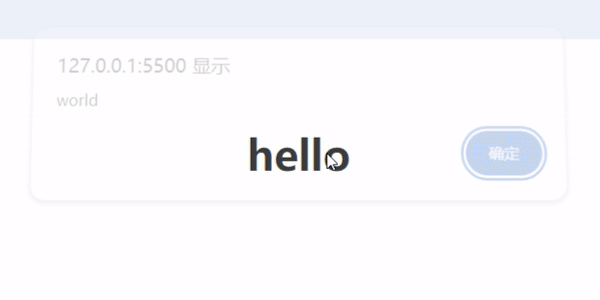
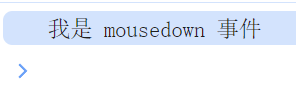
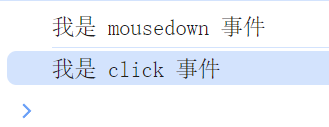
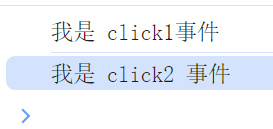
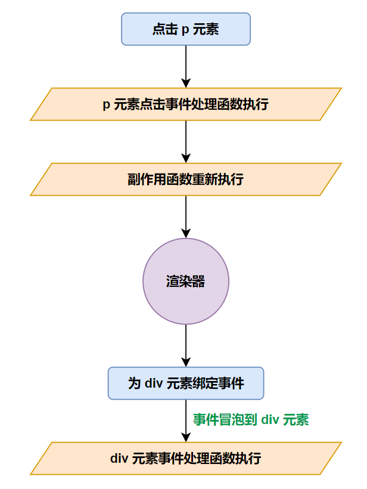
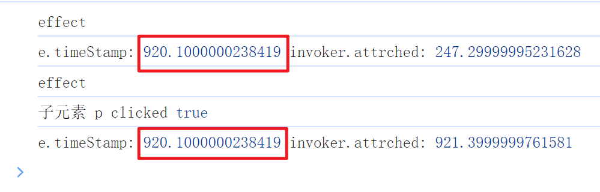
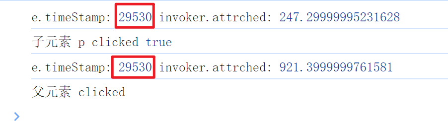

# 事件的处理

## 绑定事件与解绑事件

既然要处理事件，那么首先面临的问题是如何在 vnode 中描述这个事件，在 vnode.props 中，凡是以 on 开头的字符串，都被视作事件，例如：

```javascript
const vnode = {
  type: 'h1',
  props: {
    onClick: () => {
      alert('world')
    }
  },
  children: 'hello'
}
```

当有了正确的描述之后，我们需要做的就是在处理 vnode.props 的时候，增加一个分支，当检测到以 on 开头的属性之后，就作为事件处理，如下：

```javascript
export function patchProp(el, key, prevValue, nextValue) {
  if (key === 'class') {
    patchClass(el, nextValue)
  } else if (key === 'style') {
    patchStyle(el, prevValue, nextValue)
  } else if (isOn(key)) {
    patchEvent(el, key, prevValue, nextValue)
  }
  // 处理 DOM Properties
  else if (shouldSetAsProp(el, key)) {
    patchDOMProp(el, key, nextValue)
  }
  // 处理 HTML Attributes
  else {
    patchAttr(el, key, nextValue)
  }
}

// isOn 方法实现非常简单，如下：
function isOn(value) {
  return value.startsWith('on')
}
```

忘记这块处理逻辑的可以翻阅之前的文档，patchEvent 具体实现如下：

```javascript
export function patchEvent(el, key, prevValue, nextValue) {
  // 获取事件名称
  //  - onClick -> click
  const evnetName = key.slice(2).toLowerCase()
  // 根据绑定的事件进行处理
  if (nextValue) {
    // 绑定事件
    el.addEventListener(evnetName, nextValue)
  }
}
```

那我们来看一下这个是否可行呢，如图：



解决初次绑定，那么如果是更新事件应该如何处理呢？我们很容易想到的方式就是，直接将上一次绑定的事件移除，如下：

```javascript
export function patchEvent(el, key, prevValue, nextValue) {
  const evnetName = key.slice(2).toLowerCase()
  // 移除
  prevValue && el.removeEventListener(evnetName, prevValue)
  if (nextValue) {
    el.addEventListener(evnetName, nextValue)
  }
}
```

这样做，代码确实能够按照预期的进行工作，但是不够好，我们可以使用一种性能更优的方式来解决。

## 优化事件的绑定和解绑方式

在绑定事件时，我们可以绑定一个伪造的事件处理函数 invoker，然后把真正的事件处理函数设置为 invoker.value 属性的值，这样当更新事件的时候，我们将不再需要调用 removeEventListener 函数来移除上一次的事件，只需要更新 invoker.value 的值即可，如下：

```javascript
export function patchEvent(el, key, prevValue, nextValue) {
  const evnetName = key.slice(2).toLowerCase()
  // 获取上一次的伪造的事件处理函数 invoker
  let invoker = el._vei

  if (nextValue) {
    // 如果存在新的vnode且且上一次的invoker不存在，则创建新的invoker
    if (!invoker) {
      // vei 是 vue event invoker 的缩写
      invoker = el._vei = e => {
        // invoker.value 的值就是真正要执行的事件回调函数
        invoker.value(e)
      }
      // 把真正的事件处理函数赋值给 invoker.value
      invoker.value = nextValue
      // 绑定 invoker 为事件处理函数
      el.addEventListener(evnetName, invoker)
    }
    // 如果新的vnode存在且invoker也存在，则表示这是一次更新操作
    else {
      // 此时：我们的更新操作要做的就只是把 invoker.value 更新成新的回调函数即可
      //  - 而不再需要重新绑定事件处理函数
      invoker.value = nextValue
    }
  } else if (invoker) {
    // 如果新的 vnode 不存在，且 invoker 存在，则表示这个 el 之前绑定过事件函数，需要解绑
    el.removeEventListener(evnetName, invoker)
  }
}
```

此时性能就得到了优化，但是 invoker 的作用还不至于此，还可以解决事件冒泡和事件更新之间的相互影响的问题，不过此时我们先暂时不探讨这个问题。

## 处理不同事件类型的绑定

我们目前面临的是一个其他的问题，我们现在是把事件处理函数缓存到 el._vei 属性中，问题是，在同一时刻只能缓存一个事件处理函数，这意味这如果绑定了多种事件，就会出现事件覆盖的问题，比如同事存在 click 和 mousedown 事件，如下：

```javascript
const vnode = {
  type: 'h1',
  props: {
    onClick: () => {
      console.log('我是 click 事件')
    },
    onMouseDown: () => {
      console.log('我是 mousedown 事件')
    }
  },
  children: 'hello'
}
```

我们现在绑定了两个事件，来看一下打印的结果，如图：



就仅仅输出了一个，并且是后者覆盖前者，所以为了处理不同类型的事件时，我们需要修改一下缓存事件的结构，如下：

```javascript
export function patchEvent(el, key, prevValue, nextValue) {
  const evnetName = key.slice(2).toLowerCase()
  // 将 el._vei 改为对象
  let invokers = el._vei || (el._vei = {})
  // 根据事件名称获取对应的invoker
  let invoker = invokers[key]

  if (nextValue) {
    if (!invoker) {
      // 进行缓存的时候，通过 key 作为区分，避免覆盖
      invoker = el._vei[key] = e => {
        invoker.value(e)
      }
      invoker.value = nextValue
      el.addEventListener(evnetName, invoker)
    } else {
      invoker.value = nextValue
    }
  } else if (invoker) {
    el.removeEventListener(evnetName, invoker)
  }
}
```

现在我们来看一下执行的结果，如图：



## 处理同一事件类型多个事件处理函数

当完成了不同类型的事件绑定之后，我们还面临一个问题，就是同一个事件类型的事件绑定多个事件处理函数时，只会执行一次，vnode 如下：

```javascript
const vnode = {
  type: 'h1',
  props: {
    onClick: [
      () => {
        console.log('我是 click1事件')
      },
      () => {
        console.log('我是 click2 事件')
      }
    ],
  },
  children: 'hello'
}
```

按照预期是两个都会触发，但是实际情况并不是这样，所以为了达到这个目标，我们还需要调整一下代码，如下：

```javascript
export function patchEvent(el, key, prevValue, nextValue) {
  const evnetName = key.slice(2).toLowerCase()
  let invokers = el._vei || (el._vei = {})
  let invoker = invokers[key]

  if (nextValue) {
    if (!invoker) {
      invoker = el._vei[key] = e => {
        // 如果 invoker.value 是一个数组，则依次执行
        if (isArray(invoker.value)) {
          invoker.value.forEach(fn => fn(e))
        }
        // 不是数组，则表示只有一个事件处理函数，直接执行
        else {
          invoker.value(e)
        }
      }
      // nextValue 可能会直接是一个函数，也可能会是一个包含多个函数的数组
      invoker.value = nextValue
      el.addEventListener(evnetName, invoker)
    } else {
      invoker.value = nextValue
    }
  } else if (invoker) {
    el.removeEventListener(evnetName, invoker)
  }
}
```

执行结果如图：



## 事件冒泡与更新时机问题

我们来看一下下面这个案例，如下：

```javascript
const bol = ref(false)

effect(() => {
  console.log('effect')
  const vnode = {
    type: 'div',
    props: bol.value
      ? {
          onClick() {
            console.log('父元素 clicked')
          }
        }
      : {},
    children: [
      {
        type: 'p',
        props: {
          onClick() {
            bol.value = true
            console.log('子元素 p clicked', bol.value)
          }
        },
        children: 'click me'
      }
    ]
  }
  
  render(vnode, document.querySelector('#app'))
})
```

根据这段代码，我们可以思考一个问题，首次渲染完成之后，点击 p 标签的点击事件是否会触发 div 的点击事件？

根据代码的逻辑分析，一开始 bol 的值为 false，则不会给 div 绑定点击事件，那么点击 p 元素时，就算因为事件冒泡的存在，但是因为没有给 bol 绑定点击事件，所以就不会触发 div 的点击事件。

但是实际上却不是，在运行这段代码时，触发了 p 元素的点击事件也会触发 div 的点击事件，这是因为在 p 元素的点击事件中奖 bol 的值改为 true，我们又处于 effect 函数中，bol 是一个响应式数据，所以 bol 发生改变后就会立即执行 effect 函数，自然也会重新执行 render 函数渲染，也就是说在 p 元素的 click 点击事件还没处理完成的时候，就会再次渲染了，再次渲染就会给 div 绑定点击事件，而当 p 元素点击事件执行完成之后，进行冒泡，此时 div 已经绑定了点击事件，所以就会触发 div 的点击事件。

根据这个流程，我们可以使用一个图来表达执行顺序，如图：



那如何解决呢，我们其实在这个图中可以发现，事件触发的时间是在时间处理函数被绑定之前的，这就意味着事件触发时，目标元素上还没有绑定相关事件处理函数，我们可以根据这个特点来解决问题，即**屏蔽所有绑定时间晚于事件触发时间的事件处理函数的执行**，如下：

```javascript
export function patchEvent(el, key, prevValue, nextValue) {
  const evnetName = key.slice(2).toLowerCase()
  let invokers = el._vei || (el._vei = {})
  let invoker = invokers[key]

  if (nextValue) {
    if (!invoker) {
      invoker = el._vei[key] = e => {
        // e.timeStamp 是事件触发的时间
        // 如果 e.timeStamp 小于于绑定事件的时间，则不执行
        if (e.timeStamp < invoker.attrched) return

        if (isArray(invoker.value)) {
          invoker.value.forEach(fn => fn(e))
        } else {
          invoker.value(e)
        }
      }
      invoker.value = nextValue
      // 添加时间绑定的时间
      invoker.attrched = performance.now()
      el.addEventListener(evnetName, invoker)
    } else {
      invoker.value = nextValue
    }
  } else if (invoker) {
    el.removeEventListener(evnetName, invoker)
  }
}
```

这样就可以解决了，为什么可以解决呢，我们就来分析一下这新增的两行代码，performance.now() 是一个高精时间，具体的可以查阅文档[DOMHighResTimeStamp](https://developer.mozilla.org/zh-CN/docs/Web/API/DOMHighResTimeStamp)，这**时间源**是创建浏览器上下文的时间，在这里可以简单理解为一个只会增加的时间，页面刷新就会重置重新计算，所以首次渲染之后，点击 p 元素，触发点击事件，将 bol 的值改为 true，此时会执行 effect 然后绑定事件，并记录下绑定的时间，重点来了，此时的 e.timeStamp 触发的时间是 p 事件触发的时间，而非这个冒泡到 div 的事件触发时间，所以这个 timeStamp 一定比 div 的事件绑定时间要早，而比这个早就会被 `if (e.timeStamp < invoker.attrched) return` 这句代码拦截，而后续触发的时候，invoker 已经存在，所以不会重新设置 invoker.attrched 的值，所以后续触发时，e.timeStamp 的时间就是大于 invoker.attrched 所记录的时间。这样就解决了我们的问题。

如果不够直观，我们可以看一下初次渲染点击的时间记录，如图：



再来看看再次点击的执行结果，如图：

