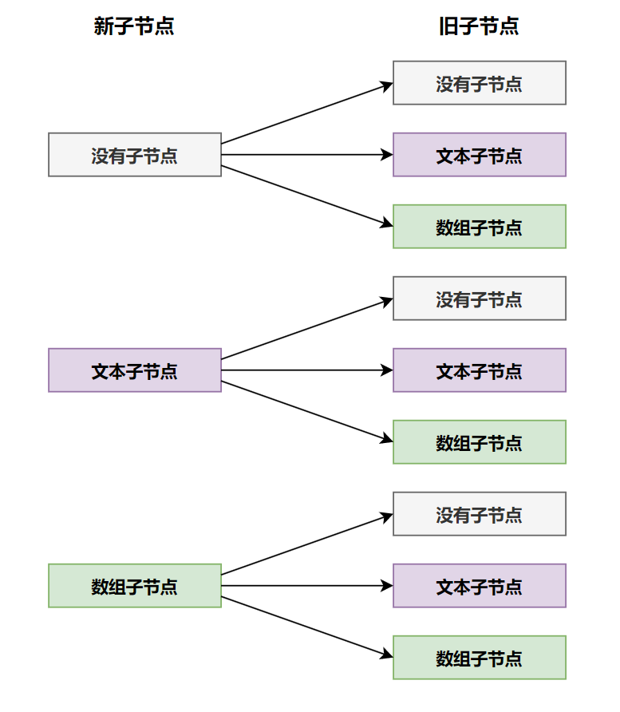

# 更新子节点

在之前，我们已经规范了 vnode.children 的类型，无非就是三种，没有、文本、数组，而这三种会对应到九种情况，如图：



看着情况很多，但是实际实现起来，并不需要处理这么多情况，我们来看一下 patchElement 代码的实现，如下：

```javascript
function patchElement(n1, n2) {
  // 将旧vnode上的 el 赋值给 新vnode的 el 属性，实现 dom 元素复用
  const el = (n2.el = n1.el)
  const oldProps = n1.props || EMPTY_OBJ
  const newProps = n2.props || EMPTY_OBJ

  // 更新 props
  for (const key in newProps) {
    // 如果新属性和就旧属性不一样，则更新
    if (newProps[key] !== oldProps[key]) {
      hostPatchProp(el, key, oldProps[key], newProps[key])
    }
  }

  // 移除旧属性
  //  - 如果旧属性是一个空对象，则不需要处理
  if (oldProps !== EMPTY_OBJ) {
    for (const key in oldProps) {
      //  - 遍历旧props，如果旧props上存在的属性，但是在新props上不存在，则移除
      if (!(key in newProps)) {
        hostPatchProp(el, key, oldProps[key], null)
      }
    }
  }
  
  // 更新 children
  patchChildren(n1, n2, el)
}
```

如上所示，最后一步操作是打补丁的最后一个操作，我们将其放入 patchChildren 函数中实现，如下：

```javascript
function patchChildren(n1, n2, container) {
  // 判断新vnode的 children 是否是文本节点
  if (isString(n2.children)) {
    // 旧节点有三种情况：文本节点、数组、空
    // 如果旧节点是一个数组时，则将旧节点依次卸载
    if (isArray(n1.children)) {
      n1.children.forEach(child => {
        unmount(child)
      })
    }
    // 如果旧节点不存在或者是文本节点，且不一致时，则更新为文本节点
    if (n1.children !== n2.children) {
      hostSetText(container, n2.children)
    }
  }
}
```

此时我们还需要处理新节点 children 是数组的情况，如下：

```javascript
function patchChildren(n1, n2, container) {
  if (isString(n2.children)) {
    if (isArray(n1.children)) {
      n1.children.forEach(child => {
        unmount(child)
      })
    }
    if (n1.children !== n2.children) {
      hostSetText(container, n2.children)
    }
  }
  // 新vnode 的 children 是一个数组
  else if (isArray(n2.children)) {
    // 如果旧节点的 children 也是数组，则需要进行 diff 算法
    if (isArray(n1.children)) {
      // diff 算法
      // 目前暂时还未涉及 diff 算法，所以使用暴力的循环进行更新

      // 先卸载旧节点
      n1.children.forEach(child => {
        unmount(child)
      })

      // 再挂载新节点
      n2.children.forEach(child => {
        patch(null, child, container)
      })
    } else {
      // 此时旧节点只能是文本节点或者空
      // 但是不管是那个情况，直接清空旧节点即可
      hostSetText(container, '')
      // 依次挂载新节点
      n2.children.forEach(child => {
        patch(null, child, container)
      })
    }
  }
}
```

当然，还有新节点的 children 不存在的情况，如下：

```javascript
function patchChildren(n1, n2, container) {
  if (isString(n2.children)) {
    if (isArray(n1.children)) {
      n1.children.forEach(child => {
        unmount(child)
      })
    }
    if (n1.children !== n2.children) {
      hostSetText(container, n2.children)
    }
  } else if (isArray(n2.children)) {
    if (isArray(n1.children)) {
      n1.children.forEach(child => {
        unmount(child)
      })

      n2.children.forEach(child => {
        patch(null, child, container)
      })
    } else {
      hostSetText(container, '')
      n2.children.forEach(child => {
        patch(null, child, container)
      })
    }
  }
  // 新节点的 children 是空
  else {
    // 如果旧节点children是一个数组，则依次卸载
    if (isArray(n1.children)) {
      n1.children.forEach(child => {
        unmount(child)
      })
    }
    // 如果旧节点children是文本节点，则清空
    if (isString(n1.children)) {
      hostSetText(container, '')
    }
    // 新旧节点的 children 都是空，则不需要处理
  }
}
```

