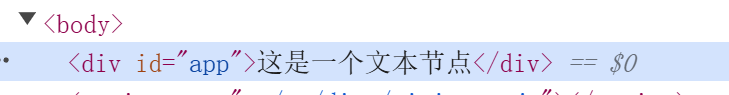
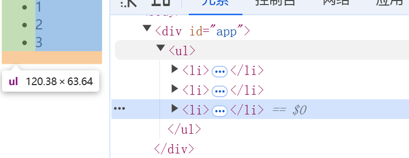

# 文本、注释、Fragment节点

## 文本节点和注释节点

在之前我们只是描述了一种 vnode 的节点类型，在日常开发中还有注释节点以及文本节点都是比较常见的，我们需要处理一下，而这些节点不具备标签名称，我们需要通过人为创造标识，如下：

```javascript
const Text = Symbol('text')
const vnode = {
  type: Text,
  children: '我是文本内容'
}

const Fragment = Symbol('fragment')
const vnode = {
  type: Fragment,
  children: '我是注释内容'
}
```

有了对应的节点类型之后，我们就可以进行处理，先处理文本节点，如下：

```javascript
function patch(n1, n2, container) {
  if (n1 && !isSameVNodeType(n1, n2)) {
    unmount(n1)
    n1 = null
  }

  const { type } = n2
  if (isString(type)) {
    if (!n1) {
      mountElement(n2, container)
    } else {
      patchElement(n1, n2)
    }
  }
  // 处理文本节点
  else if (type === Text) {
    if (!n1) {
      mountText(n2, container)
    } else {
      patchText(n1, n2)
    }
  } else if (isObject(type)) {
    // todo 处理组件
  } else {
    // TODO 处理其他情况
  }
}
```

剩下的就是要完善 mountText 和 patchText 方法，而根据之前处理 mountElement 的经验，我们还需要一个创建文本节点的函数，如下：

```javascript
const nodeOps = {
  createElement(tag) {
    return doc.createElement(tag)
  },
  setText(el, text) {
    el.textContent = text
  },
  insert(el, parent, anchor = null) {
    parent.insertBefore(el, anchor)
  },
  // 创建文本节点
  createText(text) {
    return doc.createTextNode(text)
  }
}
```

并同时在创建渲染器函数内部引用且重命名，如下：

```javascript
function baseCreateRenderer(options) {
  const {
    createElement: hostCreateElement,
    setText: hostSetText,
    insert: hostInsert,
    patchProp: hostPatchProp,
    createText: hostCreateText
  } = options
}
```

mountText 函数如下：

```javascript
function mountText(vnode, container) {
  // 创建文本节点
  const el = (vnode.el = hostCreateText(vnode.children))
  // 插入文本节点内容
  hostInsert(el, container)
}
```

patchText 函数如下：

```javascript
function patchText(n1, n2) {
  n2.el = n1.el
  if (n2.children !== n1.children) {
    hostSetText(n2.el, n2.children)
  }
}
```

既然如此，我们来写一段测试代码看看：

```javascript
const vnode = {
  type: Text,
  children: '这是一个文本节点'
}

render(vnode, document.querySelector('#app'))
```

执行结果如图：



而注释节点与文本节点唯一不同之处就在于需要使用创建注释节点方法，如下：

```javascript
const nodeOps = {
  createElement(tag) {
    return doc.createElement(tag)
  },
  setText(el, text) {
    el.textContent = text
  },
  insert(el, parent, anchor = null) {
    parent.insertBefore(el, anchor)
  },
  createText(text) {
    return doc.createTextNode(text)
  },
  // 创建注释节点
  createComment(text) {
    return doc.createComment(text)
  }
}
```

## Fragment

### 为什么需要 Fragment

Fragment 是 vue3 新增的一个 vnode 类型，在实现这个类型之前，我们可以先聊一下为什么需要这个类型。

假设我们遇到的一个这样的场景，需要封装一组列表组件：

```html
<List>
	<Items />
</List>
```

整体由两个组件构成，即 List 组件和 Items 组件，其中 List 组件会渲染一个 ul 列表作为包裹层：

```html
<!-- List.vue -->
<template>
	<ul>
    <slot></slot>
  </ul>
</template>
```

而 Items 组件负责渲染一组 <li> 列表：

```html
<!-- Items.vue -->
<template>
	<li>1</li>
  <li>2</li>
  <li>3</li>
</template>
```

而 Items 组件这个情况在 vue2 中是无法实现的，因为在 vue2 中，组件的魔板不允许存在多个根节点，这意味着，一个 Items 组件最多只能渲染一个 li 标签：

```html
<!-- Items.vue -->
<template>
	<li>1</li>
</template>
```

因此在 vue2 中，我们通常需要配合 v-for 才行：

```html
<List>
 <Items v-for="item in list"></Items>
</List>
```

类似的组合还有 <select> 和 <options> 这两个标签，而 vue3 中支持多个根节点模板，所以不存在这个问题，而 vue3 中是如何描述这个多根节点模板呢？就是利用 Fragment 来进行包裹，如下：

```javascript
const Fragment = Symbol('fragment')

const vnode = {
  type: Fragment,
  children: [
    { type: 'li', children: 'text 1' },
    { type: 'li', children: 'text 2' },
    { type: 'li', children: 'text 3' }
  ]
}
```

类似，对于如下模板：

```html
<List>
	<Items />
</List>
```

可以使用如下 vnode 来进行描述：

```javascript
const vnode = {
  type: 'ul',
  children: [
    {
      type: Fragment,
      children: [
        { type: 'li', children: '1' },
        { type: 'li', children: '2' },
        { type: 'li', children: '3' },
      ]
    }
  ]
}
```

而 Fragment 本身并不会渲染任何内容，因此只会渲染 Fragment 的子节点

### 处理 Fragment

还是一样，添加分支判断，进行处理，如下：

```javascript
function patch(n1, n2, container) {
  if (n1 && !isSameVNodeType(n1, n2)) {
    unmount(n1)
    n1 = null
  }

  const { type } = n2
  if (isString(type)) {
    // ...省略部分代码
  } else if (type === Text) {
    // ...省略部分代码
  } else if (type === Comment) {
    // ...省略部分代码
  } else if (type === Fragment) {
    if (!n1) {
      mountFragment(n2, container)
    } else {
      patchFragment(n1, n2, container)
    }
  }
  // 如果是对象表示是组件
  else if (isObject(type)) {
    // todo 处理组件
  } else {
    // TODO 处理其他情况
  }
}
```

mountFragment 和 patchFragment 实现如下：

```javascript
function mountFragment(vnode, container) {
  // 因为 Fragment 本身不渲染，只会渲染子节点，所以这里只要处理子节点即可
  vnode.children.forEach(child => {
    patch(null, child, container)
  })
}

function patchFragment(n1, n2, container) {
  // 更新也是一样，只需要更新子节点即可
  //  - patchChildren 在前文已经实现
  patchChildren(n1, n2, container)
}
```

值得注意的是，unmount 函数也需要支撑 Fragment 节点的卸载，如下：

```javascript
function unmount(vnode) {
  // 卸载时，如果是 Fragment 则需要卸载子节点
  if (vnode.type === Fragment) {
    vnode.children.forEach(child => {
      unmount(child)
    })
    return
  }

  const { el } = vnode
  const parent = el.parentNode
  if (parent) {
    parent.removeChild(el)
  }
}
```

最后我们看一下写的这段代码的渲染效果，如图：



