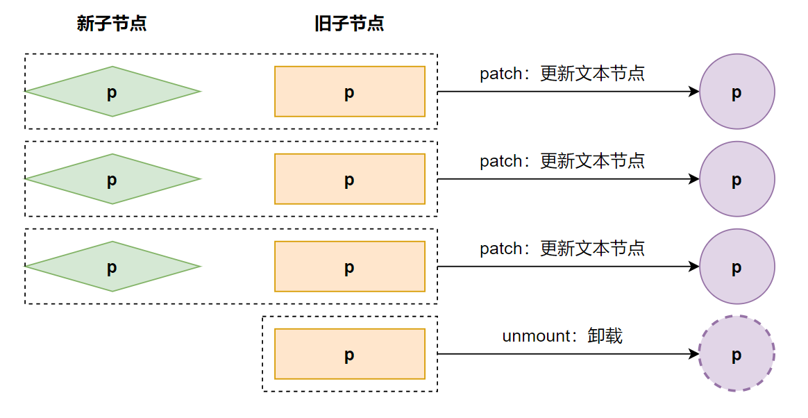
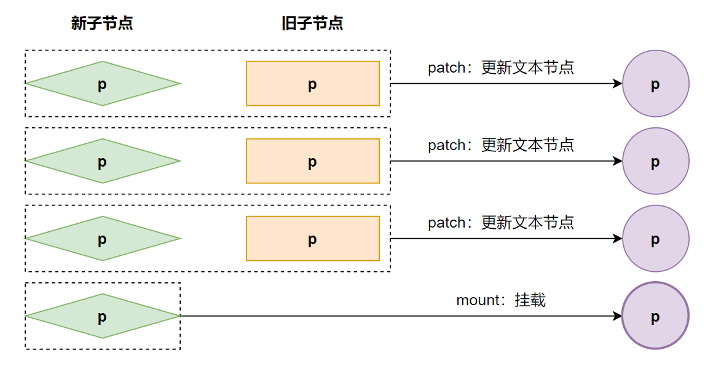
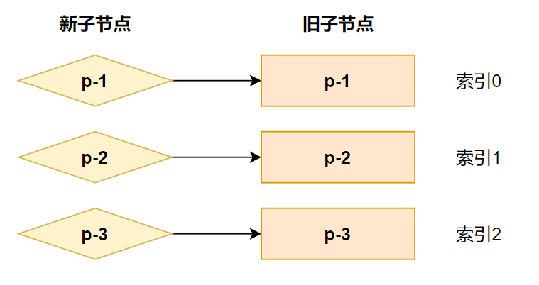
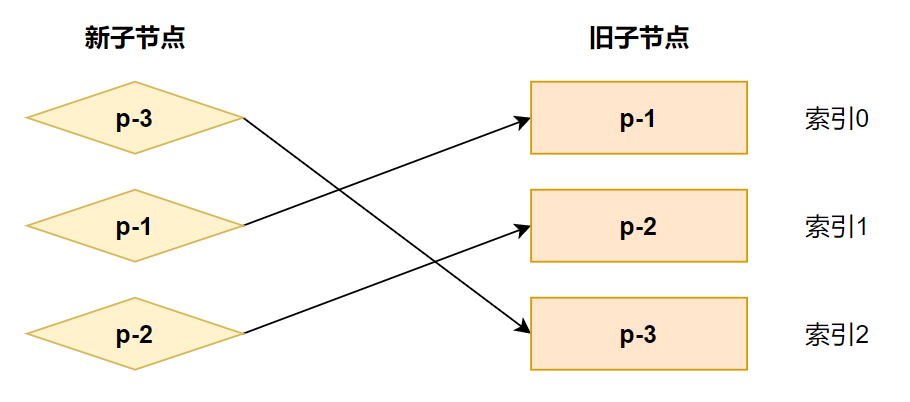
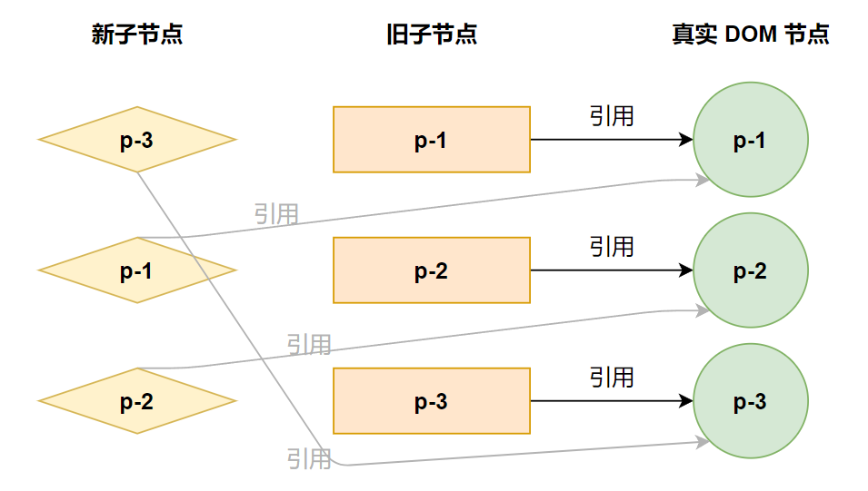
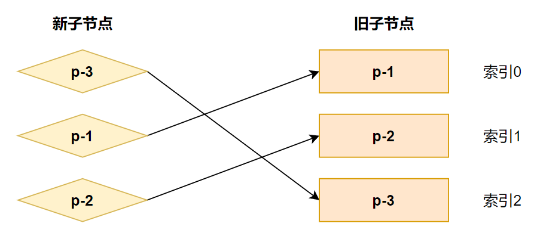
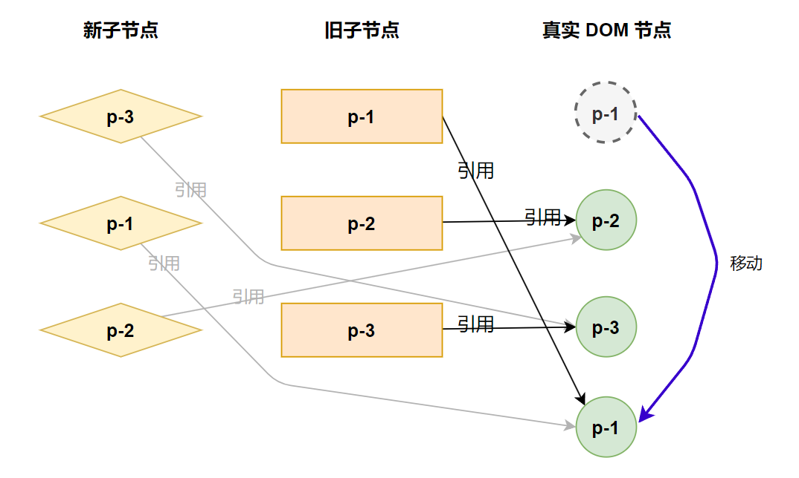
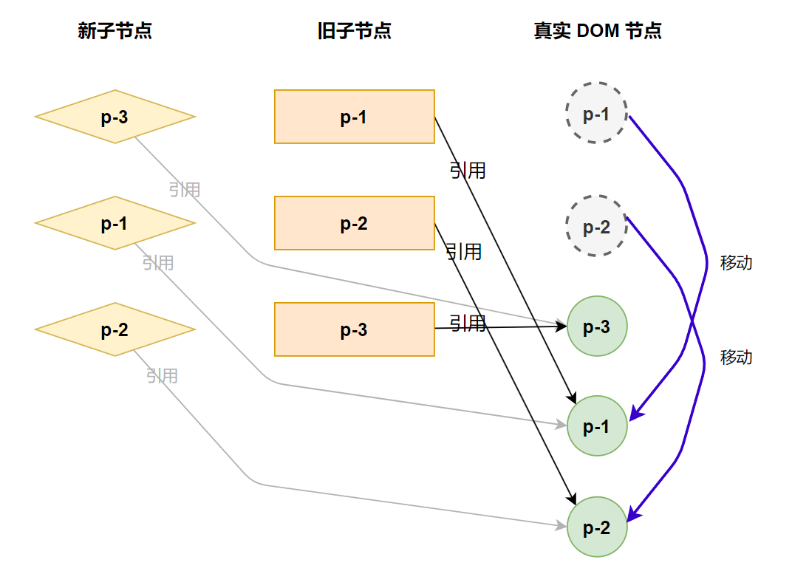
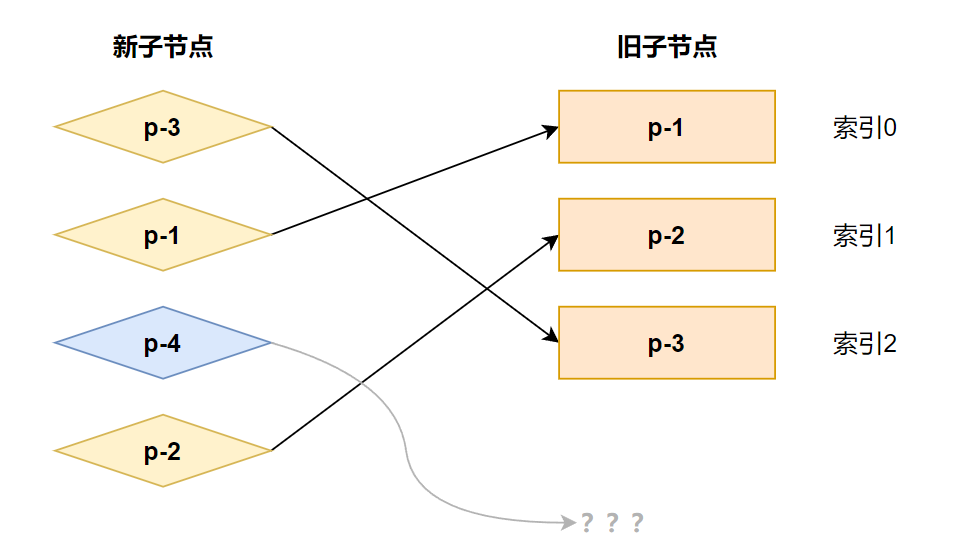
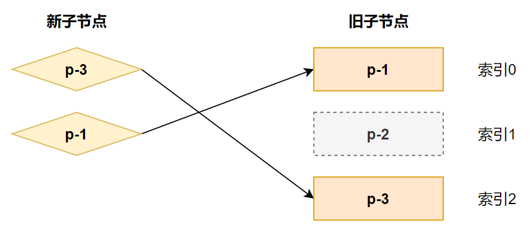

# 简单的diff算法

## 减少 DOM 操作的性能开销
在前文，我们针对新旧vnode 的 children 都是数组时，采用的方案是，先卸载旧节点的子元素，在重新挂在新节点的子元素。这个方案没有进行任何的复用，明显就带着极大的性能开销，如下：

```javascript
const oldVNode = {
  type: 'div',
  children: [
    { type: 'p', children: '1' },
    { type: 'p', children: '2' },
    { type: 'p', children: '3' }
  ]
}

const newVNode = {
  type: 'div',
  children: [
    { type: 'p', children: '4' },
    { type: 'p', children: '5' },
    { type: 'p', children: '6' }
  ]
}
```

在上述的这个暴力操作，我们卸载时需要执行三次 DOM 操作，在挂载也需要三次 DOM 操作，一共就是六次。

而我们可以通过 vnode 看出，这些元素都是 p 标签，不一样的只有文本内容而已，所以我们如果只更新文本内容的话，那么只需要进行三次 DOM 操作，而且不要再次重复创建的 p 标签，性能至少提升一倍。

根据这个思路，我们需要修改一下 patchChildren 函数，如下：

```javascript
function patchChildren(n1, n2, container) {
  if (isString(n2.children)) {
    // 省略
  } else if (isArray(n2.children)) {
    if (isArray(n1.children)) {
      const oldChildren = n1.children
      const newChildren = n2.children
      for (let i = 0; i < newChildren.length; i++) {
        const newChild = newChildren[i]
        const oldChild = oldChildren[i]
        // 调用 patch 方法进行 diff 算法
        patch(oldChild, newChild)
      }
    } else {
      // 省略
    }
  } else {
    // 省略
  }
}
```

这样的实现就完美了吗，如果仔细观察就不难发现，这只适用于新旧子节点都是一样数量的时候，如果出现下面两种情况呢。

**情况一：新子节点数量小于旧子节点数量**



**情况二：新子节点数量大于旧子节点数量**



根据这两张图分析，当新子节点数量较多时，那么多余的部分就要进行卸载，反之则要进行挂载，所以我们需要遍历新旧子节点共有的部分，即我们需要得到两个子节点的长度最小值，然后遍历这个最小值，然后进行遍历，调用 patch 方法进行更新，然后再根据两个子节点长度来判断多余的部分是进行卸载还是挂载，如下：

```javascript
function patchChildren(n1, n2, container) {
  if (isString(n2.children)) {
    // 省略
  } else if (isArray(n2.children)) {
    if (isArray(n1.children)) {
      const oldChildren = n1.children
      const newChildren = n2.children
      // 获取新子节点长度
      const newLen = newChildren.length
      // 获取旧子节点长度
      const oldLen = oldChildren.length
      // 获取最小长度
      const minLen = Math.min(oldLen, newLen)
      // 使用最小值依次比较新旧子节点，完成公共节点的复用
      for (let i = 0; i < minLen; i++) {
        patch(oldChildren[i], newChildren[i], container)
      }

      // 如果新子节点长度大于旧子节点长度，则说明有新增节点，则新增节点
      if (newLen > oldLen) {
        newChildren.slice(oldLen).forEach(child => {
          patch(null, child, container)
        })
      }
      // 如果旧子节点长度大于新子节点长度，则说明有删除节点，则删除节点
      else if (newLen < oldLen) {
        oldChildren.slice(newLen).forEach(child => {
          unmount(child)
        })
      }
    } else {
      // 省略
    }
  } else {
    // 省略
  }
}
```

## DOM 复用与 key 的作用

在上一节我们提升了了性能，但是这个方案还是有缺陷，比如下面这种情况：

```javascript
// oldChildren
[
  { type: 'p', children: '我是一个p元素' },
  { type: 'div', children: '我是一个div元素' },
  { type: 'span', children: '我是一个span元素' }
]

// newChildren
[
  { type: 'div', children: '我是一个div元素' },
  { type: 'span', children: '我是一个span元素' },
  { type: 'p', children: '我是一个p元素' }
]
```
可以看到，这种情况下，如果还使用上一节的方案，那么还是会导致执行 6 次 DOM 操作，因为现在的方案就是进行了顺序的比较，所以会导致因为 vnode 的类型不一样，导致进行卸载和挂载，而实际这里是不需要卸载和挂载的，节点可以进行复用，只需要移动一下位置即可。
但是如果想通过移动 DOM 节点实现对 DOM 的复用则需要有一个前提：新旧两个子节点中，存在可复用的元素，而一个元素是否可复用，光使用 type 来判断是不准确的，因为类型重复的概率非常大，所以我们需要一个类似 id 的东西来表示这个节点是否可复用，在 vue 中这个 id 就是 key。
而有了 key 之后，我们的情况就可以划分为无 key 的比较和有 key 的比较，所以可以将之前的代码单独放入一个函数，表示处理无 key 的比较，如下：
```javascript
// c1 表示旧子节点，c2 表示新子节点
function patchUnkeyedChildren(c1, c2, container) {
  // 获取新子节点长度
  const newLen = c2.length
  // 获取旧子节点长度
  const oldLen = c1.length
  // 获取最小长度
  const minLen = Math.min(oldLen, newLen)
  // 使用最小值依次比较新旧子节点，完成公共节点的复用
  for (let i = 0; i < minLen; i++) {
    patch(c1[i], c2[i], container)
  }

  // 如果新子节点长度大于旧子节点长度，则说明有新增节点，则新增节点
  if (newLen > oldLen) {
    c2.slice(minLen).forEach(child => {
      patch(null, child, container)
    })
  }
  // 如果旧子节点长度大于新子节点长度，则说明有删除节点，则删除节点
  else if (newLen < minLen) {
    c1.slice(newLen).forEach(child => {
      unmount(child)
    })
  }
}

function patchChildren(n1, n2, container) {
  if (isString(n2.children)) {
    // 省略
  } else if (isArray(n2.children)) {
    if (isArray(n1.children)) {
      const oldChildren = n1.children
      const newChildren = n2.children
      // 这里先做一个简单处理。只要新节点的第一个元素如果存在 key 属性，则表示是有 key 的
      if (newChildren[0].key) {
        // todo 有 key 的比较
      } else {
        patchUnkeyedChildren(oldChildren, newChildren, container)
      }
    } else {
      // 省略
    }
  } else {
    // 省略
  }
}
```

现在我们的目光就要放在如何实现这个有 key 的比较上了，在此之前，我们需要知道，DOM 复用并不意味着不需要更新，比如下面的情况：

```javascript
const oldVNode = { type: 'p', children: 'text 1', key: 1 }
const newVNode = { type: 'p', children: 'text 2', key: 1 }
```

虽然他的 key 一致，但是 children 这个文本节点则从 `text 1 ` 变成了 `text 2`，因此在移动 DOM 之前需要完成打补丁的操作，如下：

```javascript
function patchChildren(n1, n2, container) {
  if (isString(n2.children)) {
    // 省略
  } else if (isArray(n2.children)) {
    if (isArray(n1.children)) {
      const oldChildren = n1.children
      const newChildren = n2.children
      if (newChildren[0].key) {
        // 遍历新的 children
        for (let i = 0; i < newChildren.length; i++) {
          const newChild = newChildren[i]
          // 遍历旧的 children
          for (let j = 0; j < oldChildren.length; j++) {
            const oldChild = oldChildren[j]
            // 检测新旧节点是否相同-- 如果相同，则进行复用
            if (isSameVNodeType(newChild, oldChild)) {
              // 进行 patch 更新
              patch(oldChild, newChild, container)
              break
            }
          }
        }
      } else {
        patchUnkeyedChildren(oldChildren, newChildren, container)
      }
    } else {
      // 省略
    }
  } else {
    // 省略
  }
}
```

经过这一步的操作之后，我们就可以保证所有可复用的节点都已经完成了可复用节点本身都已经更新完毕了，以下面的两组子节点为例，如下：

```javascript
const oldVNode = {
  type: 'div',
  children: [
    { type: 'p', children: '1', key: 1 },
    { type: 'p', children: '2', key: 2 },
    { type: 'p', children: 'hello', key: 3 }
  ]
}

const newVNode = {
  type: 'div',
  children: [
    { type: 'p', children: 'world', key: 3 },
    { type: 'p', children: '1', key: 1 },
    { type: 'p', children: '2', key: 2 }
  ]
}

render(oldVNode, document.querySelector('#app'))

setTimeout(() => {
  render(newVNode, document.querySelector('#app'))
}, 2000)
```

这段节点运行，2 秒之后，key 为 3 的节点的文本内容会从 'hello' 更新为 'world'。

## 找到需要移动的元素

现在，我们已经能够通过 key 找到可复用的节点了，接下里需要处理的是：

1. 如何判断一个元素是否需要移动
2. 如何移动元素

针对第一个问题，我们可以逆向的思考一下，什么情况下一个节点不需要移动，当新旧两子节点的节点顺序不变时，就不需要进行移动，如图：



在图中，子节点的顺序没发生改变，我们对这两组子节点进行比对的过程进行一个分析，如下：

- 第一步：取新子节点的第一个节点 p-1，它的 key 为 1，在旧子节点中尝试找一个具有相同 key 值的可复用节点，发现能够找到，且该节点在旧子节点中的索引为 0。
- 第二步：取新子节点的第一个节点 p-2，它的 key 为 2，在旧子节点中尝试找一个具有相同 key 值的可复用节点，发现能够找到，且该节点在旧子节点中的索引为 1。
- 第三步：取新子节点的第一个节点 p-3，它的 key 为 3，在旧子节点中尝试找一个具有相同 key 值的可复用节点，发现能够找到，且该节点在旧子节点中的索引为 2。

在这个过程中，每一次找到可复用的节点时，都会记录该可复用节点在旧子节点中的位置索引。如果把这些索引值按照先后顺序排列，就可以到一个序列：0、1、2。这是一个递增的序列，在这种情况下不需要移动任何节点。

我们来看一下下面这个例子，如图：



这个例子执行之后，记录的在旧子节点中可复用节点的索引依次为：2、0、1。

通过这个索引我们看出，在执行第二步的时候，发现 p-1 节点在旧子节点的顺序是 0，0 比 2 小，打破了这个递增的顺序，**新的 children 中 p-1 是在 p-3 的后面，而旧的 children 中 p-1 是在 p-3 的前面**，也就表示这个 p-1 需要进行移动。

而第三步找到的索引是 1，1 比 2小，这就表示在旧的 children 中，p-2 是在 p-3 前面的，而新的 children 中，p-2 是在 p-3 的后面，这也表示 p-2 也需要移动。

通过这次分析，我们得到了 p-2 和 p-1 是需要移动的，且 2、0、1 不具备递增的趋势。

我们可以将 p-3 在旧的 children 中的索引定义为：**在旧 children 中寻找具有相同 key 值节点的过程中，遇到的最大索引值**。即在后续的寻找过程中，如存在索引值比当前遇到最大索引值还要小的节点，则意味这个该节点需要移动。

我们可以用 lastIndex 来存储整个寻找过程中遇到的最大索引值，如下：

```javascript
function patchChildren(n1, n2, container) {
  if (isString(n2.children)) {
    // 省略
  } else if (isArray(n2.children)) {
    if (isArray(n1.children)) {
      const oldChildren = n1.children
      const newChildren = n2.children
      if (newChildren[0].key) {
        // 存储寻找过程中遇到的最大索引值
        let lastIndex = 0
        for (let i = 0; i < newChildren.length; i++) {
          const newChild = newChildren[i]
          for (let j = 0; j < oldChildren.length; j++) {
            const oldChild = oldChildren[j]
            if (isSameVNodeType(newChild, oldChild)) {
              patch(oldChild, newChild, container)
              if (j < lastIndex) {
                // 如果小于 lastIndex 则表示需要移动
                // todo 移动
              } else {
                // 如果当前找到的节点在旧的 children 中的索引大于当前找到的最大索引值 lastIndex
                // 则直接更新 lastIndex
                lastIndex = j
              }
              break
            }
          }
        }
      } else {
        patchUnkeyedChildren(oldChildren, newChildren, container)
      }
    } else {
      // 省略
    }
  } else {
    // 省略
  }
}
```

## 如何移动元素

移动元素指的是真实的 DOM 元素而非 vnode，所以我们需要获取到这个引用，而之前我们已经给 vnode 设置了 el 属性，这个属性就是真实的 DOM 元素。

那我们通过一幅图来查看一下这个引用的关系，如图：



为了阐述如何移动 DOM 节点，我们还是采用上一节的更新案例，如图：



执行过程如下：

- **第一步：**取新的子节点的第一个节点 p-3，它的 key 为 3，尝试在旧的子节点中找一个可复用的节点，找到了，并且找到的复用节点在旧的子节点中索引为 2，此时变量 lastIndex 的值为 0，**索引 2 不小于 0**，因此不需要进入移动的分支，但是会更新 lastIndex 为 2。

- **第二步：**取新的子节点的第二个节点 p-1，它的 key 为 1，尝试在旧的子节点中找一个可复用的节点，找到了，并且找到的复用节点在旧的子节点中索引为 0，此时变量 lastIndex 的值为 2，**索引 0 小于 2**，因此将会进入需要移动的分支。

  到了这一步我们会发现，节点 p-1 对应的 DOM 元素需要移动，但是移动到哪里呢？**新 children 的顺序其实就是更新后真实 DOM 节点应有的顺序**。所以节点 p-1 在新 children 中的位置就代表了真实 DOM 更新后的位置。由于 p-1 节点在新 children 中排在 p-3 的后面，所以我们应该**把节点 p-1 所对应的真实 DOM 元素移到节点 p-3 的后面**。移动的结果如图：

  

  可以看到，如果像上图所示这样操作之后，此时真实的 DOM 顺序就是 p-2、p-3、p-1。

- **第三步：**取新的子节点的第二个节点 p-2，它的 key 为 2，尝试在旧的子节点中找一个可复用的节点，找到了，并且找到的复用节点在旧的子节点中索引为 1，此时变量 lastIndex 的值为 2，**索引 1 小于 2**，因此将会进入需要移动的分支。

  第三步与第二步类似，同样由于 p-2 在新 children 中处于 p-1 的后面，所以也需要把真实 DOM 节点 p-2 移动到真实 DOM 节点 p-1 后面，如图：

  

当分析完这个关系之后，实现起来就并不复杂了，如下：

```javascript
function patchChildren(n1, n2, container) {
  if (isString(n2.children)) {
    // 省略
  } else if (isArray(n2.children)) {
    if (isArray(n1.children)) {
      const oldChildren = n1.children
      const newChildren = n2.children
      if (newChildren[0].key) {
        // 存储寻找过程中遇到的最大索引值
        let lastIndex = 0
        for (let i = 0; i < newChildren.length; i++) {
          const newChild = newChildren[i]
          let j = 0
          for (j; j < oldChildren.length; j++) {
            const oldChild = oldChildren[j]
            if (isSameVNodeType(newChild, oldChild)) {
              patch(oldChild, newChild, container)
              if (j < lastIndex) {
                // 如果运行到这里，则说明 newVNode 对应的真实 DOM 需要进行移动
                // 先获取 newVNode 的前一个 VNode，即 prevVNode
                const prevVNode = newChildren[i - 1]
                // 如果 prevVNode 不存在，则表示当前 newVNode 是第一个节点，不需要移动
                if (prevVNode) {
                  // 而如果想要将 newVNode.el 移动到 prevVNode.el 后面，则需要获取 prevVNode.el 的下一个兄弟节点
                  // 并将这个兄弟节点作为锚点
                  const anchor = prevVNode.el.nextSibling
                  // 调用 hostInsert 方法将 newVNode.el 移动到锚点位置
                  hostInsert(newChild.el, container, anchor)
                }
              } else {
                // 如果当前找到的节点在旧的 children 中的索引大于当前找到的最大索引值 lastIndex
                // 则直接更新 lastIndex
                lastIndex = j
              }
              break
            }
          }
        }
      } else {
        patchUnkeyedChildren(oldChildren, newChildren, container)
      }
    } else {
      // 省略
    }
  } else {
    // 省略
  }
}
```

为什么这里要取用上一个节点作为锚点呢？我们知道新 children 表示的就是实际更新之后 DOM 元素的顺序，我们是按照顺序遍历的，所以当前的 newVNode 如果需要移动，则就表示当前的 newVNode 实际更新后的位置就要处于当前 newVNode 的上一个节点之后，所以需要再新 children 中获取当前 newVNode 的上一个节点的下一个兄弟节点作为锚点。

## 添加新元素

我们来看一下下面这种情况，如图：



此时会多出一个节点 p-4，它的 key 是 4，此时并不能在旧的子节点中找到，那么就应该是新增，如何才能正确的挂载呢？分为两步：

- 想办法找到新增节点
- 将新增节点挂载到正确的位置上

而这个执行逻辑其实和之前移动的逻辑差不多，只是需要多处理一个情况，如下：

```javascript
function patchChildren(n1, n2, container) {
  if (isString(n2.children)) {
    // 省略
  } else if (isArray(n2.children)) {
    if (isArray(n1.children)) {
      const oldChildren = n1.children
      const newChildren = n2.children
      if (newChildren[0].key) {
        // 存储寻找过程中遇到的最大索引值
        let lastIndex = 0
        for (let i = 0; i < newChildren.length; i++) {
          const newChild = newChildren[i]
          let j = 0
          // 定义变量 find，用于判断是否找到了可复用的节点
          let find = false
          for (j; j < oldChildren.length; j++) {
            const oldChild = oldChildren[j]
            if (isSameVNodeType(newChild, oldChild)) {
              // 如果找到了可复用的节点，则将 find 设置为 true
              find = true
              patch(oldChild, newChild, container)
              if (j < lastIndex) {
                const prevVNode = newChildren[i - 1]
                if (prevVNode) {
                  const anchor = prevVNode.el.nextSibling
                  hostInsert(newChild.el, container, anchor)
                }
              } else {
                lastIndex = j
              }
              break
            }
          }

          // 如果此时 find 还为 false，则说明没有找到可复用的节点，需要进行挂载
          if (!find) {
            const prevVNode = newChildren[i - 1]
            let anchor = null
            if (prevVNode) {
              // 如果有前一个节点，则使用前一个节点的下一个兄弟节点作为锚点
              anchor = prevVNode.el.nextSibling
            } else {
              // 如果没有前一个节点，则使用父节点的第一个子节点作为锚点
              anchor = container.firstChild
            }
            // 挂载
            patch(null, newChild, container, anchor)
          }
        }
      } else {
        patchUnkeyedChildren(oldChildren, newChildren, container)
      }
    } else {
      // 省略
    }
  } else {
    // 省略
  }
}
```

## 移除不存在的元素

既然有需要挂载的，那么自然也存在多余需要移除的，如图：



而实现这个也很简单，在前面我们已经处理了移动和新增，当这两个步骤完成之后，我们只需再遍历一次旧的子节点，然后看看这个遍历的旧节点的 key 是否存在于新的子节点中，如果不存在，移除即可，如下：

```javascript
function patchChildren(n1, n2, container) {
  if (isString(n2.children)) {
    // 省略
  } else if (isArray(n2.children)) {
    if (isArray(n1.children)) {
      const oldChildren = n1.children
      const newChildren = n2.children
      if (newChildren[0].key) {
        // 存储寻找过程中遇到的最大索引值
        let lastIndex = 0
        for (let i = 0; i < newChildren.length; i++) {
          // 省略
        }
        // 上一步更新操作完成之后
        // 卸载多余的节点
        for (let i = 0; i < oldChildren.length; i++) {
          const oldChild = oldChildren[i]
          // 如果旧节点在 newVhildren 中不存在，则卸载
          const has = newChildren.find(n => n.key === oldChild.key)
          if (!has) {
            unmount(oldChild)
          }
        }
      } else {
        patchUnkeyedChildren(oldChildren, newChildren, container)
      }
    } else {
      // 省略
    }
  } else {
    // 省略
  }
}
```

至此，更新结束。
