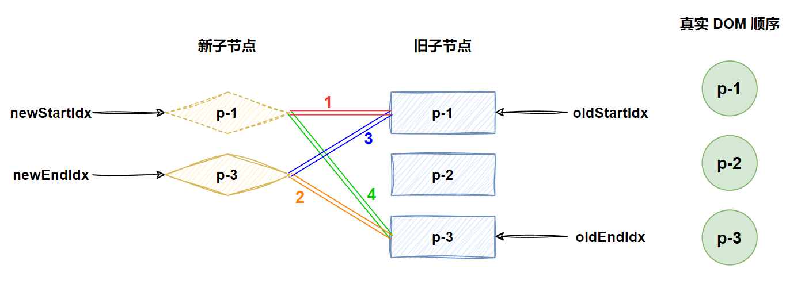

# 双端 diff 算法

> 在上一节中，我们实现了简单的 diff 算法，简单的 diff 算法利用 key 属性，尽可能的复用 DOM 元素，并通过移动 DOM 元素来完成更新，从而减少不断创建和销毁 DOM 元素带来的性能开销，但是简单 diff 算法依然存在很多缺陷，这些缺陷可以通过双端 diff 算法来解决。

## 双端比较的原理

简单 diff 算法的问题在于，它的移动操作并不是最优的，我们还是使用上一节的例子来看，如图：


在这个例子中，我们使用简单 diff 算法来更新需要进行两次 DOM 移动，将 p-1 移动到 p-3 后面，将 p-2移动到 p-1 后面。

但是其实只需要一次移动 DOM 即可，就是将 p-3 移动到 p-1 的前面即可。这一点想要实现，是简单 diff 算法无法做到的，而使用双端 diff 算法就可以。

顾名思义，双端 diff 算法是一种同事对新旧两组子节点的两个端点进行比较的算法，因此我们需要四个索引值，分别指向新旧两组子节点的端点，如图：


现在我们就将之前简单 diff 算法的代码清空，来编写双端 diff 算法的代码，并将其封装到 patchKeyedChildren 函数中，首先我们需要四个索引值，和四个索引值指向的 vnode，如下：

```javascript
function patchChildren(n1, n2, container) {
  if (isString(n2.children)) {
    // 省略
  } else if (isArray(n2.children)) {
    if (isArray(n1.children)) {
      const oldChildren = n1.children
      const newChildren = n2.children
      if (newChildren[0].key) {
        patchKeyedChildren(oldChildren, newChildren, container)
      } else {
        patchUnkeyedChildren(oldChildren, newChildren, container)
      }
    } else {
      // 省略
    }
  } else {
    // 省略
  }
}

function patchKeyedChildren(c1, c2, container) {
  // 四个索引值
  let oldStartIdx = 0
  let oldEndIdx = c1.length - 1
  let newStartIdx = 0
  let newEndIdx = c2.length - 1

  // 四个节点
  let oldStartVNode = c1[oldStartIdx]
  let oldEndVNode = c1[oldEndIdx]
  let newStartVNode = c2[newStartIdx]
  let newEndVNode = c2[newEndIdx]
}
```

双端比较的步骤如图所示，如图：


在双端比较中，一共分为了四步，如图中的连线所示。

- 第一步：比较 oldChildren 中的第一个子节点 p-1 与 newChildren 第一个子节点 p-4 进行对比，两者 key 不一致，不可复用，所以什么都不做。
- 第二步：比较 oldChildren 中的最后一个子节点 p-4 与 newChildren 最后一个子节点 p-3 进行对比，两者 key 不一致，不可复用，所以什么都不做。
- 第三步：比较 oldChildren 中的第一个子节点 p-1 与 newChildren 最后一个子节点 p-3 进行对比，两者 key 不一致，不可复用，所以什么都不做。
- 第四步：比较 oldChildren 中的最后一个子节点 p-4 与 newChildren 第一个子节点 p-4 进行对比，key 值一样，可以进行复用，因此 DOM 可以进行复用。

而通过这个比较，我们不难发现: **节点 p-4 原本是最后一个子节点，但在新的顺序中，是第一个子节点**。换句话说：**将索引 oldEndIdx 指向的虚拟节点所对应的真实 DOM 移动到索引 oldStartIdx 指向的虚拟节点所对应的真实 DOM 前面**。如下：

```javascript
function patchKeyedChildren(c1, c2, container) {
  let oldStartIdx = 0
  let oldEndIdx = c1.length - 1
  let newStartIdx = 0
  let newEndIdx = c2.length - 1
  let oldStartVNode = c1[oldStartIdx]
  let oldEndVNode = c1[oldEndIdx]
  let newStartVNode = c2[newStartIdx]
  let newEndVNode = c2[newEndIdx]

  if (isSameVNodeType(oldStartVNode, newStartVNode)) {
    // 第一步
  } else if (isSameVNodeType(oldEndVNode, newEndVNode)) {
    // 第二步
  } else if (isSameVNodeType(oldStartVNode, newEndVNode)) {
    // 第三步
  } else if (isSameVNodeType(oldEndVNode, newStartVNode)) {
    // 第四步
    // 依然需要调用 patch 函数进行打补丁
    patch(oldEndVNode, newStartVNode, container)

    // 移动 DOM 操作
    // 将旧的子节点中的最后一个节点移动到第一个节点之前
    hostInsert(oldEndVNode.el, container, oldStartVNode.el)

    // 移动完毕后，更新索引值，并指向下一个位置
    oldEndVNode = c1[--oldEndIdx]
    newStartVNode = c2[++newStartIdx]
  }
}
```

在这段代码中，我们可以发现除了上述分析的步骤之外，还更新了索引值，这是因为只进行一次，还没有将新的顺序都移动到正确的位置上，所以我们需要更新索引进行下一次循环，这里修改 oldEndIdx 和 newStartIdx 是因为这次移动的节点分别是 newChildren 的头部节点和 oldChildren 的尾部节点，经过这一次更新之后，新旧两组子节点与真实 DOM 节点关系如图：


从此图可以看出下一次双端 diff 比较的步骤以及目前真实 DOM 节点的顺序，而为了让其再次执行，我们需要使用一个 while 循环来开启下一次的比较，并套用上一步的步骤，我们会发现执行到第二步的时候新旧两组节点的 key 就是相等，也就意味着可以服用，不要移动，但是为了保证下一次比较的进行，还需要更新索引，如下：

```javascript
function patchKeyedChildren(c1, c2, container) {
  // 省略
  
  // 设置循环条件，防止数组越界
  while (oldStartIdx <= oldEndIdx && newStartIdx <= newEndIdx) {
    if (isSameVNodeType(oldStartVNode, newStartVNode)) {
      // 第一步
    } else if (isSameVNodeType(oldEndVNode, newEndVNode)) {
      // 第二步
      // 新节点顺序也处于尾部，不需要移动，但仍需打补丁
      patch(oldEndVNode, newEndVNode, container)
      // 更新索引值
      oldEndVNode = c1[--oldEndIdx]
      newEndVNode = c2[--newEndIdx]
    } else if (isSameVNodeType(oldStartVNode, newEndVNode)) {
      // 第三步
    } else if (isSameVNodeType(oldEndVNode, newStartVNode)) {
      // 第四步
      patch(oldEndVNode, newStartVNode, container)
      hostInsert(oldEndVNode.el, container, oldStartVNode.el)
      oldEndVNode = c1[--oldEndIdx]
      newStartVNode = c2[++newStartIdx]
    }
  }
}
```

这次更新完成之后，关系如图：


在这个状态下，再次进行比较，执行到第三步的时候会发现，newChild 的 p-1 与 oldChildren 的 p-1 是可复用的，那么同理，移动 DOM，而第三步的移动，是需要将 oldChildren 的头部节点对应的真实 DOM 移动到 oldChildren 的尾部节点对应的真实 DOM 后面，然后更新索引，如下：

```javascript
function patchKeyedChildren(c1, c2, container) {
  // 省略
  // 设置循环条件，防止数组越界
  while (oldStartIdx <= oldEndIdx && newStartIdx <= newEndIdx) {
    if (isSameVNodeType(oldStartVNode, newStartVNode)) {
      // 第一步
    } else if (isSameVNodeType(oldEndVNode, newEndVNode)) {
      // 第二步
      patch(oldEndVNode, newEndVNode, container)
      oldEndVNode = c1[--oldEndIdx]
      newEndVNode = c2[--newEndIdx]
    } else if (isSameVNodeType(oldStartVNode, newEndVNode)) {
      // 第三步
      // 打补丁
      patch(oldStartVNode, newEndVNode, container)
      // 移动 DOM，将 oldStartVNode.el 移动到 oldEndVNode.el 的下一个兄弟节点之前
      // - 此时 oldEndVNode 是相对遍历比较的最后一个节点，而非是真实 DOM 的最后一个节点
      hostInsert(oldStartVNode.el, container, oldEndVNode.el.nextSibling)
      // 更新索引
      oldStartVNode = c1[++oldStartIdx]
      newEndVNode = c2[--newEndIdx]
    } else if (isSameVNodeType(oldEndVNode, newStartVNode)) {
      // 第四步
      patch(oldEndVNode, newStartVNode, container)
      hostInsert(oldEndVNode.el, container, oldStartVNode.el)
      oldEndVNode = c1[--oldEndIdx]
      newStartVNode = c2[++newStartIdx]
    }
  }
}
```

这次比较之后，就只存在一个节点了，关系如图：


而此时将会进行最后一次遍历，即进入第一步，如下：

```javascript
function patchKeyedChildren(c1, c2, container) {
  // 省略
  // 设置循环条件，防止数组越界
  while (oldStartIdx <= oldEndIdx && newStartIdx <= newEndIdx) {
    if (isSameVNodeType(oldStartVNode, newStartVNode)) {
      // 第一步
      patch(oldStartVNode, newStartVNode, container)
      // 更新索引值
      oldStartVNode = c1[++oldStartIdx]
      newStartVNode = c2[++newStartIdx]
    } else if (isSameVNodeType(oldEndVNode, newEndVNode)) {
      // 第二步
      patch(oldEndVNode, newEndVNode, container)
      oldEndVNode = c1[--oldEndIdx]
      newEndVNode = c2[--newEndIdx]
    } else if (isSameVNodeType(oldStartVNode, newEndVNode)) {
      // 第三步
      patch(oldStartVNode, newEndVNode, container)
      hostInsert(oldStartVNode.el, container, oldEndVNode.el.nextSibling)
      oldStartVNode = c1[++oldStartIdx]
      newEndVNode = c2[--newEndIdx]
    } else if (isSameVNodeType(oldEndVNode, newStartVNode)) {
      // 第四步
      patch(oldEndVNode, newStartVNode, container)
      hostInsert(oldEndVNode.el, container, oldStartVNode.el)
      oldEndVNode = c1[--oldEndIdx]
      newStartVNode = c2[++newStartIdx]
    }
  }
}
```

此时，新旧两组子节点都遍历完毕，真实 DOM 元素也正确的移动了位置。

## 非理想状况的处理方式

在上述的例子中，我们采用的案例是一个理想的情况，每一次对比都可以命中四步中的任意一步，但实际中不可能总会出现这种理想情况，例如：

- 旧的一组子节点：p-1、p-2、p-3、p-4
- 新的一组子节点：p-2、p-4、p-1、p-3

当我们的对比情况是上面这种情况的时候，开始第一次的双端对比，发现无法命中四步中的任何一步，所以我们还需要开一个分支来处理这个额外的情况。

具体的处理方法就是，使用 newChildren 中的头部节点去 oldChildren 中去寻找，如果找到了，就通过找到的 index 在 oldChildren 中找到对应的元素，然后在将这个元素移动到最前面，最后将原来这个位置 vnode 设置为 undefined，并更新索引，如下：

```javascript
function patchKeyedChildren(c1, c2, container) {
  // 省略
  while (oldStartIdx <= oldEndIdx && newStartIdx <= newEndIdx) {
    if (isSameVNodeType(oldStartVNode, newStartVNode)) {
      // 第一步-省略
    } else if (isSameVNodeType(oldEndVNode, newEndVNode)) {
      // 第二步-省略
    } else if (isSameVNodeType(oldStartVNode, newEndVNode)) {
      // 第三步-省略
    } else if (isSameVNodeType(oldEndVNode, newStartVNode)) {
      // 第四步-省略
    } else {
      // 处理其他情况
      const idxInOld = c1.findIndex(node => {
        return isSameVNodeType(node, newStartVNode)
      })

      // 如果大于 0 则是找到了，等于 0 是不存在的，因为前面四步就校验过了
      if (idxInOld > 0) {
        const vnodeToMove = c1[idxInOld]
        // 打补丁
        patch(vnodeToMove, newStartVNode, container)
        // 移动 DOM
        hostInsert(vnodeToMove.el, container, oldStartVNode.el)
        // 由于 idxInOld 位置的节点已经移动，所以需要设置为 undefined
        c1[idxInOld] = undefined
        // 更新索引
        newStartVNode = c2[++newStartIdx]
      }
    }
  }
}
```

处理之后的情况如图：


此时真实 DOM 的顺序为：p-2、p-1、p-3、p-4，然后继续进行双端的 diff 算法，如图：


而按照之前的比较逻辑，会在第四步比对成功，所以会进行一次移动，而第四步是取的 newChildren 的头部节点，则表示这个 oldChildren 的尾部节点要移动到当前 oldStartVNode 的前面，移动之后的关系和下一轮比较步骤如图：


此时真实 DOM 的顺序为：p-2、p-4、p-1、p-3，然后开始进行比较，此时就会执行第一步，而第一步是不需要移动的，只需要更新索引即可，更新索引之后的关系和下一轮比较步骤如图：


此时不难发现，有一些不同于之前的地方，即 oldChildren 的头部节点是 undefined，表示处理过了，我们就需要跳过。因此我们需要补充这部分的代码，如下：

```javascript
function patchKeyedChildren(c1, c2, container) {
  // 省略
  while (oldStartIdx <= oldEndIdx && newStartIdx <= newEndIdx) {
    // 增加两个判断分支，如果头尾部节点为 undefined，表示处理过了，则跳过
    if (!oldStartVNode) {
      oldStartVNode = c1[++oldStartIdx]
    } else if (!oldEndVNode) {
      oldEndVNode = c1[--oldEndIdx]
    } else if (isSameVNodeType(oldStartVNode, newStartVNode)) {
      // 第一步-省略
    } else if (isSameVNodeType(oldEndVNode, newEndVNode)) {
      // 第二步-省略
    } else if (isSameVNodeType(oldStartVNode, newEndVNode)) {
      // 第三步-省略
    } else if (isSameVNodeType(oldEndVNode, newStartVNode)) {
      // 第四步-省略
    } else {
      // 处理其他情况
      const idxInOld = c1.findIndex(node => {
        return isSameVNodeType(node, newStartVNode)
      })

      if (idxInOld > 0) {
        const vnodeToMove = c1[idxInOld]
        patch(vnodeToMove, newStartVNode, container)
        hostInsert(vnodeToMove.el, container, oldStartVNode.el)
        c1[idxInOld] = undefined
        newStartVNode = c2[++newStartIdx]
      }
    }
  }
}
```

这一步处理完成之后，跳过了 undefined 节点，四个步骤又重合了，继续对比的逻辑，就完成了排序。

## 添加新元素

我们来看一下新增元素的例子，如下：

- oldChildren：p-1、p-2、p-3
- newChildren：p-4、p-1、p-3、p-2

这个例子中，我们需要将 p-4 进行新增，首先我们按照双端比较的四个步骤，去对比，发现 newChildren 的 p-4 节点都无法找到，然后再去 oldChildren 遍历查找，也没有找到，则说明这个节点需要进行新增。

而挂载到哪里呢，此时 p-4 为 newStartVNode，表示在 newChildren 中为头部节点，则需要加入到当前 oldStartVNode 对应的真实 DOM 之前，如下：

```javascript
function patchKeyedChildren(c1, c2, container) {
  // 省略
  while (oldStartIdx <= oldEndIdx && newStartIdx <= newEndIdx) {
    if (!oldStartVNode) {
      oldStartVNode = c1[++oldStartIdx]
    } else if (!oldEndVNode) {
      oldEndVNode = c1[--oldEndIdx]
    } else if (isSameVNodeType(oldStartVNode, newStartVNode)) {
      // 第一步-省略
    } else if (isSameVNodeType(oldEndVNode, newEndVNode)) {
      // 第二步-省略
    } else if (isSameVNodeType(oldStartVNode, newEndVNode)) {
      // 第三步-省略
    } else if (isSameVNodeType(oldEndVNode, newStartVNode)) {
      // 第四步-省略
    } else {
      // 处理其他情况
      const idxInOld = c1.findIndex(node => {
        return isSameVNodeType(node, newStartVNode)
      })

      if (idxInOld > 0) {
        const vnodeToMove = c1[idxInOld]
        patch(vnodeToMove, newStartVNode, container)
        hostInsert(vnodeToMove.el, container, oldStartVNode.el)
        c1[idxInOld] = undefined
      } else {
        // 如果没有找到，则创建新节点，并传入锚点
        patch(null, newStartVNode, container, oldStartVNode.el)
      }
      newStartVNode = c2[++newStartIdx]
    }
  }
}
```

这样就可以进行挂载了，但是这样真的完美吗？我们来看一下下面这个例子，如下：

- oldChildren：p-1、p-2、p-3
- newChildren：p-4、p-1、p-2、p-3

可以看到，和上一个例子的不同之处只在于，更换了一下顺序，这样改动之后，我们需要对比的步骤如图：


在这个步骤中，我们执行到第二步的时候，就找到了可以服用的节点，不过由于都是尾部节点，所以无需移动，只需要进行索引的更新即可，此时两组子节点关系和下一次比较步骤如图：


此时我们可以发现，后续的两次比对都是与上一次是一样的，所以我们这里省略 p-2、p-1 的对比，直接来到完成 p-1 对比之后的状态，如图：


现在我们可以发现，oldStartIdx 大于了 oldEndIdx，就会导致无法进入 while 循环，自然无法执行挂载逻辑，所以我们还需要进行一次处理，如下：

```javascript
function patchKeyedChildren(c1, c2, container) {
  // 省略

  while (oldStartIdx <= oldEndIdx && newStartIdx <= newEndIdx) {
    // 省略
  }

  // 循环结束之后检查索引值的情况
  if (oldEndIdx < oldStartIdx && newStartIdx <= newEndIdx) {
    // oldEndIdx 小于 oldStartIdx，表示旧节点遍历完了
    // newStartIdx 小于或等于 newEndIdx，表示还有新节点没有处理，需要进行挂载
    // 可能存在多个，所以要使用 for 循环来处理
    for (let i = newStartIdx; i <= newEndIdx; i++) {
      // 锚点：如果 newEndIdx 下一个节点存在，则使用下一个节点，否则使用 null
      //  - 为 null 则表示这个多余的节点是处于尾部
      const anchor = c2[newEndIdx + 1] ? c2[newEndIdx + 1].el : null
      patch(null, c2[i], container, anchor)
    }
  }
}
```

## 移除不存在的元素

我们再来看一下移除元素的情况，如图：



执行第一步的时候就会发现，p-1 是可以复用的，那么将不做处理，下一步需要执行的步骤如图：


在此图中可以看出，执行第二步的时候，会发现 p-3 可以进行复用，newChildren 的 p-3 为尾部节点，即会将 newEndIdx 进行 --，oldChildren 的 p-3 也是尾部节点，也会将 oldEndIdx 进行 --，又因为都是尾部的原因，无需移动，最后关系如图：


此时再次执行的时候，就会发现 newEndIdx 小于 newStartIdx，不符合 while 循环的条件，则会结束 while 循环。需要额外增加逻辑来进行处理，如下：

```javascript
function patchKeyedChildren(c1, c2, container) {
  // 省略

  while (oldStartIdx <= oldEndIdx && newStartIdx <= newEndIdx) {
    // 省略
  }

  // 循环结束之后检查索引值的情况
  if (oldEndIdx < oldStartIdx && newStartIdx <= newEndIdx) {
    // 挂载-省略
  } else if (newEndIdx < newStartIdx && oldStartIdx <= oldEndIdx) {
    // newEndIdx 小于 newStartIdx，表示新节点遍历完了
    // 且如果此时 oldStartIdx 小于或等于 oldEndIdx，表示还有旧节点没有处理，需要进行卸载
    // 可能存在多个，所以要使用 for 循环来处理
    for (let i = oldStartIdx; i <= oldEndIdx; i++) {
      unmount(c1[i])
    }
  }
}
```

