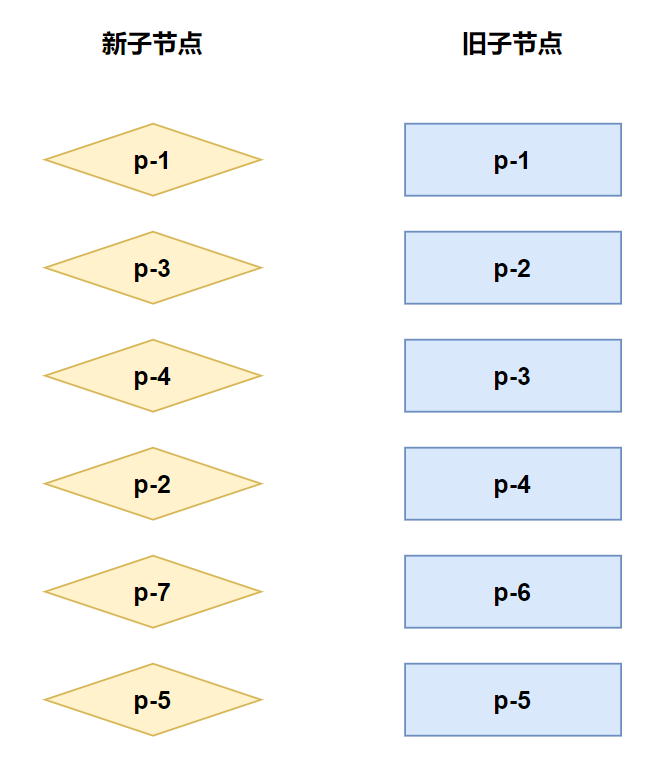
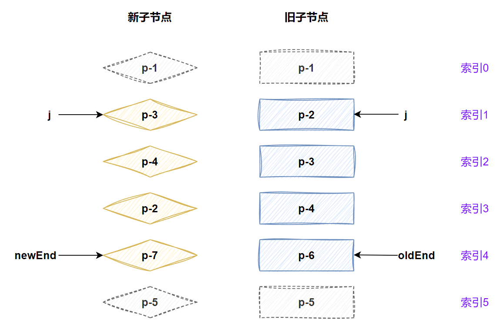
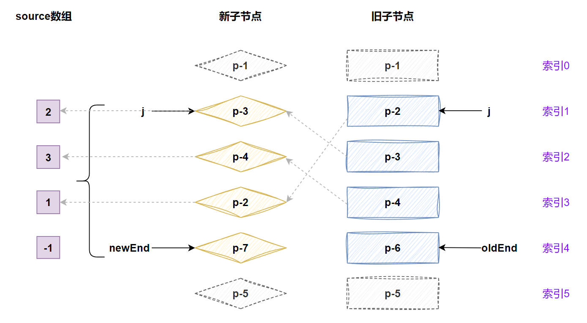
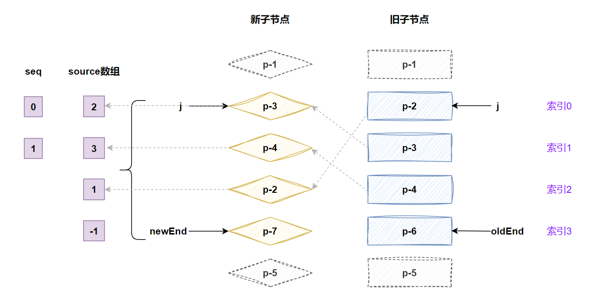
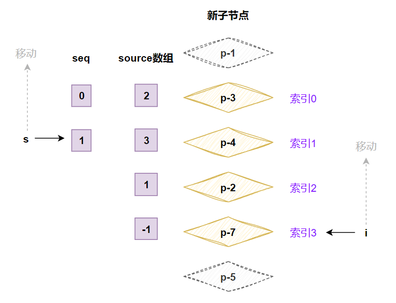
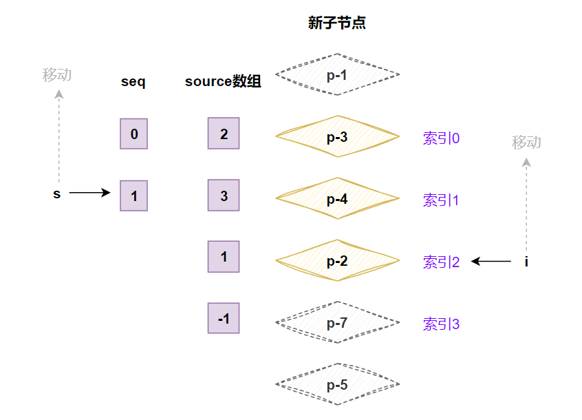

# 快速diff算法

## 处理相同的前置元素和后置元素

快速 diff 算法是需要经过预处理的，什么是预处理呢？我们来看一下下面这个例子：

- oldChildren：p-1、p-2、p-3
- newChildren：p-1、p-4、p-2、p-3

在这个例子中，p-1 在新旧两组子节点中，就属于相同的前置节点，p-2、p-3 就属于相同的后置节点。而对于相同的即表示他们在新旧两组子节点中的相对顺序不变，只需要进行打补丁即可。

对于前置节点，我们可以设置一个变量 j 为索引，从 0 开始，用来指向两组子节点的开头。并开启一个 while 循环，让索引 j 进行递增，直到遇到不相同的节点为止，如下：

```javascript
function patchKeyedChildren(c1, c2, container) {
  // 处理相同的前置节点
  let j = 0
  let oldVNode = c1[j]
  let newVNode = c2[j]

  // while 循环，向后遍历，直到遇到不一样的节点为止
  while (isSameVNodeType(oldVNode, newVNode)) {
    // 打补丁
    patch(oldVNode, newVNode, container)
    // 更新索引
    j++
    // 更新节点
    oldVNode = c1[j]
    newVNode = c2[j]
  }
}
```

当这段代码运行完毕之后，j 的值为 1，此时我们还需要处理相同的后置节点，思路也是一样的。不过由于新旧两组子节点的数量可能不一致，所以在处理相同的后置节点时，我们需要两个索引 newEnd 和 oldEnd，然后再开启一个 while 循环来处理，如下：

```javascript
function patchKeyedChildren(c1, c2, container) {
  // 处理相同的前置节点
  let j = 0
  let oldVNode = c1[j]
  let newVNode = c2[j]

  // while 循环，向后遍历，直到遇到不一样的节点为止
  while (isSameVNodeType(oldVNode, newVNode)) {
    // 打补丁
    patch(oldVNode, newVNode, container)
    // 更新索引
    j++
    // 更新节点
    oldVNode = c1[j]
    newVNode = c2[j]
  }

  // 处理相同的后置节点
  let oldEnd = c1.length - 1
  let newEnd = c2.length - 1
  oldVNode = c1[oldEnd]
  newVNode = c2[newEnd]

  while (isSameVNodeType(oldVNode, newVNode)) {
    // 打补丁
    patch(oldVNode, newVNode, container)
    // 更新索引
    oldEnd--
    newEnd--
    // 更新节点
    oldVNode = c1[oldEnd]
    newVNode = c2[newEnd]
  }
}
```

## 处理相同的前置元素和后置元素-挂载

而处理完成相同的前置和后置节点之后，就不难发现，在我们这个例子中只存在一个 p-4，是一个新增节点。而 j、oldEnd、newEnd 三个索引分别对应的值是 1、0、1。

那么具体是如何得出 p-4 是一个新增节点的呢？我们看一下下面两种情况：

- oldEnd 小于 j 时，说明在处理的过程中，所有的旧子节点都处理完成了
- newEnd 大于或等于 j 时，说明在预处理的过程后，在新的一组节点中，仍然有未被处理的节点，而这些节点都是新增节点。

如果上面两个情况作为条件都成立的话，说明存 newChildren 中遗留的节点都是新增节点。

根据这个分析，我们可以根据这个条件来设置新增的分支，如下：

```javascript
function patchKeyedChildren(c1, c2, container) {
  // 省略

  // 预处理完毕之后，如果满足以下条件，则进行新增
  if (j > oldEnd && j <= newEnd) {
    // 获取锚点的位置
    const nextPos = newEnd + 1
    // 获取锚点元素
    const anchor = nextPos < c2.length ? c2[nextPos].el : null
    // 进行循环遍历，依次新增节点
    while (j <= newEnd) {
      patch(null, c2[j++], container, anchor)
    }
  }
}
```

## 处理相同的前置元素和后置元素-卸载

我们再来看一下存在多余节点的情况，如下：

- oldChildren：p-1、p-2、p-3
- newChildren：p-1、p-3

按照这个例子，执行后的 j、oldEnd、newEnd 结果为 1、1、0。而此时 oldEnd 大于或者 j，则表示旧子节点还没有处理完成，newEnd 小于 j 则表示新子节点已经处理完成了，那么旧子节点中多余的部分则需要卸载，如下：

```javascript
function patchKeyedChildren(c1, c2, container) {
  // 省略

  // 预处理完毕之后，如果满足以下条件，则进行新增
  if (j > oldEnd && j <= newEnd) {
    // 获取锚点的位置
    const nextPos = newEnd + 1
    // 获取锚点元素
    const anchor = nextPos < c2.length ? c2[nextPos].el : null
    // 进行循环遍历，依次新增节点
    while (j <= newEnd) {
      patch(null, c2[j++], container, anchor)
    }
  } else if (oldEnd >= j && j > newEnd) {
    // 进行循环遍历，依次卸载节点
    while (j <= oldEnd) {
      unmount(c1[j++])
    }
  }
}
```

## 判断是否需要进行 DOM 移动操作

在上述的论述中，我们只采用了一个简单的例子来进行演示，下面我们将采用一个复杂一些的例子来进行演示，如图：



而这个例子经过预处理之后，状态如图：



此时就可以看到，预处理之后，新旧两组子节点都存在未处理的节点，这种情况就需要判断一个节点是否需要移动，如果不需要移动，则判断是需要被添加还是被移除的节点。

因此我们需要新开一个分支来处理这个情况，如下：

```javascript
function patchKeyedChildren(c1, c2, container) {
  // 省略

  if (j > oldEnd && j <= newEnd) {
    const nextPos = newEnd + 1
    const anchor = nextPos < c2.length ? c2[nextPos].el : null
    while (j <= newEnd) {
      patch(null, c2[j++], container, anchor)
    }
  } else if (oldEnd >= j && j > newEnd) {
    while (j <= oldEnd) {
      unmount(c1[j++])
    }
  } else {
    // 新的一组节点中剩余需要处理节点的数量
    const count = newEnd - j + 1
    // 构造 source 数组
    const source = new Array(count)
    source.fill(-1)
  }
}
```

source 数组将会用来存储**新的一组子节点中的节点在旧的一组子节点中的位置索引，后面将会使用它计算出一个最长递增子序列，并用于辅助完成 DOM 移动的操作**。如图：



该图表示 p-3 在 oldChildren 中的索引为 2，依次类推，p-7 由于在 oldChildren 没有，所以为 -1。而如果得到这个结果，我们需要使用双重 for 循环来填充，如下：

```javascript
function patchKeyedChildren(c1, c2, container) {
  // 省略

  if (j > oldEnd && j <= newEnd) {
    const nextPos = newEnd + 1
    const anchor = nextPos < c2.length ? c2[nextPos].el : null
    while (j <= newEnd) {
      patch(null, c2[j++], container, anchor)
    }
  } else if (oldEnd >= j && j > newEnd) {
    while (j <= oldEnd) {
      unmount(c1[j++])
    }
  } else {
    // 新的一组节点中剩余需要处理节点的数量
    const count = newEnd - j + 1
    // 构造 source 数组
    const source = new Array(count)
    source.fill(-1)

    // 设置起始索引
    const oldStart = j
    const newStart = j
    // 遍历 oldChildren
    for (let i = oldStart; i <= oldEnd; i++) {
      const oldVNode = c1[i]
      // 遍历 newChildren
      for (let k = newStart; k <= newEnd; k++) {
        const newVNode = c2[k]
        if (isSameVNodeType(oldVNode, newVNode)) {
          // 打补丁
          patch(oldVNode, newVNode, container)
          // 设置 source 数组
          //  - 这里记录的是中间那部分没有被预处理的节点部分，是一个相对索引
          source[k - newStart] = i
        }
      }
    }
  }
}
```

这里为什么说是相对索引呢，source 是从 0 开始的，而未处理的节点就未必是从 0 开始的，所以记录一个相对索引。

当然出于优化的目的，这里使的是嵌套 for 循环的速度不是很好，所以我们可以通过**索引表**来解决。如下：

```javascript
function patchKeyedChildren(c1, c2, container) {
  // 省略

  if (j > oldEnd && j <= newEnd) {
    // 省略
  } else if (oldEnd >= j && j > newEnd) {
    // 省略
  } else {
    // 新的一组节点中剩余需要处理节点的数量
    const count = newEnd - j + 1
    // 构造 source 数组
    const source = new Array(count)
    source.fill(-1)

    // 设置起始索引
    const oldStart = j
    const newStart = j

    // 构建索引表
    const keyIndex = {}
    for (let i = newStart; i <= newEnd; i++) {
      // 以 vnode 的 key 属性为键，在 newChildren 中的索引为值
      keyIndex[c2[i].key] = i
    }

    // 遍历 oldChildren 中未处理的节点
    for (let i = oldStart; i <= oldEnd; i++) {
      const oldVNode = c1[i]
      // 通过 旧节点的 key 在索引表中获取索引值
      const k = keyIndex[oldVNode.key]

      if (k !== undefined) {
        const newVNode = c2[k]
        // 打补丁
        patch(oldVNode, newVNode, container)
        // 更新 source 数组-记录下这个新节点在 oldChildren 中的索引位置
        source[k - newStart] = i
      } else {
        // 如果索引不存在，说明这个旧的vnode在 newChildren 中不存在，说明该节点需要卸载
        unmount(oldVNode)
      }
    }
  }
}
```

虽然还是使用了两个 for 循环，但不再是嵌套的关系，所以性能会有所提升。

现在我们的目光就要聚焦到如何实现元素的移动上面，其实快速 diff 算法和简单 diff 算法的移动逻辑是类似的，如下：

```javascript
function patchKeyedChildren(c1, c2, container) {
  // 省略

  if (j > oldEnd && j <= newEnd) {
    // 省略
  } else if (oldEnd >= j && j > newEnd) {
    // 省略
  } else {
    const count = newEnd - j + 1
    const source = new Array(count)
    source.fill(-1)

    const oldStart = j
    const newStart = j
    // 新增两个变量
    let moved = false
    // 表示在遍历 oldChildren 的过程中，遇到的最大索引值 k
    let pos = 0

    const keyIndex = {}
    for (let i = newStart; i <= newEnd; i++) {
      // 这个 i 是 newChildren 中真实的索引
      keyIndex[c2[i].key] = i
    }

    // 遍历旧的 oldChildren
    for (let i = oldStart; i <= oldEnd; i++) {
      // 获取旧的虚拟节点
      const oldVNode = c1[i]
      // 使用旧节点的 key 去新节点中寻找
      const k = keyIndex[oldVNode.key]

      // 如果存在则复用
      if (k !== undefined) {
        // 根据索引表记录的 index 获取新的虚拟节点
        const newVNode = c2[k]
        patch(oldVNode, newVNode, container)
        source[k - newStart] = i

        // 判断这个复用的节点是否需要移动
        //  - 即采用类似递增索引的方式来判断是否需要移动
        //  - 判断当前新节点的索引 k 是否大于上一次在 oldChildren 遍历过程中遇到的最大索引 pos
        //  - 一但 k 小于上一次遍历时记录的pos，则表示破坏了连续递增的规律，所以需要移动
        if (k < pos) {
          // 需要移动
          moved = true
        } else {
          // 无需移动，更新最大索引 pos
          pos = k
        }
      } else {
        unmount(oldVNode)
      }
    }
  }
}
```

除此之外，我们还需要一个数量标识，代表**已经更新过的节点数量**。我们知道，已经**已经更新过的节点数量**应该小于新的一组节点需要更新的节点数量，一但前者超过后者，则说明有多余的节点，需要将其卸载，如下：

```javascript
function patchKeyedChildren(c1, c2, container) {
  // 省略

  if (j > oldEnd && j <= newEnd) {
    // 省略
  } else if (oldEnd >= j && j > newEnd) {
    // 省略
  } else {
    const count = newEnd - j + 1
    const source = new Array(count)
    source.fill(-1)

    const oldStart = j
    const newStart = j
    let moved = false
    let pos = 0

    const keyIndex = {}
    for (let i = newStart; i <= newEnd; i++) {
      keyIndex[c2[i].key] = i
    }

    // 记录更新过的节点的数量
    let patched = 0
    for (let i = oldStart; i <= oldEnd; i++) {
      const oldVNode = c1[i]
      if (patched <= count) {
        const k = keyIndex[oldVNode.key]

        if (k !== undefined) {
          const newVNode = c2[k]
          patch(oldVNode, newVNode, container)
          source[k - newStart] = i

          if (k < pos) {
            moved = true
          } else {
            pos = k
          }
        } else {
          unmount(oldVNode)
        }
      } else {
        // 如果更新过的节点数量大于需要更新的节点数量，则说明剩下的 oldChildren 中的节点都是需要卸载的
        unmount(oldVNode)
      }
    }
  }
}
```

## 如何移动元素

在上一步，我们已经分辨出了需要移动的节点，那具体如何移动呢？我们可以来创建一下这部分的逻辑，如下：

```javascript
function patchKeyedChildren(c1, c2, container) {
  // 省略

  if (j > oldEnd && j <= newEnd) {
    // 省略
  } else if (oldEnd >= j && j > newEnd) {
    // 省略
  } else {
    // 省略

    for (let i = oldStart; i <= oldEnd; i++) {
      // 省略
    }

    if (moved) {
      // 如果 moved 为 true，则需要进行 DOM 移动
    }
  }
}
```

首先我们需要根据 source 数组求出**最长递增子序列**。关于这个概念以及如何实现这个算法不在本文赘述。

source 在之前是图中，我们可以知道记录的结果是 [2, 3, 1, -1]，那么他的最长递增子序列是 [2, 3]，然后我们要得到这个 2 和 3 所对应的索引，所以结果应该是 [0, 1]，如下：

```javascript
if (moved) {
  const seq = lis(source) // [0, 1]
}
```

有了最长递增子序列之后，我们需要重新对节点进行编码，如图：




可以看到，在重新编码之后，忽略了 p-1 和 p-5，将 p-2 设置为了索引为 0，以此类推。重新编号的意义是为了让子序列 seq 与新的索引值产生对应关系，最长递增子序列有一个重要的意义，即子序列 [0, 1]，它的含义是：**在新的一组子节点中，重新编号后索引值为 0 和 1 的这两个节点，在更新后节点顺序没有变化，不需要移动**。

为了完成这个移动，我们需要创建两个索引值 i 和 s：

- 索引 i 指向新的一组子节点中的最后一个节点
- 索引 s 指向最长递增子序列中的最后一个元素

如图：



上图去掉了一些不相关的节点和变量，接下来，我们将使用一个 for 循环来让其按照图中所示进行移动，如下：

```javascript
if (moved) {
  const seq = lis(source)

  // s 指向最长递增子序列的最后一个元素的索引
  let s = seq.length - 1
  // i 指向新的一组子节点的最后一个节点的索引
  let i = count - 1
  // 从后向前遍历，依次处理需要移动的节点
  for (i; i >= 0; i--) {
    if (i !== seq[s]) {
      // 如果节点的索引 i 不等于最长递增子序列的最后一个元素的索引 s
      // 则说明该节点需要移动
    } else {
      // 如果节点的索引 i 等于最长递增子序列的最后一个元素的索引 s
      // 则说明该节点不需要移动，更新 s 的值
      s--
    }
  }
}
```

接下来我们还需要处理 -1 的情况，即新增的情况，如下：

```javascript
if (moved) {
  const seq = lis(source)
  let s = seq.length - 1
  let i = count - 1
  for (i; i >= 0; i--) {
    if (source[i] === -1) {
      // 如果为 -1，说明该节点是新增的
      // 获取这个新增节点在 newChildren 中的位置索引
      const pos = i + newStart
      const newVNode = c2[pos]
      // 这个节点的下一个节点位置索引
      const nextPos = pos + 1
      // 获取锚点元素
      const anchor = nextPos < c2.length ? c2[nextPos].el : null
      // 挂载
      patch(null, newVNode, container, anchor)
    } else if (i !== seq[s]) {
      // 移动
    } else {
      s--
    }
  }
}
```

新节点创建完毕之后，索引 i 会往上走一步，如图：



这次遍历明显是不需要挂载的，seq[s] 的值是 1，而 i 的值是 2，所以不相等，需要进行移动，移动的方法是一致的，如下：

```javascript
if (moved) {
  const seq = lis(source)
  let s = seq.length - 1
  let i = count - 1
  for (i; i >= 0; i--) {
    if (source[i] === -1) {
      // 省略
    } else if (i !== seq[s]) {
      // 获取这个节点在 newChildren 中的位置索引
      const pos = i + newStart
      const newVNode = c2[pos]
      // 这个节点的下一个节点位置索引
      const nextPos = pos + 1
      // 获取锚点元素
      const anchor = nextPos < c2.length ? c2[nextPos].el : null
      // 移动
      hostInsert(newVNode.el, container, anchor)
    } else {
      s--
    }
  }
}
```

后面的步骤以此类推即可，关于求最长递增子序列，我们这里就直接贴出 vue 中的源码，如下：

```javascript
// https://en.wikipedia.org/wiki/Longest_increasing_subsequence
function getSequence(arr) {
	const p = arr.slice()
	const result = [0]
	let i, j, u, v, c
	const len = arr.length
	for (i = 0; i < len; i++) {
		const arrI = arr[i]
		if (arrI !== 0) {
			j = result[result.length - 1]
			if (arr[j] < arrI) {
				p[i] = j
				result.push(i)
				continue
			}
			u = 0
			v = result.length - 1
			while (u < v) {
				c = (u + v) >> 1
				if (arr[result[c]] < arrI) {
					u = c + 1
				} else {
					v = c
				}
			}
			if (arrI < arr[result[u]]) {
				if (u > 0) {
					p[i] = result[u - 1]
				}
				result[u] = i
			}
		}
	}
	u = result.length
	v = result[u - 1]
	while (u-- > 0) {
		result[u] = v
		v = p[v]
	}
	return result
}
```

